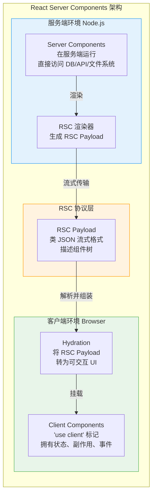
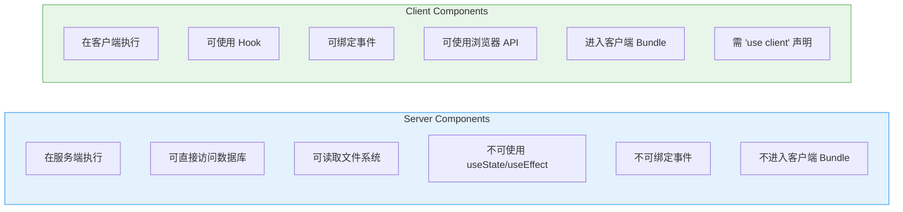
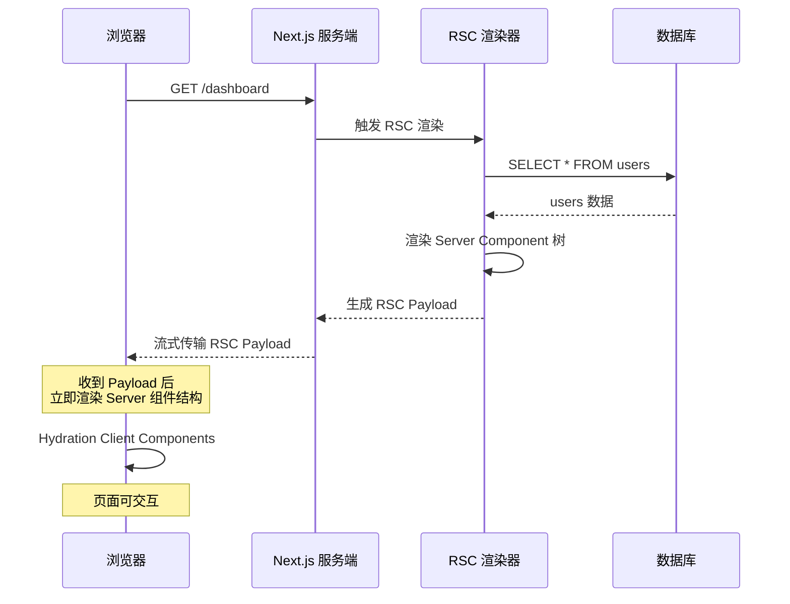
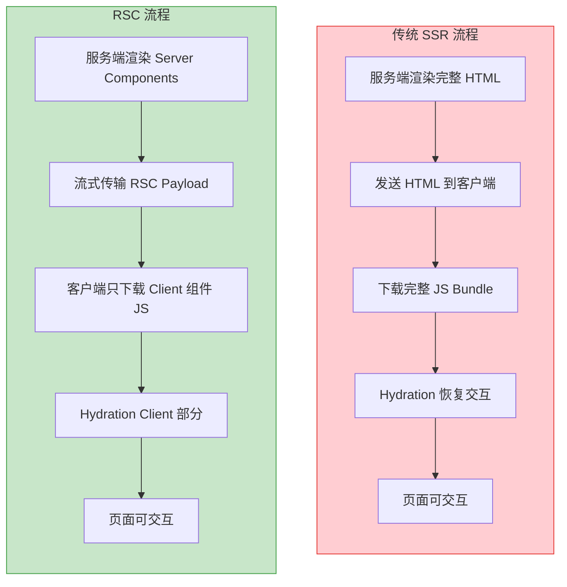

# React Server Components

React Server Components（RSC）是 React 18/19 引入的全新渲染范式，允许组件在服务端执行，直接访问数据源，同时支持流式传输到客户端。

## RSC 核心架构



## Server Components vs Client Components



### 对比表

| 维度 | Server Component | Client Component |
|------|-----------------|-----------------|
| **运行环境** | 服务端（Node.js） | 客户端（浏览器） |
| **声明方式** | 默认（无需标记） | `'use client'` 指令 |
| **状态管理** | 不可（无 useState） | 可以 |
| **副作用** | 不可（无 useEffect） | 可以 |
| **事件处理** | 不可 | 可以 |
| **数据获取** | 直接 async/await | useEffect / fetch |
| **Bundle 大小** | 不计入客户端 | 计入客户端 |
| **访问后端资源** | 直接（DB、文件系统） | 需 API 层 |

## RSC 数据流详解



## RSC Payload 格式

RSC Payload 是一种类 JSON 的流式协议，描述组件树的序列化表示：

```
// RSC Payload 示例（简化）
0:["$@1",["main",null]]
1:["$","div",null,{"className":"dashboard"}]
2:["$","h1",null,{"children":"Dashboard"}]
3:["$","@4",null,{"data":"server-loaded-data"}]  // 引用 Client Component
4:{"id":"./components/Chart.client.tsx","name":"Chart"}
// 流式追加
5:["$","section",null,{"children":"$@6"}]
6:["$","Suspense",null,{"fallback":"Loading...","children":"$@7"}]
7:["$","div",null,{"children":"Loaded content"}]
```

## 代码实践

### Server Component — 直接访问数据库

```tsx
// app/dashboard/page.tsx (Server Component by default)
import { db } from '@/lib/db';
import { UserList } from './UserList';     // Client Component
import { Header } from './Header';          // Server Component

// 这是一个 Server Component
// 可以直接 await 数据库查询，无需 API 层
export default async function DashboardPage() {
  // 直接在组件中查询数据库
  const users = await db.user.findMany({
    orderBy: { createdAt: 'desc' },
    take: 10,
  });

  const stats = await db.$queryRaw`
    SELECT COUNT(*) as total FROM users
  `;

  return (
    <main>
      {/* Server Component — 零客户端 JS */}
      <Header title="Dashboard" />

      {/* 传递序列化数据给 Client Component */}
      <UserList initialUsers={users} />

      {/* Server Component — 直接渲染 */}
      <section>
        <p>Total users: {stats[0].total}</p>
      </section>
    </main>
  );
}
```

### Client Component — 交互逻辑

```tsx
'use client';

import { useState, useTransition } from 'react';
import { addUser } from '@/app/actions';

interface User {
  id: string;
  name: string;
  email: string;
}

// Client Component 处理交互
export function UserList({ initialUsers }: { initialUsers: User[] }) {
  const [users, setUsers] = useState(initialUsers);
  const [isPending, startTransition] = useTransition();

  const handleAdd = async (formData: FormData) => {
    startTransition(async () => {
      const newUser = await addUser(formData);
      setUsers(prev => [newUser, ...prev]);
    });
  };

  return (
    <div>
      <form action={handleAdd}>
        <input name="name" placeholder="Name" required />
        <input name="email" placeholder="Email" required />
        <button type="submit" disabled={isPending}>
          {isPending ? 'Adding...' : 'Add User'}
        </button>
      </form>

      <ul>
        {users.map(user => (
          <li key={user.id}>
            {user.name} — {user.email}
          </li>
        ))}
      </ul>
    </div>
  );
}
```

### 嵌套的 Server/Client 组件组合

```tsx
// app/layout.tsx — Server Component
export default async function RootLayout({ children }) {
  const session = await getSession(); // 服务端获取 session

  return (
    <html>
      <body>
        {/* Server Component */}
        <nav>
          <span>Welcome, {session.user.name}</span>
        </nav>

        {/* children 可以包含 Client Components */}
        {children}
      </body>
    </html>
  );
}
```

## RSC 与 SSR 对比



### 关键差异

| 维度 | 传统 SSR | RSC |
|------|---------|-----|
| **渲染输出** | HTML 字符串 | RSC Payload（流式协议） |
| **JS Bundle** | 全量发送到客户端 | 只发送 Client Component 部分 |
| **数据获取** | useEffect 或 getServerSideProps | 组件内直接 async/await |
| **组件运行** | 服务端渲染一次，客户端 Hydration | Server 只在服务端，Client 在客户端 |
| **流式支持** | 需要额外配置 | 原生支持 |
| **代码拆分** | 路由级 | 组件级 |

## 流式渲染与 Suspense 结合

```tsx
// 利用 Suspense 实现流式渲染
import { Suspense } from 'react';

export default async function Page() {
  return (
    <div>
      {/* 这部分立即渲染 */}
      <h1>Dashboard</h1>

      {/* 这部分流式加载，先显示 fallback */}
      <Suspense fallback={<Skeleton />}>
        <SlowDataComponent />
      </Suspense>

      <Suspense fallback={<ChartSkeleton />}>
        <AnalyticsChart />
      </Suspense>
    </div>
  );
}

// Server Component — 慢速数据查询
async function SlowDataComponent() {
  const data = await fetchAnalytics(); // 可能需要 2-3 秒
  return <DataTable data={data} />;
}

// Server Component — 独立的数据查询
async function AnalyticsChart() {
  const chartData = await fetchChartData();
  return <Chart data={chartData} />;
}
```

**流式效果**：
1. 用户立即看到 "Dashboard" 标题
2. DataTable 和 Chart 各自独立加载
3. 先完成的部分先显示，无需等待全部数据

## RSC 中的数据缓存

```tsx
// React 19 中的 fetch 缓存
// 同一个 URL 在一次渲染中只请求一次
export default async function Page() {
  // 两次调用同一个 URL，只会发一次请求
  const [users, posts] = await Promise.all([
    fetch('/api/users').then(r => r.json()),
    fetch('/api/posts').then(r => r.json()),
  ]);

  return (
    <div>
      <UserList users={users} />
      <PostList posts={posts} />
    </div>
  );
}

// 使用 React.cache 去重
import { cache } from 'react';

const getUser = cache(async (id: string) => {
  return db.user.findUnique({ where: { id } });
});

// 在同一次渲染中，多次调用 getUser('1') 只会查询一次
export default async function Profile({ params }: { params: { id: string } }) {
  const user = await getUser(params.id); // 查询
  const sameUser = await getUser(params.id); // 缓存命中
  // ...
}
```

## 最佳实践

1. **默认使用 Server Component** — 只在需要交互时才加 `'use client'`
2. **Client Component 放在叶子节点** — 尽量让 Client Component 是组件树的最底层
3. **Server Component 直接获取数据** — 不要绕道 API 层
4. **用 Suspense 包裹慢速数据** — 实现流式渲染，提升感知性能
5. **避免不必要的 Client 边界** — `'use client'` 会将其下所有子组件打入客户端 Bundle

## 面试要点

1. **Server Components 和 SSR 的区别？** — SSR 渲染 HTML 字符串，RSC 生成组件树描述（Payload），两者可组合使用
2. **'use client' 的作用？** — 声明组件为客户端组件，标记 Server/Client 边界
3. **Server Component 为什么不能用 useState？** — 它只在服务端执行一次，没有客户端生命周期
4. **RSC 如何减少 Bundle 大小？** — Server Component 的代码不进入客户端 Bundle，依赖也不会
5. **流式渲染的优势？** — 用户更快看到内容，慢速数据不阻塞快速数据的展示
6. **RSC Payload 和 HTML 的区别？** — Payload 是可增量更新的组件树描述，HTML 是一次性渲染结果

---

> **相关章节**：[Suspense 与并发模式](./suspense-concurrent.md) | [React 19 新特性](./react-19.md)
