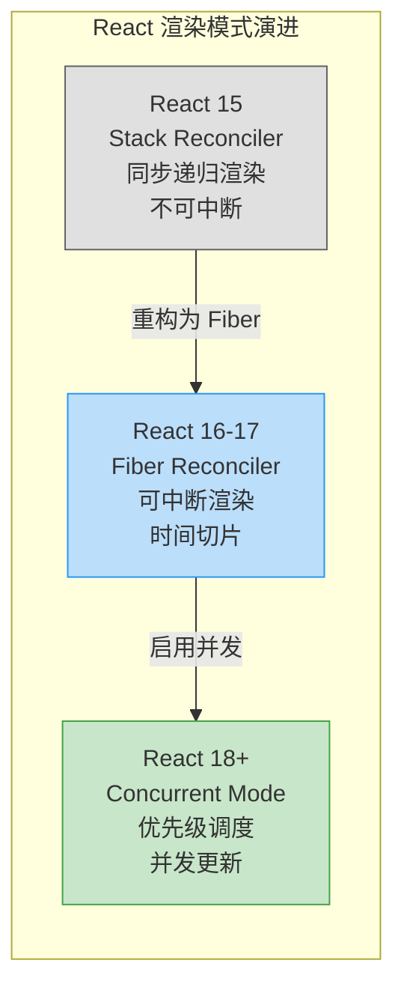
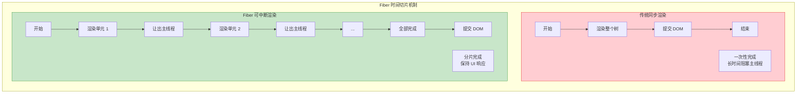
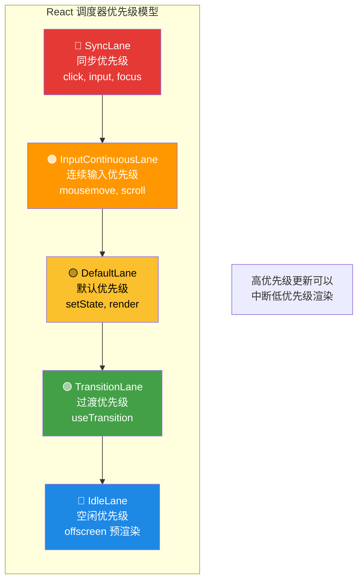
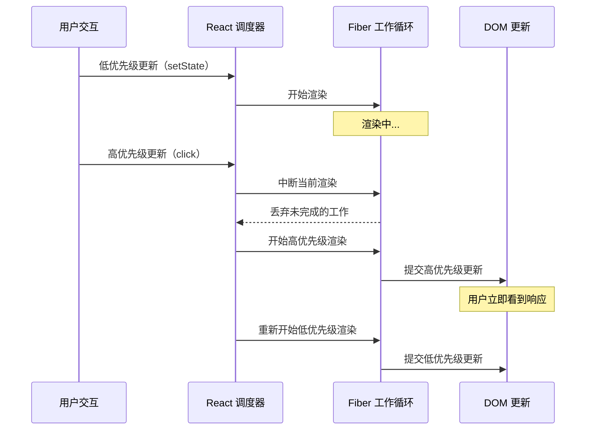
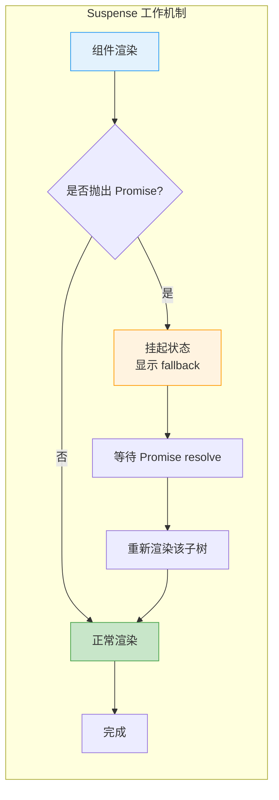
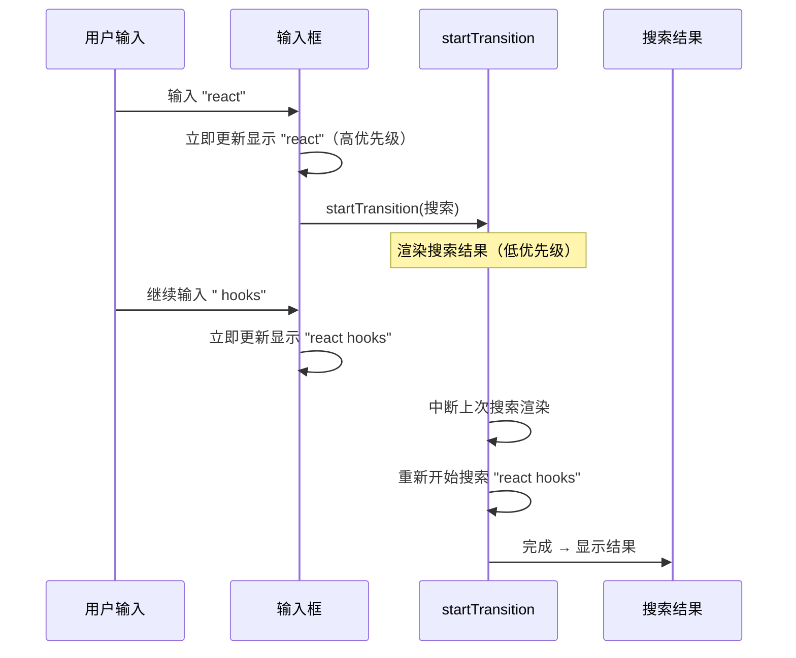
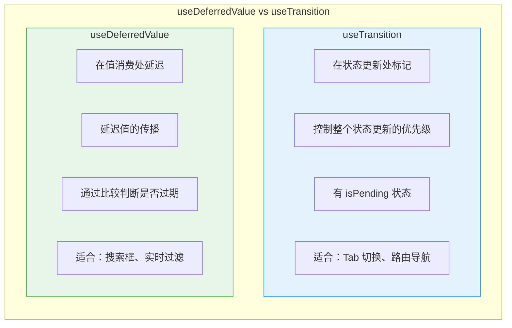

# Suspense 与并发模式

并发模式（Concurrent Mode）是 React 18 引入的核心渲染机制，允许 React 在渲染过程中中断、暂停和恢复更新，配合 Suspense 实现优雅的异步 UI 处理。

## 并发渲染原理

### React 渲染模式演进



### Fiber 架构与时间切片



**Fiber 节点结构**：

```typescript
// Fiber 节点简化结构
interface Fiber {
  tag: number;           // 组件类型（函数组件、类组件、原生 DOM）
  type: any;             // 组件函数/类或 DOM 标签名
  key: string | null;
  stateNode: any;        // DOM 节点或组件实例

  // Fiber 树结构
  child: Fiber | null;   // 第一个子节点
  sibling: Fiber | null; // 下一个兄弟节点
  return: Fiber | null;  // 父节点

  // 工作单元
  pendingProps: any;     // 新 props
  memoizedProps: any;    // 上次渲染的 props
  memoizedState: any;    // 上次渲染的 state

  // 副作用
  flags: number;         // 标记需要执行的副作用
  updateQueue: any;      // 更新队列
}
```

## 优先级调度系统



### 并发更新流程



## Suspense 深度解析

### Suspense 工作原理



### Suspense 的三种使用模式

```tsx
import { Suspense } from 'react';

// 模式 1：数据获取（配合 RSC / lazy）
function App() {
  return (
    <Suspense fallback={<Loading />}>
      <UserProfile />
    </Suspense>
  );
}

// 模式 2：代码分割（lazy）
const HeavyChart = lazy(() => import('./HeavyChart'));

function Dashboard() {
  return (
    <Suspense fallback={<ChartSkeleton />}>
      <HeavyChart data={chartData} />
    </Suspense>
  );
}

// 模式 3：嵌套 Suspense — 渐进式加载
function Page() {
  return (
    <>
      <h1>Dashboard</h1>
      <Suspense fallback={<HeaderSkeleton />}>
        <Header />
      </Suspense>
      <Suspense fallback={<ContentSkeleton />}>
        <Content />
      </Suspense>
      <Suspense fallback={<SidebarSkeleton />}>
        <Sidebar />
      </Suspense>
    </>
  );
}
```

## useTransition

`useTransition` 允许将状态更新标记为"过渡"（Transition），使其不阻塞用户交互。

### 核心用法

```tsx
import { useTransition, useState } from 'react';

function SearchPage() {
  const [query, setQuery] = useState('');
  const [results, setResults] = useState([]);
  const [isPending, startTransition] = useTransition();

  const handleSearch = (e: React.ChangeEvent<HTMLInputElement>) => {
    const value = e.target.value;
    setQuery(value); // 高优先级：输入框立即更新

    // 低优先级：搜索结果延迟更新
    startTransition(() => {
      setResults(performSearch(value));
    });
  };

  return (
    <div>
      <input value={query} onChange={handleSearch} />
      {isPending && <Spinner />}
      <SearchResults results={results} />
    </div>
  );
}
```

### useTransition 执行流程



### useTransition vs 直接 setState

```tsx
// ❌ 直接 setState — 所有更新同等优先级
function Bad() {
  const [tab, setTab] = useState('home');
  const [data, setData] = useState(null);

  const switchTab = (newTab: string) => {
    setTab(newTab);          // 阻塞 UI
    setData(loadData(newTab)); // 也阻塞 UI
  };
}

// ✅ useTransition — tab 切换不被数据加载阻塞
function Good() {
  const [tab, setTab] = useState('home');
  const [data, setData] = useState(null);
  const [isPending, startTransition] = useTransition();

  const switchTab = (newTab: string) => {
    setTab(newTab); // 高优先级，立即更新
    startTransition(() => {
      setData(loadData(newTab)); // 低优先级，可中断
    });
  };
}
```

## useDeferredValue

`useDeferredValue` 创建一个值的延迟版本，用于优化频繁变化的输入。

### 核心用法

```tsx
import { useDeferredValue, useState, useMemo } from 'react';

function SearchApp() {
  const [query, setQuery] = useState('');
  const deferredQuery = useDeferredValue(query);

  // 基于延迟值计算结果 — 不会阻塞输入
  const filteredList = useMemo(
    () => filterItems(items, deferredQuery),
    [deferredQuery]
  );

  const isStale = query !== deferredQuery;

  return (
    <div>
      <input
        value={query}
        onChange={e => setQuery(e.target.value)}
      />
      <div style={{ opacity: isStale ? 0.7 : 1 }}>
        <FilteredList items={filteredList} />
      </div>
    </div>
  );
}
```

### useDeferredValue vs useTransition



| 场景 | 推荐方案 | 原因 |
|------|---------|------|
| 输入框实时搜索 | useDeferredValue | 源自外部 props，无法控制更新 |
| Tab 切换加载数据 | useTransition | 自己控制状态更新 |
| 列表筛选过滤 | useDeferredValue | 值来自父组件 |
| 路由跳转 | useTransition | 主动触发的状态变更 |
| 大列表渲染优化 | useDeferredValue | 可以延迟渲染 |

## 综合实战：搜索页面

```tsx
'use client';

import { useState, useTransition, useDeferredValue, Suspense } from 'react';

export function SearchPage() {
  const [query, setQuery] = useState('');
  const [category, setCategory] = useState('all');
  const [isPending, startTransition] = useTransition();
  const deferredQuery = useDeferredValue(query);

  // 类别切换用 Transition（主动控制）
  const handleCategoryChange = (newCategory: string) => {
    startTransition(() => {
      setCategory(newCategory);
    });
  };

  return (
    <div>
      {/* 搜索框 */}
      <input
        value={query}
        onChange={e => setQuery(e.target.value)}
        placeholder="搜索..."
      />

      {/* 类别标签 */}
      <div>
        {['all', 'posts', 'users', 'tags'].map(cat => (
          <button
            key={cat}
            onClick={() => handleCategoryChange(cat)}
            style={{ opacity: isPending ? 0.6 : 1 }}
          >
            {cat}
          </button>
        ))}
      </div>

      {/* 结果区 — 使用 deferredQuery 实现防抖效果 */}
      <Suspense fallback={<ResultsSkeleton />}>
        <SearchResults
          query={deferredQuery}
          category={category}
        />
      </Suspense>
    </div>
  );
}

// Server Component — 独立加载
async function SearchResults({ query, category }: Props) {
  const results = await searchAPI(query, category);
  return (
    <ul>
      {results.map(item => (
        <li key={item.id}>{item.title}</li>
      ))}
    </ul>
  );
}
```

## 并发模式最佳实践

1. **区分紧急更新和过渡更新** — 输入框反馈是紧急的，搜索结果是过渡的
2. **Suspense 边界要合理** — 太粗会导致整页 loading，太细会增加复杂度
3. **isPending 用于即时反馈** — 让用户知道后台在工作
4. **useDeferredValue 处理外部值** — 当你无法控制更新来源时使用
5. **避免在 Transition 中做同步计算** — Transition 用于异步/昂贵操作

## 面试要点

1. **Fiber 架构解决了什么问题？** — 将递归渲染改为可中断的循环，实现时间切片和优先级调度
2. **Suspense 的本质是什么？** — 捕获子组件抛出的 Promise，显示 fallback，Promise resolve 后重新渲染
3. **useTransition 的工作原理？** — 将回调内的状态更新标记为低优先级（TransitionLane），可被高优先级更新中断
4. **useDeferredValue 和防抖的区别？** — 防抖是固定延迟，useDeferredValue 是 React 根据渲染情况动态调度
5. **并发模式下 React 如何保证一致性？** — 高优先级更新中断低优先级渲染后，以最新状态重新开始
6. **为什么 React 要引入并发模式？** — 解决大型应用中"CPU 密集型渲染阻塞用户交互"的问题

---

> **相关章节**：[React Server Components](./server-components.md) | [React 19 新特性](./react-19.md)
