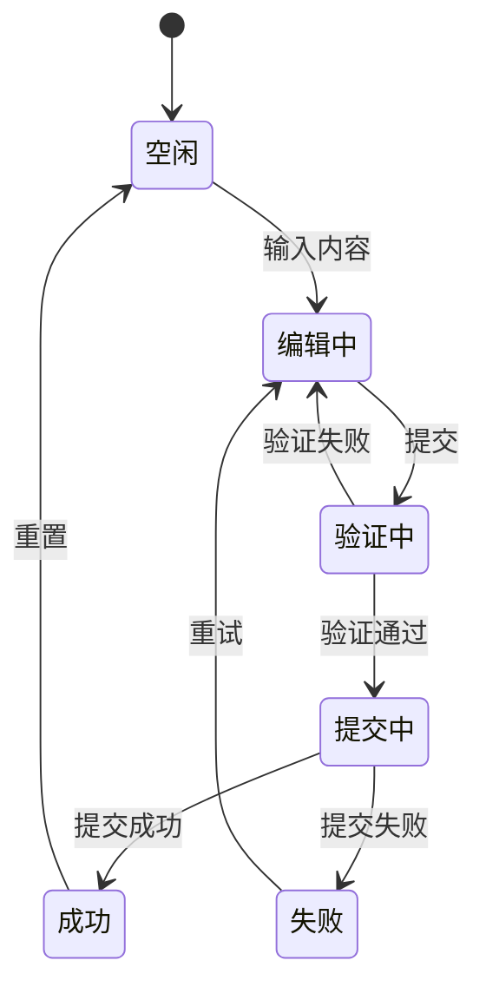
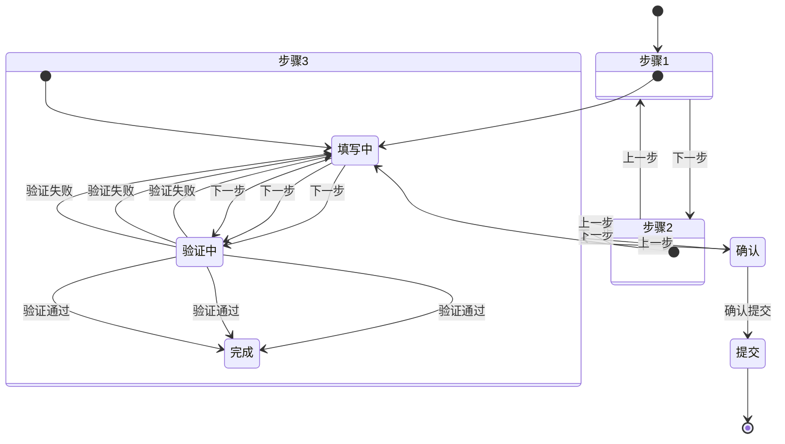
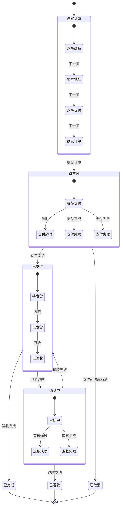
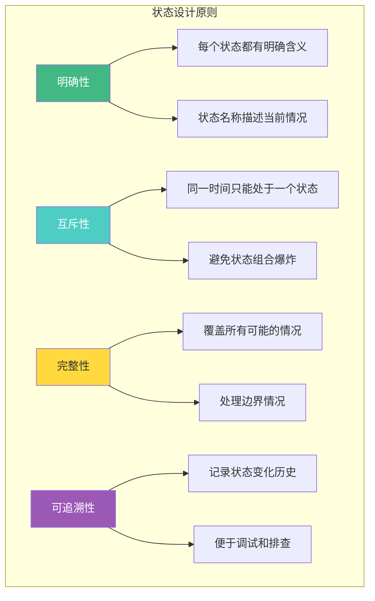

# 前端状态机实战

状态机在前端开发中有着广泛的应用，特别是在表单流程、多步骤向导和复杂业务流程的管理中。本章将通过实际案例展示如何使用状态机简化复杂的状态管理。

## 表单状态机

### 基本表单状态



### 实现代码

```typescript
import { createMachine, assign } from 'xstate';

interface FormContext {
  values: Record<string, any>;
  errors: Record<string, string>;
  touched: Record<string, boolean>;
  submitCount: number;
}

type FormEvent =
  | { type: 'CHANGE'; field: string; value: any }
  | { type: 'BLUR'; field: string }
  | { type: 'SUBMIT' }
  | { type: 'VALID'; errors: Record<string, string> }
  | { type: 'INVALID'; errors: Record<string, string> }
  | { type: 'SUCCESS' }
  | { type: 'FAILURE'; error: string }
  | { type: 'RESET' };

const formMachine = createMachine<FormContext, FormEvent>({
  id: 'form',
  initial: 'idle',
  context: {
    values: {},
    errors: {},
    touched: {},
    submitCount: 0
  },
  states: {
    idle: {
      on: {
        CHANGE: {
          target: 'editing',
          actions: assign({
            values: (context, event) => ({
              ...context.values,
              [event.field]: event.value
            })
          })
        }
      }
    },
    editing: {
      on: {
        CHANGE: {
          actions: assign({
            values: (context, event) => ({
              ...context.values,
              [event.field]: event.value
            }),
            errors: (context, event) => {
              const newErrors = { ...context.errors };
              delete newErrors[event.field];
              return newErrors;
            }
          })
        },
        BLUR: {
          actions: assign({
            touched: (context, event) => ({
              ...context.touched,
              [event.field]: true
            })
          })
        },
        SUBMIT: {
          target: 'validating',
          actions: assign({
            submitCount: (context) => context.submitCount + 1,
            touched: (context) => {
              // 标记所有字段为已触摸
              const touched: Record<string, boolean> = {};
              Object.keys(context.values).forEach(key => {
                touched[key] = true;
              });
              return touched;
            }
          })
        }
      }
    },
    validating: {
      invoke: {
        src: 'validateForm',
        onDone: {
          target: 'submitting',
          actions: assign({ errors: {} })
        },
        onError: {
          target: 'editing',
          actions: assign({
            errors: (_, event) => event.data as Record<string, string>
          })
        }
      }
    },
    submitting: {
      invoke: {
        src: 'submitForm',
        onDone: {
          target: 'success',
          actions: assign({ errors: {} })
        },
        onError: {
          target: 'failure',
          actions: assign({
            errors: { _form: (event as any).data.message }
          })
        }
      }
    },
    success: {
      on: {
        RESET: {
          target: 'idle',
          actions: assign({
            values: {},
            errors: {},
            touched: {},
            submitCount: 0
          })
        }
      }
    },
    failure: {
      on: {
        SUBMIT: { target: 'validating' },
        RESET: {
          target: 'idle',
          actions: assign({
            values: {},
            errors: {},
            touched: {},
            submitCount: 0
          })
        }
      }
    }
  }
});
```

### Vue 集成

```vue
<script setup>
import { useMachine } from '@xstate/vue';
import { formMachine } from './machines/form';

const { state, send } = useMachine(formMachine, {
  services: {
    validateForm: async (context) => {
      const errors: Record<string, string> = {};

      if (!context.values.email) {
        errors.email = '邮箱不能为空';
      } else if (!/\S+@\S+\.\S+/.test(context.values.email)) {
        errors.email = '邮箱格式不正确';
      }

      if (!context.values.password) {
        errors.password = '密码不能为空';
      } else if (context.values.password.length < 6) {
        errors.password = '密码长度至少 6 位';
      }

      if (Object.keys(errors).length > 0) {
        throw errors;
      }
    },
    submitForm: async (context) => {
      const response = await fetch('/api/login', {
        method: 'POST',
        headers: { 'Content-Type': 'application/json' },
        body: JSON.stringify(context.values)
      });

      if (!response.ok) {
        throw new Error('登录失败');
      }

      return response.json();
    }
  }
});

const handleChange = (field: string, value: any) => {
  send({ type: 'CHANGE', field, value });
};

const handleBlur = (field: string) => {
  send({ type: 'BLUR', field });
};

const handleSubmit = () => {
  send({ type: 'SUBMIT' });
};
</script>

<template>
  <form @submit.prevent="handleSubmit">
    <div>
      <input
        :value="state.context.values.email"
        @input="handleChange('email', $event.target.value)"
        @blur="handleBlur('email')"
        placeholder="邮箱"
      />
      <span v-if="state.context.touched.email && state.context.errors.email">
        {{ state.context.errors.email }}
      </span>
    </div>

    <div>
      <input
        type="password"
        :value="state.context.values.password"
        @input="handleChange('password', $event.target.value)"
        @blur="handleBlur('password')"
        placeholder="密码"
      />
      <span v-if="state.context.touched.password && state.context.errors.password">
        {{ state.context.errors.password }}
      </span>
    </div>

    <button
      type="submit"
      :disabled="state.matches('validating') || state.matches('submitting')"
    >
      {{ state.matches('submitting') ? '提交中...' : '登录' }}
    </button>

    <div v-if="state.matches('success')">登录成功！</div>
    <div v-if="state.context.errors._form">{{ state.context.errors._form }}</div>
  </form>
</template>
```

## 多步骤向导

### 向导状态图



### 实现代码

```typescript
import { createMachine, assign } from 'xstate';

interface WizardContext {
  currentStep: number;
  data: {
    personal: Record<string, any>;
    address: Record<string, any>;
    payment: Record<string, any>;
  };
  errors: Record<string, string>;
  isSubmitting: boolean;
}

type WizardEvent =
  | { type: 'NEXT' }
  | { type: 'PREVIOUS' }
  | { type: 'UPDATE_DATA'; step: string; data: Record<string, any> }
  | { type: 'CONFIRM' }
  | { type: 'SUBMIT' }
  | { type: 'SUCCESS' }
  | { type: 'FAILURE'; error: string }
  | { type: 'RESET' };

const wizardMachine = createMachine<WizardContext, WizardEvent>({
  id: 'wizard',
  initial: 'step1',
  context: {
    currentStep: 1,
    data: {
      personal: {},
      address: {},
      payment: {}
    },
    errors: {},
    isSubmitting: false
  },
  states: {
    step1: {
      on: {
        UPDATE_DATA: {
          actions: assign({
            data: (context, event) => ({
              ...context.data,
              personal: { ...context.data.personal, ...event.data }
            })
          })
        },
        NEXT: {
          target: 'step1.validating',
          guard: (context) => {
            // 验证步骤 1 数据
            const { name, email } = context.data.personal;
            return name && email;
          }
        }
      },
      initial: 'editing',
      states: {
        editing: {},
        validating: {
          invoke: {
            src: 'validateStep1',
            onDone: { target: 'done' },
            onError: {
              target: 'editing',
              actions: assign({
                errors: (_, event) => event.data as Record<string, string>
              })
            }
          }
        },
        done: { type: 'final' }
      },
      onDone: { target: 'step2' }
    },
    step2: {
      on: {
        UPDATE_DATA: {
          actions: assign({
            data: (context, event) => ({
              ...context.data,
              address: { ...context.data.address, ...event.data }
            })
          })
        },
        PREVIOUS: { target: 'step1' },
        NEXT: {
          target: 'step2.validating',
          guard: (context) => {
            const { city, street } = context.data.address;
            return city && street;
          }
        }
      },
      initial: 'editing',
      states: {
        editing: {},
        validating: {
          invoke: {
            src: 'validateStep2',
            onDone: { target: 'done' },
            onError: {
              target: 'editing',
              actions: assign({
                errors: (_, event) => event.data as Record<string, string>
              })
            }
          }
        },
        done: { type: 'final' }
      },
      onDone: { target: 'step3' }
    },
    step3: {
      on: {
        UPDATE_DATA: {
          actions: assign({
            data: (context, event) => ({
              ...context.data,
              payment: { ...context.data.payment, ...event.data }
            })
          })
        },
        PREVIOUS: { target: 'step2' },
        NEXT: {
          target: 'step3.validating',
          guard: (context) => {
            const { cardNumber, expiry } = context.data.payment;
            return cardNumber && expiry;
          }
        }
      },
      initial: 'editing',
      states: {
        editing: {},
        validating: {
          invoke: {
            src: 'validateStep3',
            onDone: { target: 'done' },
            onError: {
              target: 'editing',
              actions: assign({
                errors: (_, event) => event.data as Record<string, string>
              })
            }
          }
        },
        done: { type: 'final' }
      },
      onDone: { target: 'confirm' }
    },
    confirm: {
      on: {
        PREVIOUS: { target: 'step3' },
        SUBMIT: {
          target: 'submitting',
          actions: assign({ isSubmitting: true })
        }
      }
    },
    submitting: {
      invoke: {
        src: 'submitWizard',
        onDone: {
          target: 'success',
          actions: assign({ isSubmitting: false })
        },
        onError: {
          target: 'failure',
          actions: assign({
            isSubmitting: false,
            errors: { _form: (event as any).data.message }
          })
        }
      }
    },
    success: {
      on: {
        RESET: {
          target: 'step1',
          actions: assign({
            currentStep: 1,
            data: { personal: {}, address: {}, payment: {} },
            errors: {},
            isSubmitting: false
          })
        }
      }
    },
    failure: {
      on: {
        RETRY: { target: 'submitting' },
        RESET: {
          target: 'step1',
          actions: assign({
            currentStep: 1,
            data: { personal: {}, address: {}, payment: {} },
            errors: {},
            isSubmitting: false
          })
        }
      }
    }
  }
});
```

### Vue 向导组件

```vue
<script setup>
import { useMachine } from '@xstate/vue';
import { wizardMachine } from './machines/wizard';

const { state, send } = useMachine(wizardMachine, {
  services: {
    validateStep1: async (context) => {
      // 验证逻辑
    },
    validateStep2: async (context) => {
      // 验证逻辑
    },
    validateStep3: async (context) => {
      // 验证逻辑
    },
    submitWizard: async (context) => {
      // 提交逻辑
    }
  }
});

const currentStep = computed(() => {
  if (state.value.matches('step1')) return 1;
  if (state.value.matches('step2')) return 2;
  if (state.value.matches('step3')) return 3;
  if (state.value.matches('confirm')) return 4;
  return 0;
});

const canGoNext = computed(() => {
  return !state.value.matches('submitting') && !state.value.matches('success');
});

const canGoPrevious = computed(() => {
  return currentStep.value > 1 && !state.value.matches('submitting');
});

const handleNext = () => send({ type: 'NEXT' });
const handlePrevious = () => send({ type: 'PREVIOUS' });
const handleConfirm = () => send({ type: 'SUBMIT' });
</script>

<template>
  <div class="wizard">
    <!-- 步骤指示器 -->
    <div class="steps">
      <div
        v-for="step in 4"
        :key="step"
        :class="{ active: currentStep === step, completed: currentStep > step }"
      >
        步骤 {{ step }}
      </div>
    </div>

    <!-- 步骤内容 -->
    <div v-if="state.matches('step1')">
      <Step1
        :data="state.context.data.personal"
        :errors="state.context.errors"
        @update="(data) => send({ type: 'UPDATE_DATA', step: 'personal', data })"
      />
    </div>

    <div v-if="state.matches('step2')">
      <Step2
        :data="state.context.data.address"
        :errors="state.context.errors"
        @update="(data) => send({ type: 'UPDATE_DATA', step: 'address', data })"
      />
    </div>

    <div v-if="state.matches('step3')">
      <Step3
        :data="state.context.data.payment"
        :errors="state.context.errors"
        @update="(data) => send({ type: 'UPDATE_DATA', step: 'payment', data })"
      />
    </div>

    <div v-if="state.matches('confirm')">
      <ConfirmStep :data="state.context.data" />
    </div>

    <!-- 操作按钮 -->
    <div class="actions">
      <button
        v-if="canGoPrevious"
        @click="handlePrevious"
      >
        上一步
      </button>

      <button
        v-if="canGoNext && currentStep < 4"
        @click="handleNext"
      >
        下一步
      </button>

      <button
        v-if="currentStep === 4"
        @click="handleConfirm"
        :disabled="state.matches('submitting')"
      >
        {{ state.matches('submitting') ? '提交中...' : '确认提交' }}
      </button>
    </div>

    <!-- 状态反馈 -->
    <div v-if="state.matches('success')" class="success">
      提交成功！
    </div>

    <div v-if="state.context.errors._form" class="error">
      {{ state.context.errors._form }}
    </div>
  </div>
</template>
```

## 业务流程编排

### 订单流程状态机



### 实现代码

```typescript
import { createMachine, assign, sendParent } from 'xstate';

interface OrderContext {
  orderId: string;
  items: Array<{ id: string; name: string; price: number; quantity: number }>;
  address: { city: string; street: string; zip: string };
  paymentMethod: string;
  totalAmount: number;
  paidAt: Date | null;
  shippedAt: Date | null;
  refundReason: string | null;
}

type OrderEvent =
  | { type: 'SUBMIT_ORDER' }
  | { type: 'PAYMENT_SUCCESS'; paidAt: Date }
  | { type: 'PAYMENT_FAILURE'; error: string }
  | { type: 'PAYMENT_TIMEOUT' }
  | { type: 'SHIP'; shippedAt: Date }
  | { type: 'DELIVER' }
  | { type: 'REQUEST_REFUND'; reason: string }
  | { type: 'REFUND_APPROVED' }
  | { type: 'REFUND_REJECTED' }
  | { type: 'CANCEL' };

const orderMachine = createMachine<OrderContext, OrderEvent>({
  id: 'order',
  initial: 'creating',
  context: {
    orderId: '',
    items: [],
    address: { city: '', street: '', zip: '' },
    paymentMethod: '',
    totalAmount: 0,
    paidAt: null,
    shippedAt: null,
    refundReason: null
  },
  states: {
    creating: {
      initial: 'selectItems',
      states: {
        selectItems: {
          on: {
            NEXT: { target: 'fillAddress' }
          }
        },
        fillAddress: {
          on: {
            NEXT: { target: 'selectPayment' },
            PREVIOUS: { target: 'selectItems' }
          }
        },
        selectPayment: {
          on: {
            NEXT: { target: 'confirm' },
            PREVIOUS: { target: 'fillAddress' }
          }
        },
        confirm: {
          on: {
            SUBMIT_ORDER: { target: 'submitting' },
            PREVIOUS: { target: 'selectPayment' }
          }
        },
        submitting: {
          invoke: {
            src: 'createOrder',
            onDone: {
              target: '#order.pendingPayment',
              actions: assign({
                orderId: (_, event) => event.data.orderId
              })
            },
            onError: {
              target: 'confirm',
              actions: assign({
                // 处理错误
              })
            }
          }
        }
      }
    },
    pendingPayment: {
      initial: 'waiting',
      states: {
        waiting: {
          invoke: {
            src: 'paymentTimeout',
            onDone: { target: 'timeout' }
          },
          on: {
            PAYMENT_SUCCESS: {
              target: '#order.paid',
              actions: assign({ paidAt: (_, event) => event.paidAt })
            },
            PAYMENT_FAILURE: { target: 'failed' },
            CANCEL: { target: '#order.cancelled' }
          }
        },
        timeout: {
          entry: [sendParent({ type: 'CANCEL' })],
          always: { target: '#order.cancelled' }
        },
        failed: {
          on: {
            RETRY: { target: 'waiting' }
          }
        }
      }
    },
    paid: {
      initial: 'pendingShipment',
      states: {
        pendingShipment: {
          on: {
            SHIP: {
              target: 'shipped',
              actions: assign({ shippedAt: (_, event) => event.shippedAt })
            },
            REQUEST_REFUND: {
              target: '#order.refunding',
              actions: assign({ refundReason: (_, event) => event.reason })
            }
          }
        },
        shipped: {
          on: {
            DELIVER: { target: 'delivered' }
          }
        },
        delivered: {
          type: 'final'
        }
      },
      onDone: { target: 'completed' }
    },
    refunding: {
      initial: 'reviewing',
      states: {
        reviewing: {
          on: {
            REFUND_APPROVED: { target: 'approved' },
            REFUND_REJECTED: { target: 'rejected' }
          }
        },
        approved: {
          invoke: {
            src: 'processRefund',
            onDone: { target: '#order.refunded' },
            onError: { target: 'rejected' }
          }
        },
        rejected: {
          on: {
            REQUEST_REFUND: { target: 'reviewing' }
          }
        }
      },
      on: {
        '': { target: 'paid', guard: (context) => !context.refundReason }
      }
    },
    completed: {
      type: 'final'
    },
    cancelled: {
      type: 'final'
    },
    refunded: {
      type: 'final'
    }
  }
});
```

## 最佳实践

### 1. 状态设计原则



### 2. 避免过度设计

```typescript
// ❌ 过度设计：简单的 boolean 状态不需要状态机
const machine = createMachine({
  id: 'toggle',
  initial: 'off',
  states: {
    off: { on: { TOGGLE: 'on' } },
    on: { on: { TOGGLE: 'off' } }
  }
});

// ✅ 简单状态直接使用 boolean
const [isOn, setIsOn] = useState(false);
```

### 3. 合理使用 Context

```typescript
// ✅ 将相关数据放入 context
const machine = createMachine({
  context: {
    // 表单数据
    formData: {},
    // UI 状态
    isLoading: false,
    // 错误信息
    error: null,
    // 业务数据
    metadata: {}
  }
});
```

### 4. 测试策略

```typescript
import { createMachine } from 'xstate';
import { renderMachine } from '@xstate/test';

describe('表单状态机', () => {
  it('应该能完成完整的提交流程', () => {
    const machine = createMachine(/* ... */);

    const testModel = createModel(machine).withEvents({
      CHANGE: {
        exec: async ({ page }) => {
          await page.fill('input', 'test');
        }
      },
      SUBMIT: {
        exec: async ({ page }) => {
          await page.click('button[type="submit"]');
        }
      }
    });

    const testPlans = testModel.getSimplePathPlans();

    testPlans.forEach((plan) => {
      describe(plan.description, () => {
        plan.paths.forEach((path) => {
          it(path.description, async () => {
            await path.test({ page });
          });
        });
      });
    });
  });
});
```

## 面试要点

### Q: 什么时候应该使用状态机？

**A**: 状态机适合以下场景：
1. **复杂的状态转换**：多个状态之间有复杂的转换关系
2. **业务流程**：表单、向导、工作流等有明确步骤的流程
3. **UI 交互**：按钮、弹窗、菜单等有多种状态的组件
4. **需要可视化**：需要向团队展示系统行为

不适合的场景：
- 简单的 boolean 状态
- 纯数据管理（使用状态管理库更合适）
- 过于简单的 CRUD 操作

### Q: 如何处理状态机中的异步操作？

**A**: 使用 XState 的 `invoke`：
1. **Promise**：调用返回 Promise 的异步函数
2. **Callback**：使用回调函数处理长时间运行的操作
3. **Observable**：处理可观察的数据流
4. **子状态机**：调用其他状态机处理复杂逻辑

### Q: 状态机如何与现有代码集成？

**A**:
1. **渐进式迁移**：从最复杂的组件开始，逐步迁移
2. **适配器模式**：创建适配器连接状态机和现有代码
3. **事件驱动**：通过事件与现有系统通信
4. **包装现有逻辑**：将现有逻辑封装为状态机的服务

## 常见陷阱

1. **状态爆炸**：合理使用层次状态和并行状态，避免状态数量爆炸
2. **忽略边界情况**：确保所有可能的状态转换都被处理
3. **过度设计**：简单场景不需要状态机，避免过度工程化
4. **忽略测试**：状态机应该有完整的测试覆盖
5. **忽略可视化**：状态图是状态机的核心价值，务必充分利用
