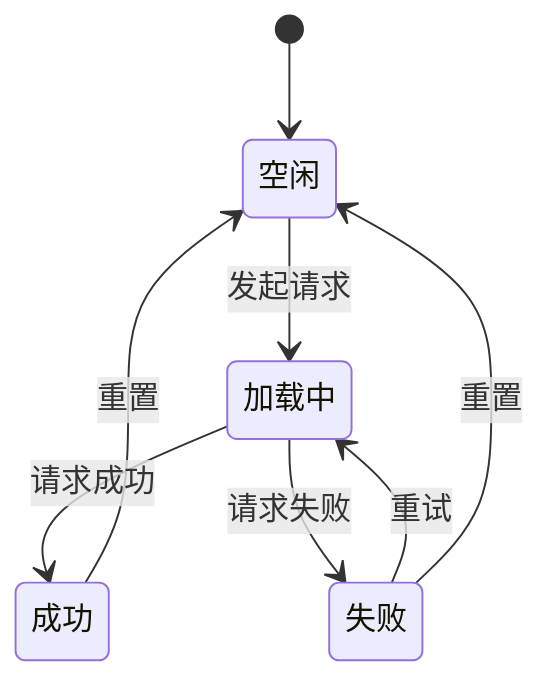
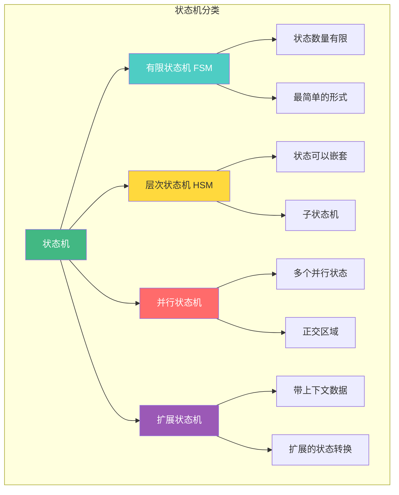
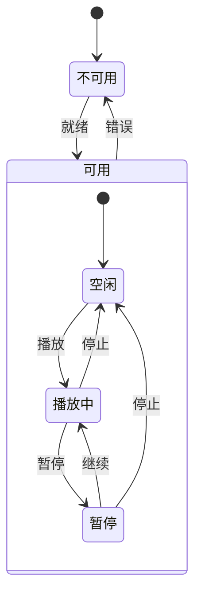
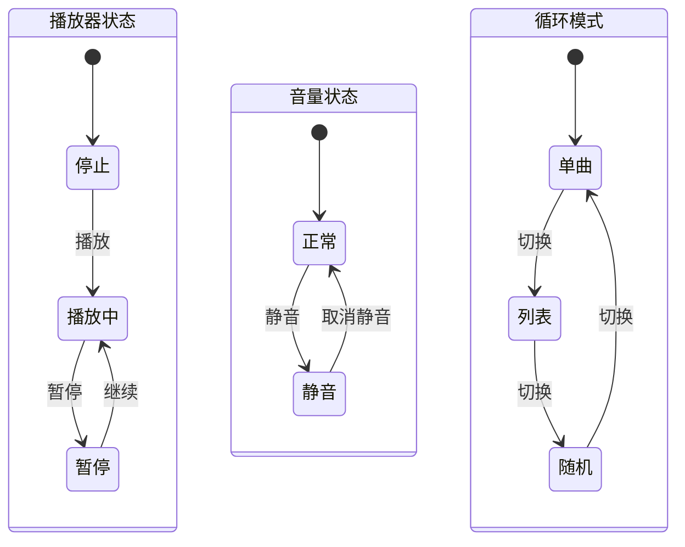
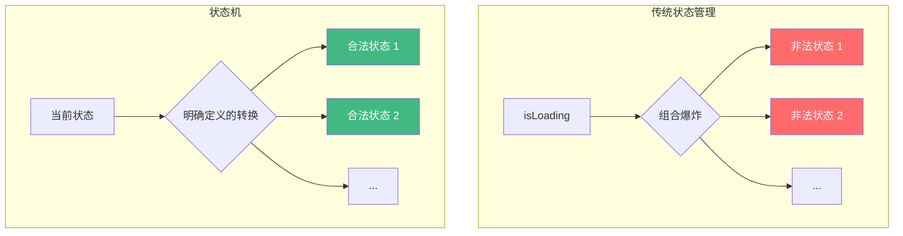
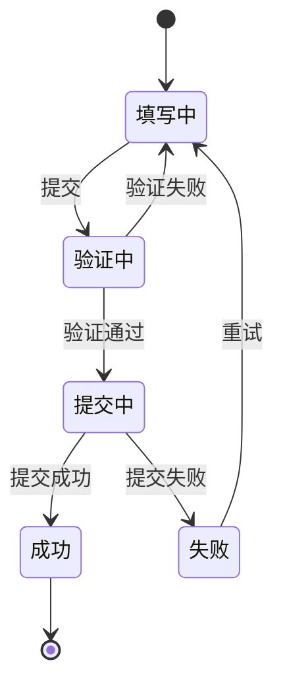
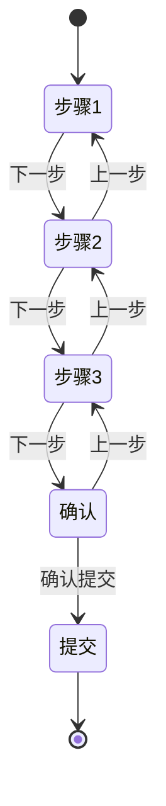

# 状态机概述

状态机（State Machine）是一种数学模型，用于描述系统在不同状态之间的转换。在前端开发中，状态机模式可以帮助我们管理复杂的 UI 状态、业务流程和用户交互。

## 什么是状态机？



状态机由四个核心要素组成：

| 要素 | 说明 | 示例 |
|------|------|------|
| **状态 (State)** | 系统可能处于的情况 | 空闲、加载中、成功、失败 |
| **事件 (Event)** | 触发状态转换的信号 | 发起请求、请求成功、请求失败 |
| **转换 (Transition)** | 从一个状态到另一个状态的变化 | 空闲 → 加载中 |
| **动作 (Action)** | 状态转换时执行的操作 | 发送 API 请求、更新 UI |

## 状态机的类型



### 有限状态机 (FSM)

最基本的类型，状态数量有限且明确：

```javascript
// 简单的有限状态机实现
function createFSM(config) {
  let currentState = config.initial;

  return {
    getState: () => currentState,
    send: (event) => {
      const transition = config.states[currentState]?.on?.[event];
      if (transition) {
        currentState = transition.target;
        transition.actions?.forEach(action => action());
      }
    }
  };
}

// 使用示例
const fetchMachine = createFSM({
  initial: 'idle',
  states: {
    idle: {
      on: {
        FETCH: {
          target: 'loading',
          actions: [() => console.log('开始加载')]
        }
      }
    },
    loading: {
      on: {
        SUCCESS: {
          target: 'success',
          actions: [() => console.log('加载成功')]
        },
        FAILURE: {
          target: 'failure',
          actions: [() => console.log('加载失败')]
        }
      }
    },
    success: {
      on: {
        RESET: { target: 'idle' }
      }
    },
    failure: {
      on: {
        RETRY: { target: 'loading' },
        RESET: { target: 'idle' }
      }
    }
  }
});

// 使用
fetchMachine.send('FETCH');   // idle → loading
fetchMachine.send('SUCCESS'); // loading → success
console.log(fetchMachine.getState()); // 'success'
```

### 层次状态机 (HSM)

状态可以嵌套，形成父子关系：



### 并行状态机

多个状态同时存在：



## 为什么使用状态机？

### 传统状态管理的问题

```javascript
// 传统方式：使用布尔值管理状态
const [isLoading, setIsLoading] = useState(false);
const [isError, setIsError] = useState(false);
const [isSuccess, setIsSuccess] = useState(false);
const [data, setData] = useState(null);

// 问题：可能存在非法状态组合
// isLoading = true, isError = true  // 不应该同时为 true
// isLoading = true, isSuccess = true // 不应该同时为 true
```

### 状态机的优势



| 优势 | 说明 |
|------|------|
| **消除非法状态** | 每个状态都是明确定义的，不存在非法组合 |
| **可预测性** | 状态转换是确定性的，相同输入产生相同结果 |
| **可测试性** | 状态机可以独立测试，不依赖 UI 框架 |
| **可视化** | 状态图可以直观展示系统行为 |
| **可维护性** | 新增状态或转换只需修改配置 |

## 状态机在前端的应用场景

### 1. 表单流程



### 2. 多步骤向导



### 3. 路由状态管理

```javascript
// 路由状态机示例
const routerMachine = {
  initial: 'home',
  states: {
    home: {
      on: {
        NAVIGATE_ABOUT: { target: 'about' },
        NAVIGATE_CONTACT: { target: 'contact' }
      }
    },
    about: {
      on: {
        NAVIGATE_HOME: { target: 'home' },
        NAVIGATE_CONTACT: { target: 'contact' }
      }
    },
    contact: {
      on: {
        NAVIGATE_HOME: { target: 'home' },
        NAVIGATE_ABOUT: { target: 'about' }
      }
    }
  }
};
```

## 前端状态机库

| 库 | 特点 | 适用场景 |
|---|------|---------|
| **XState** | 功能完整，支持所有状态机类型 | 复杂业务流程 |
| **Robot** | 轻量级，API 简洁 | 简单状态管理 |
| **State.js** | 支持层次状态机 | 复杂嵌套状态 |
| **Jasmine** | 函数式风格 | 函数式编程项目 |

## 面试要点

### Q: 什么是状态机？它解决了什么问题？

**A**: 状态机是一种描述系统状态转换的数学模型，由状态、事件、转换和动作四个要素组成。它解决了以下问题：
1. **非法状态**：通过明确定义的状态和转换，消除非法状态组合
2. **状态管理混乱**：提供清晰的状态转换图，便于理解和维护
3. **可测试性**：状态机可以独立于 UI 进行测试
4. **可预测性**：相同输入总是产生相同输出

### Q: 有限状态机和扩展状态机有什么区别？

**A**:
- **有限状态机 (FSM)**：只有有限的状态，状态之间通过事件转换
- **扩展状态机**：在 FSM 基础上增加了上下文数据（context），可以根据上下文决定转换

```javascript
// FSM：只有状态
const fsm = { state: 'loading' }

// 扩展状态机：状态 + 上下文
const extended = {
  state: 'loading',
  context: { retryCount: 3, data: null }
}
```

### Q: 什么时候应该使用状态机？

**A**: 适合使用状态机的场景：
1. **复杂的状态转换**：多个状态之间有复杂的转换关系
2. **业务流程**：表单、向导、工作流等有明确步骤的流程
3. **UI 交互**：按钮、弹窗、菜单等有多种状态的组件
4. **需要可视化**：需要向团队展示系统行为

不适合的场景：
1. 简单的 boolean 状态
2. 纯数据管理（使用状态管理库更合适）

## 推荐阅读

- [XState 官方文档](https://xstate.js.org/)
- [Statecharts: A Visual Formalism for Complex Systems](https://www.sciencedirect.com/science/article/pii/0167642387900359)
- [Understanding State Machines](https://www.freecodecamp.org/news/state-machines-basics-of-computer-science-d42855debc66/)
