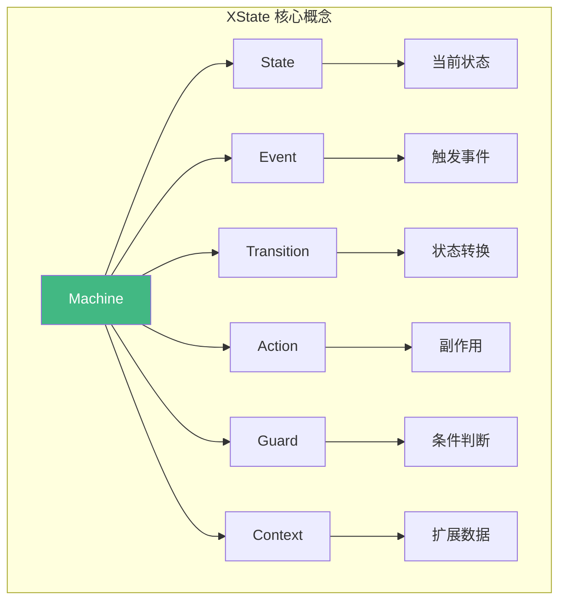
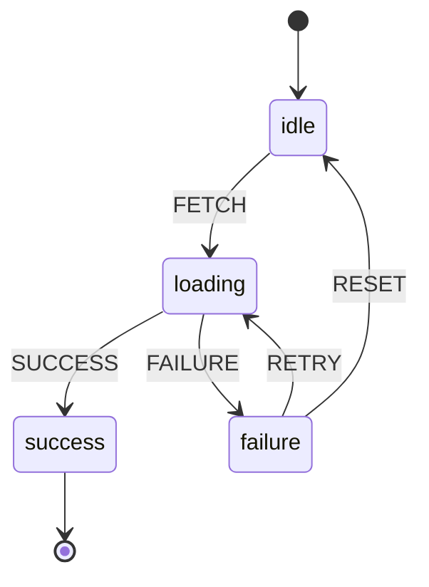
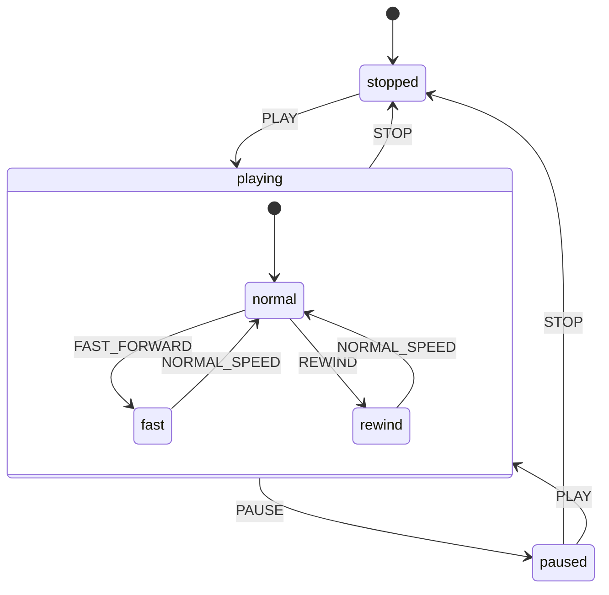
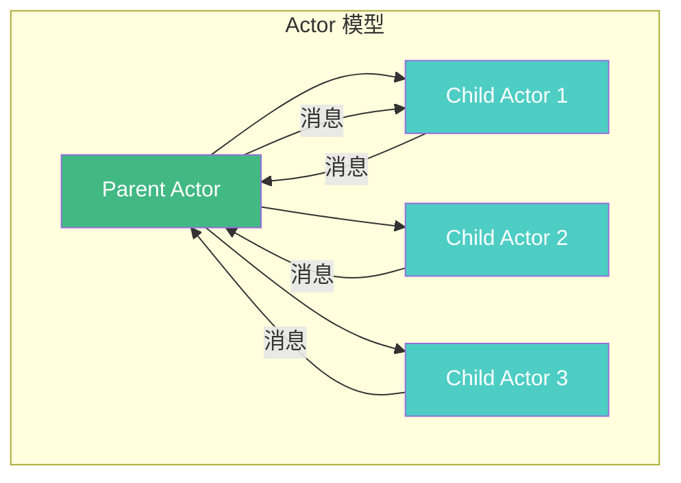
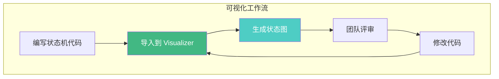

# XState 详解

XState 是一个基于状态机和状态图的 JavaScript/TypeScript 库，用于管理复杂的应用状态。它遵循 W3C 的 Statecharts XML 规范，提供了强大的状态管理能力。

## XState 核心概念



## 创建状态机

### 基础用法

```typescript
import { createMachine, interpret } from 'xstate';

// 定义状态机
const fetchMachine = createMachine({
  id: 'fetch',
  initial: 'idle',
  context: {
    data: null,
    error: null,
    retryCount: 0
  },
  states: {
    idle: {
      on: {
        FETCH: { target: 'loading' }
      }
    },
    loading: {
      on: {
        SUCCESS: { target: 'success' },
        FAILURE: { target: 'failure' }
      }
    },
    success: {
      type: 'final'
    },
    failure: {
      on: {
        RETRY: { target: 'loading' },
        RESET: { target: 'idle' }
      }
    }
  }
});

// 创建服务
const service = interpret(fetchMachine);

// 订阅状态变化
service.onTransition((state) => {
  console.log('当前状态:', state.value);
  console.log('上下文:', state.context);
});

// 启动服务
service.start();

// 发送事件
service.send({ type: 'FETCH' });
service.send({ type: 'SUCCESS', data: { id: 1, name: 'Test' } });
```

### TypeScript 类型定义

```typescript
import { createMachine, assign } from 'xstate';

// 定义事件类型
type FetchEvent =
  | { type: 'FETCH' }
  | { type: 'SUCCESS'; data: any }
  | { type: 'FAILURE'; error: string }
  | { type: 'RETRY' }
  | { type: 'RESET' };

// 定义上下文类型
interface FetchContext {
  data: any;
  error: string | null;
  retryCount: number;
}

// 创建类型安全的状态机
const fetchMachine = createMachine<FetchContext, FetchEvent>({
  id: 'fetch',
  initial: 'idle',
  context: {
    data: null,
    error: null,
    retryCount: 0
  },
  states: {
    idle: {
      on: { FETCH: { target: 'loading' } }
    },
    loading: {
      invoke: {
        src: 'fetchData',
        onDone: {
          target: 'success',
          actions: assign({ data: (_, event) => event.data })
        },
        onError: {
          target: 'failure',
          actions: assign({ error: (_, event) => event.data.message })
        }
      }
    },
    success: {
      type: 'final'
    },
    failure: {
      on: {
        RETRY: {
          target: 'loading',
          actions: assign({ retryCount: (context) => context.retryCount + 1 })
        },
        RESET: {
          target: 'idle',
          actions: assign({ data: null, error: null, retryCount: 0 })
        }
      }
    }
  }
});
```

## 状态图 (Statechart)

状态图是状态机的可视化表示，XState 完整支持状态图规范。

### 基本状态图



### 层次状态 (Hierarchical States)

```typescript
const playerMachine = createMachine({
  id: 'player',
  initial: 'stopped',
  states: {
    stopped: {
      on: { PLAY: 'playing' }
    },
    playing: {
      initial: 'normal',
      states: {
        normal: {
          on: { FAST_FORWARD: 'fast', REWIND: 'rewind' }
        },
        fast: {
          on: { NORMAL_SPEED: 'normal' }
        },
        rewind: {
          on: { NORMAL_SPEED: 'normal' }
        }
      },
      on: {
        PAUSE: 'paused',
        STOP: 'stopped'
      }
    },
    paused: {
      on: {
        PLAY: 'playing',
        STOP: 'stopped'
      }
    }
  }
});
```



### 并行状态 (Parallel States)

```typescript
const formMachine = createMachine({
  id: 'form',
  type: 'parallel',
  states: {
    // 并行区域 1：表单数据
    formData: {
      initial: 'editing',
      states: {
        editing: {
          on: { SUBMIT: 'validating' }
        },
        validating: {
          on: {
            VALID: 'submitting',
            INVALID: 'editing'
          }
        },
        submitting: {
          on: {
            SUCCESS: 'success',
            FAILURE: 'editing'
          }
        },
        success: { type: 'final' }
      }
    },
    // 并行区域 2：UI 状态
    uiState: {
      initial: 'pristine',
      states: {
        pristine: {
          on: { DIRTY: 'dirty' }
        },
        dirty: {
          on: { PRISTINE: 'pristine' }
        }
      }
    },
    // 并行区域 3：验证状态
    validation: {
      initial: 'invalid',
      states: {
        invalid: {
          on: { VALIDATE: 'valid' }
        },
        valid: {
          on: { INVALIDATE: 'invalid' }
        }
      }
    }
  }
});
```

## Actor 模型

XState 5 引入了 Actor 模型，允许状态机与其他状态机或异步服务通信。



### 调用子状态机

```typescript
import { createMachine, sendParent } from 'xstate';

// 子状态机：处理单个表单项
const fieldMachine = createMachine({
  id: 'field',
  initial: 'idle',
  context: {
    value: '',
    error: null
  },
  states: {
    idle: {
      on: {
        CHANGE: {
          actions: assign({ value: (_, event) => event.value })
        },
        VALIDATE: { target: 'validating' }
      }
    },
    validating: {
      always: [
        {
          target: 'valid',
          cond: (context) => context.value.length > 0,
          actions: sendParent({ type: 'FIELD_VALID' })
        },
        {
          target: 'invalid',
          actions: [
            assign({ error: '字段不能为空' }),
            sendParent({ type: 'FIELD_INVALID' })
          ]
        }
      ]
    },
    valid: {
      on: { CHANGE: 'idle' }
    },
    invalid: {
      on: { CHANGE: 'idle' }
    }
  }
});

// 父状态机：协调多个表单项
const formMachine = createMachine({
  id: 'form',
  initial: 'editing',
  context: {
    fields: {}
  },
  states: {
    editing: {
      on: { SUBMIT: 'validating' }
    },
    validating: {
      invoke: {
        id: 'fieldValidator',
        src: fieldMachine,
        onDone: 'submitting'
      }
    },
    submitting: {
      invoke: {
        src: 'submitForm',
        onDone: 'success',
        onError: 'editing'
      }
    },
    success: { type: 'final' }
  }
});
```

## Guard（条件守卫）

Guard 用于决定是否允许状态转换。

```typescript
const authMachine = createMachine({
  id: 'auth',
  initial: 'idle',
  context: {
    user: null,
    token: null
  },
  states: {
    idle: {
      on: {
        LOGIN: {
          target: 'authenticating',
          // Guard：检查是否有登录凭证
          guard: (_, event) => event.username && event.password
        }
      }
    },
    authenticating: {
      invoke: {
        src: 'loginService',
        onDone: {
          target: 'authenticated',
          actions: assign({
            user: (_, event) => event.data.user,
            token: (_, event) => event.data.token
          })
        },
        onError: 'error'
      }
    },
    authenticated: {
      on: {
        LOGOUT: { target: 'idle' },
        // Guard：检查用户角色
        ACCESS_ADMIN: {
          target: 'admin',
          guard: (context) => context.user?.role === 'admin'
        }
      }
    },
    admin: {
      on: {
        LOGOUT: { target: 'idle' }
      }
    },
    error: {
      on: {
        RETRY: 'idle'
      }
    }
  }
});
```

### Guard 组合

```typescript
import { not, and, or } from 'xstate';

const machine = createMachine({
  // ...
  states: {
    someState: {
      on: {
        EVENT: {
          target: 'nextState',
          // 组合 Guard
          guard: and([
            'isAuthenticated',
            not('isExpired'),
            or(['isAdmin', 'isModerator'])
          ])
        }
      }
    }
  }
});
```

## Action（动作）

Action 是状态转换时执行的副作用，分为三类：

### 1. 进入动作 (Entry Action)

```typescript
const machine = createMachine({
  states: {
    loading: {
      entry: ['showSpinner', 'logLoadingStart'],
      // ...
    }
  }
});
```

### 2. 退出动作 (Exit Action)

```typescript
const machine = createMachine({
  states: {
    loading: {
      exit: ['hideSpinner', 'logLoadingEnd'],
      // ...
    }
  }
});
```

### 3. 转换动作 (Transition Action)

```typescript
const machine = createMachine({
  states: {
    idle: {
      on: {
        FETCH: {
          target: 'loading',
          actions: ['assignData', 'logFetch']
        }
      }
    }
  }
});
```

### 内置 Action

```typescript
import { assign, send, raise, log } from 'xstate';

const machine = createMachine({
  context: { count: 0 },
  states: {
    active: {
      on: {
        INCREMENT: {
          actions: [
            // 更新上下文
            assign({ count: (context) => context.count + 1 }),
            // 记录日志
            log((context) => `Count: ${context.count}`),
            // 发送事件给自身
            raise({ type: 'CHECK_THRESHOLD' })
          ]
        },
        CHECK_THRESHOLD: {
          guard: (context) => context.count >= 10,
          target: 'complete'
        }
      }
    }
  }
});
```

## Invoke（调用异步服务）

`invoke` 用于调用 Promise、Observable、Callback 或其他状态机。

```typescript
const fetchMachine = createMachine({
  id: 'fetch',
  initial: 'idle',
  states: {
    idle: {
      on: { FETCH: 'loading' }
    },
    loading: {
      invoke: {
        id: 'fetchData',
        src: (context, event) =>
          fetch(`/api/data/${event.id}`)
            .then(res => res.json()),
        onDone: {
          target: 'success',
          actions: assign({ data: (_, event) => event.data })
        },
        onError: {
          target: 'failure',
          actions: assign({ error: (_, event) => event.data.message })
        }
      }
    },
    success: {
      type: 'final'
    },
    failure: {
      on: { RETRY: 'loading' }
    }
  }
});
```

## 与 Vue 集成

```vue
<script setup>
import { useMachine } from '@xstate/vue';
import { fetchMachine } from './machines/fetch';

const { state, send } = useMachine(fetchMachine);

const handleFetch = () => {
  send({ type: 'FETCH' });
};

const handleRetry = () => {
  send({ type: 'RETRY' });
};
</script>

<template>
  <div>
    <div v-if="state.matches('idle')">
      <button @click="handleFetch">加载数据</button>
    </div>

    <div v-if="state.matches('loading')">
      <p>加载中...</p>
    </div>

    <div v-if="state.matches('success')">
      <p>{{ state.context.data }}</p>
    </div>

    <div v-if="state.matches('failure')">
      <p>错误: {{ state.context.error }}</p>
      <button @click="handleRetry">重试</button>
    </div>
  </div>
</template>
```

## 可视化工具

### XState Visualizer

XState 提供了在线可视化工具：[stately.ai/viz](https://stately.ai/viz)



### Stately Studio

Stately Studio 是 XState 的官方可视化编辑器，支持：
- 拖拽创建状态和转换
- 导出为 XState 代码
- 团队协作
- 测试用例生成

## 面试要点

### Q: XState 的核心优势是什么？

**A**: XState 的核心优势：
1. **可视化**：状态图可以直观展示系统行为，便于团队沟通
2. **可预测**：状态转换是确定性的，相同输入产生相同输出
3. **可测试**：状态机可以独立测试，不依赖 UI 框架
4. **符合标准**：遵循 W3C Statecharts XML 规范
5. **TypeScript 支持**：完整的类型定义，减少运行时错误

### Q: XState 的 Actor 模型是什么？

**A**: Actor 模型是一种并发计算模型，在 XState 中：
- 每个状态机都是一个 Actor
- Actor 之间通过消息通信
- 父 Actor 可以创建和管理子 Actor
- 子 Actor 可以向父 Actor 发送消息

这种模型非常适合处理复杂的异步流程和分布式系统。

### Q: Guard 和 Action 有什么区别？

**A**:
- **Guard**：用于决定是否允许状态转换，是一个纯函数，返回 boolean
- **Action**：用于执行副作用，如更新上下文、发送事件、调用 API 等

```typescript
// Guard：判断是否允许转换
guard: (context) => context.user !== null

// Action：执行副作用
actions: assign({ user: (_, event) => event.data })
```

### Q: 如何处理复杂的异步流程？

**A**: 使用 XState 的 `invoke` 和 Actor 模型：

1. **单个异步操作**：使用 `invoke` 调用 Promise
2. **多个并行操作**：使用并行状态或多个子 Actor
3. **顺序操作**：使用状态链或活动（Activity）
4. **取消操作**：使用 `invoke` 的 `onDone`/`onError` 处理

## 常见陷阱

1. **过度设计**：简单状态不需要状态机，避免过度工程化
2. **忽略类型安全**：使用 TypeScript 定义严格的事件和上下文类型
3. **Action 副作用**：Action 应该是纯函数或明确的副作用
4. **状态爆炸**：合理使用层次状态和并行状态，避免状态数量爆炸
5. **忽略可视化**：状态图是 XState 的核心价值，务必充分利用
