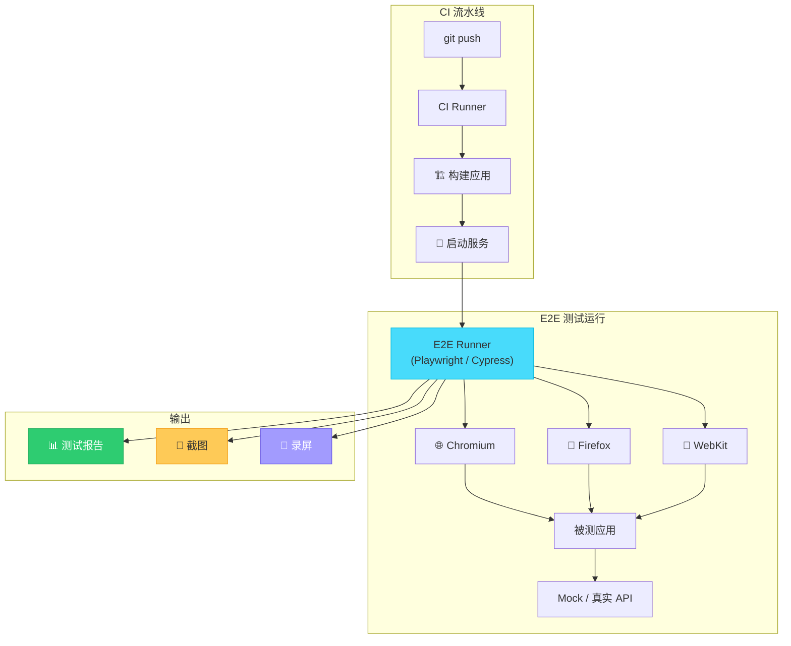
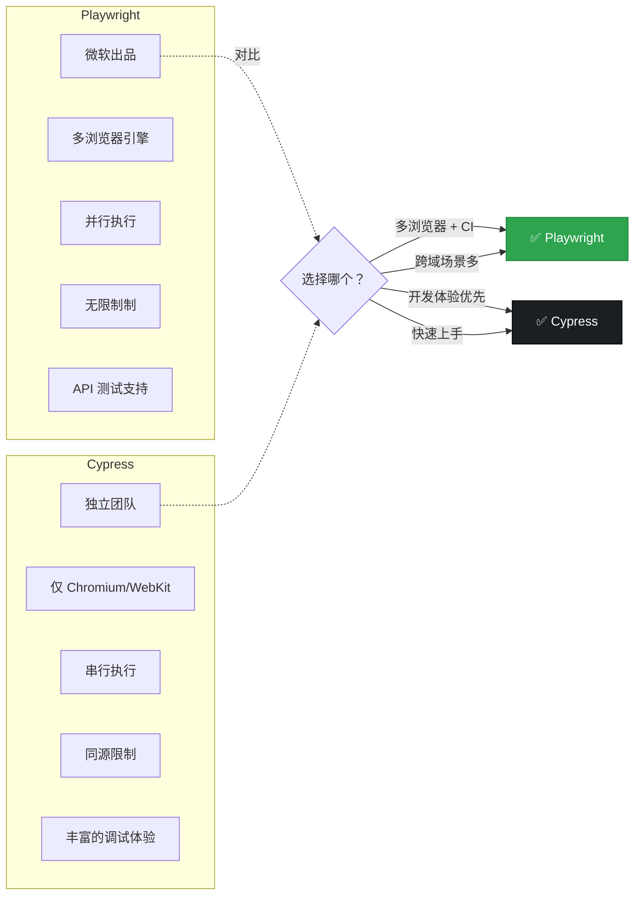
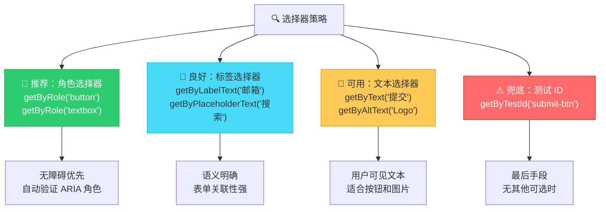
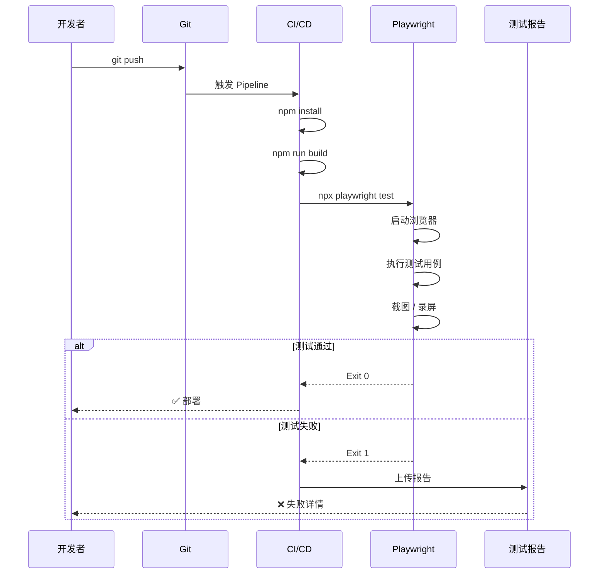
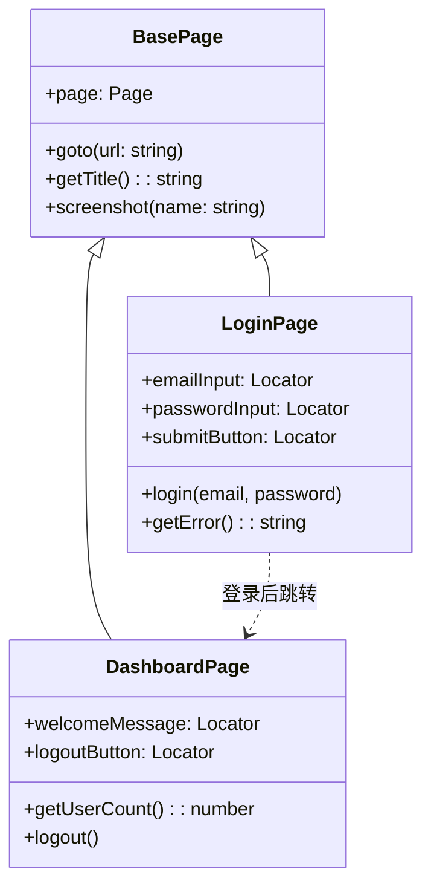

# E2E 测试详解

端到端（End-to-End）测试模拟真实用户操作，在真实浏览器中验证完整业务流程。它是测试金字塔顶层，提供最高信心但成本也最高。

---

## E2E 测试架构



---

## Playwright vs Cypress 对比



| 特性 | Playwright | Cypress |
|------|-----------|---------|
| 浏览器支持 | Chromium, Firefox, WebKit | Chromium, Firefox, WebKit |
| 并行执行 | 原生支持 | 需付费 Cloud |
| 跨域限制 | 无限制 | 同源限制（可通过配置绕过） |
| 调试体验 | Trace Viewer, Inspector | Time Travel, DevTools |
| API 测试 | 原生支持 | 需插件 |
| 学习曲线 | 中等 | 较低 |
| 社区生态 | 快速增长 | 成熟丰富 |

---

## Playwright 核心用法

### 配置文件

```typescript
// playwright.config.ts
import { defineConfig, devices } from '@playwright/test';

export default defineConfig({
  testDir: './e2e',
  fullyParallel: true,
  forbidOnly: !!process.env.CI,
  retries: process.env.CI ? 2 : 0,
  workers: process.env.CI ? 1 : undefined,
  reporter: 'html',

  use: {
    baseURL: 'http://localhost:3000',
    trace: 'on-first-retry',
    screenshot: 'only-on-failure',
    video: 'retain-on-failure',
  },

  projects: [
    { name: 'chromium', use: { ...devices['Desktop Chrome'] } },
    { name: 'firefox', use: { ...devices['Desktop Firefox'] } },
    { name: 'webkit', use: { ...devices['Desktop Safari'] } },
    { name: 'mobile', use: { ...devices['iPhone 14'] } },
  ],

  webServer: {
    command: 'npm run dev',
    url: 'http://localhost:3000',
    reuseExistingServer: !process.env.CI,
  },
});
```

### 基础测试示例

```typescript
// e2e/login.spec.ts
import { test, expect } from '@playwright/test';

test.describe('用户登录', () => {
  test('should login successfully with valid credentials', async ({ page }) => {
    // 导航到登录页
    await page.goto('/login');

    // 填写表单
    await page.getByLabel('邮箱').fill('test@example.com');
    await page.getByLabel('密码').fill('password123');

    // 点击登录
    await page.getByRole('button', { name: '登录' }).click();

    // 验证跳转到首页
    await expect(page).toHaveURL('/dashboard');
    await expect(page.getByText('欢迎回来')).toBeVisible();
  });

  test('should show error for invalid credentials', async ({ page }) => {
    await page.goto('/login');

    await page.getByLabel('邮箱').fill('wrong@example.com');
    await page.getByLabel('密码').fill('wrongpassword');
    await page.getByRole('button', { name: '登录' }).click();

    await expect(page.getByText('邮箱或密码错误')).toBeVisible();
    await expect(page).toHaveURL('/login');
  });
});
```

---

## 选择器策略



### 选择器示例对比

```typescript
// ❌ 脆弱的选择器 — 依赖实现细节
await page.locator('div.container > form > input:nth-child(2)').fill('test');
await page.locator('.btn-primary').click();
await page.locator('#submit-button').click();

// ✅ 推荐的选择器 — 语义清晰
await page.getByLabel('邮箱').fill('test@example.com');
await page.getByRole('button', { name: '登录' }).click();
await page.getByText('提交订单').click();
await page.getByAltText('用户头像').click();

// 🔧 兜底方案 — data-testid
await page.getByTestId('custom-widget').click();
```

---

## Cypress 核心用法

### 配置文件

```typescript
// cypress.config.ts
import { defineConfig } from 'cypress';

export default defineConfig({
  e2e: {
    baseUrl: 'http://localhost:3000',
    viewportWidth: 1280,
    viewportHeight: 720,
    video: true,
    screenshotOnRunFailure: true,
    retries: {
      runMode: 2,    // CI 中重试
      openMode: 0,   // 本地不重试
    },
    setupNodeEvents(on, config) {
      // 插件配置
    },
  },
});
```

### 基础测试示例

```typescript
// cypress/e2e/shopping.cy.ts
describe('购物流程', () => {
  beforeEach(() => {
    cy.visit('/');
  });

  it('should complete a purchase flow', () => {
    // 浏览商品
    cy.get('[data-cy="product-card"]').first().click();
    cy.get('[data-cy="product-title"]').should('contain', 'iPhone');

    // 添加到购物车
    cy.get('[data-cy="add-to-cart"]').click();
    cy.get('[data-cy="cart-badge"]').should('contain', '1');

    // 进入购物车
    cy.get('[data-cy="cart-link"]').click();
    cy.url().should('include', '/cart');

    // 结算
    cy.get('[data-cy="checkout-btn"]').click();
    cy.get('[data-cy="order-confirmation"]').should('be.visible');
  });
});
```

---

## E2E 测试与 CI 集成



### GitHub Actions 配置

```yaml
# .github/workflows/e2e.yml
name: E2E Tests

on:
  push:
    branches: [main]
  pull_request:
    branches: [main]

jobs:
  e2e:
    runs-on: ubuntu-latest
    steps:
      - uses: actions/checkout@v4
      - uses: actions/setup-node@v4
        with:
          node-version: 20

      - name: Install dependencies
        run: npm ci

      - name: Install Playwright Browsers
        run: npx playwright install --with-deps

      - name: Run E2E tests
        run: npx playwright test

      - name: Upload report
        uses: actions/upload-artifact@v4
        if: always()
        with:
          name: playwright-report
          path: playwright-report/
          retention-days: 30
```

### Playwright 失败截图与 Trace

```typescript
// playwright.config.ts — 失败时自动保留调试信息
use: {
  trace: 'on-first-retry',     // 失败重试时录制 Trace
  screenshot: 'only-on-failure', // 失败时截图
  video: 'retain-on-failure',    // 失败时保留录屏
},
```

---

## Page Object 模式



```typescript
// pages/LoginPage.ts
import { Page, Locator } from '@playwright/test';

export class LoginPage {
  readonly page: Page;
  readonly emailInput: Locator;
  readonly passwordInput: Locator;
  readonly submitButton: Locator;
  readonly errorMessage: Locator;

  constructor(page: Page) {
    this.page = page;
    this.emailInput = page.getByLabel('邮箱');
    this.passwordInput = page.getByLabel('密码');
    this.submitButton = page.getByRole('button', { name: '登录' });
    this.errorMessage = page.getByTestId('error-message');
  }

  async goto() {
    await this.page.goto('/login');
  }

  async login(email: string, password: string) {
    await this.emailInput.fill(email);
    await this.passwordInput.fill(password);
    await this.submitButton.click();
  }

  async getError(): Promise<string> {
    return (await this.errorMessage.textContent()) ?? '';
  }
}

// e2e/login.spec.ts — 使用 Page Object
import { test, expect } from '@playwright/test';
import { LoginPage } from '../pages/LoginPage';

test('login with valid credentials', async ({ page }) => {
  const loginPage = new LoginPage(page);
  await loginPage.goto();
  await loginPage.login('test@example.com', 'password123');

  await expect(page).toHaveURL('/dashboard');
});
```

---

## 最佳实践

| 实践 | 说明 |
|------|------|
| 独立测试数据 | 每个测试使用独立数据，避免互相干扰 |
| 选择语义化选择器 | 优先用 `getByRole`、`getByLabel` |
| 等待策略 | 用 `expect(...).toBeVisible()` 代替 `waitForTimeout` |
| Page Object 模式 | 封装页面操作，提高复用性 |
| 失败截图/录屏 | CI 中保留调试信息 |
| 并行执行 | Playwright 原生并行，加速 CI |
| 只测关键路径 | E2E 测试成本高，覆盖核心流程即可 |

---

## 面试高频问题

1. **Playwright 和 Cypress 的区别是什么？如何选择？**
2. **E2E 测试的选择器策略有哪些？优先级如何排序？**
3. **什么是 Page Object 模式？有什么好处？**
4. **如何在 CI 中集成 E2E 测试？**
5. **E2E 测试的稳定性问题（Flaky Test）如何解决？**
6. **E2E 测试应该覆盖哪些场景？**
7. **如何调试失败的 E2E 测试？**

---

## 参考资源

- [Playwright 官方文档](https://playwright.dev/)
- [Cypress 官方文档](https://docs.cypress.io/)
- [Playwright Best Practices](https://playwright.dev/docs/best-practices)
- [Cypress Best Practices](https://docs.cypress.io/guides/references/best-practices)
