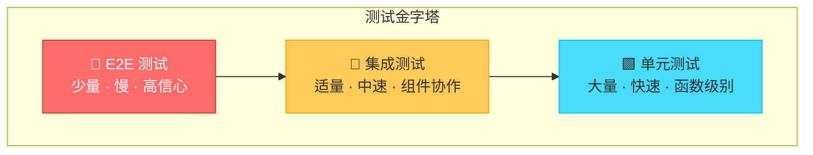
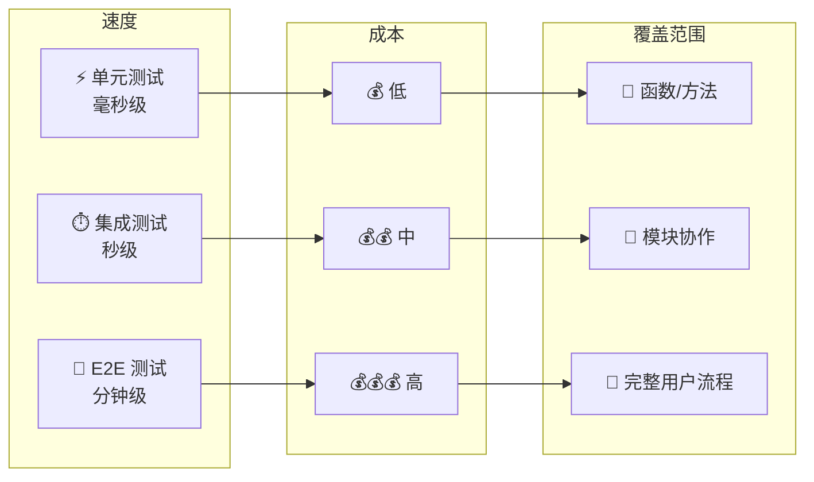
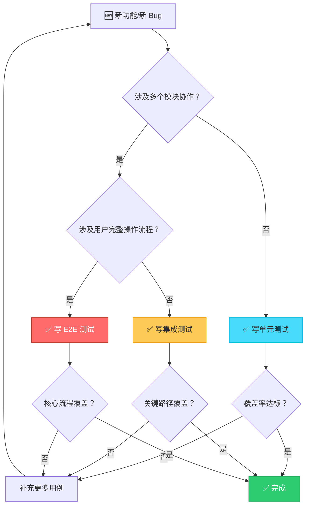
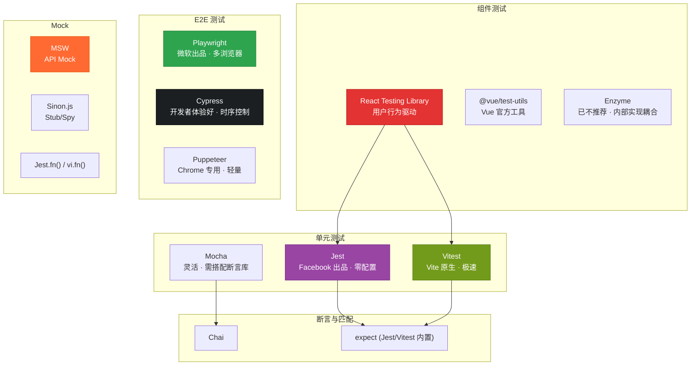

# 前端测试概述

前端测试是保障应用质量的核心手段。本文从全局视角梳理前端测试体系，帮助你建立完整的测试认知框架。

---

## 为什么需要前端测试

| 维度 | 无测试 | 有测试 |
|------|--------|--------|
| 重构信心 | 提心吊胆，怕改坏 | 自信重构，秒级反馈 |
| Bug 发现时机 | 线上用户发现 | 开发阶段拦截 |
| 协作效率 | 手动回归，耗时耗力 | 自动化回归，快速验证 |
| 文档作用 | 代码即文档，但无人敢信 | 测试即活文档，行为可读 |
| 发布节奏 | 每次发布如履薄冰 | 持续交付，快速迭代 |

---

## 测试金字塔

测试金字塔是 Mike Cohn 在《Succeeding with Agile》中提出的经典模型，它描述了不同层级测试的数量比例和执行速度。

### 各层级特征对比

---

## 测试策略选择流程

面对一个具体需求，如何决定写哪种测试？参考以下决策流程：

---

## 前端测试工具链全景

---

## 测试覆盖率指标

| 指标 | 含义 | 推荐阈值 |
|------|------|----------|
| **行覆盖率** (Line) | 有多少行被执行 | >= 80% |
| **分支覆盖率** (Branch) | if/else 是否都走到 | >= 75% |
| **函数覆盖率** (Function) | 有多少函数被调用 | >= 85% |
| **语句覆盖率** (Statement) | 有多少语句被执行 | >= 80% |

> **面试要点**：覆盖率高不等于测试质量高。100% 覆盖率但全是 `expect(true).toBe(true)` 毫无意义。关注 **有效断言** 和 **边界条件**。

---

## 子主题导航

| 文档 | 内容 | 关键词 |
|------|------|--------|
| [单元测试详解](./unit-testing.md) | Jest/Vitest 配置、Mock/Stub、覆盖率、TDD | Jest, Vitest, Mock, Coverage |
| [React 组件测试](./react-testing.md) | Testing Library 原理、渲染/事件/异步测试 | RTL, render, fireEvent, waitFor |
| [E2E 测试详解](./e2e-testing.md) | Playwright/Cypress 对比、选择器策略、CI 集成 | Playwright, Cypress, CI/CD |

---

## 面试高频问题

1. **什么是测试金字塔？各层级的比例如何分配？**
2. **单元测试、集成测试、E2E 测试的区别是什么？**
3. **如何选择合适的测试策略？**
4. **测试覆盖率 100% 是否意味着代码没有 Bug？**
5. **TDD 的流程是什么？红-绿-重构分别指什么？**

---

## 参考资源

- [Testing JavaScript — Kent C. Dodds](https://testingjavascript.com/)
- [Vitest 官方文档](https://vitest.dev/)
- [Playwright 官方文档](https://playwright.dev/)
- [React Testing Library 文档](https://testing-library.com/docs/react-testing-library/intro/)
- Martin Fowler — [Test Pyramid](https://martinfowler.com/bliki/TestPyramid.html)
