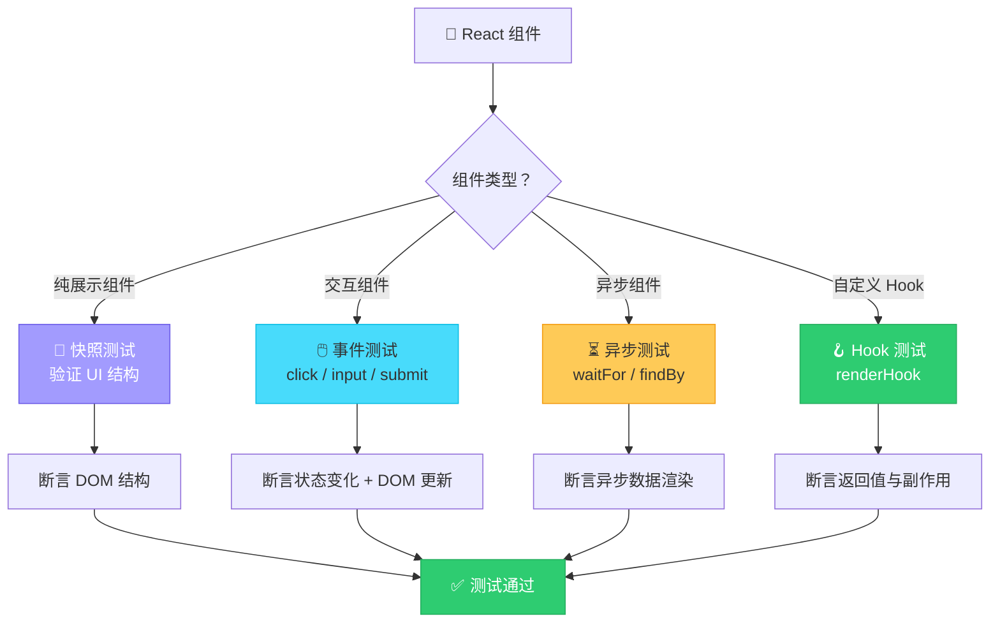
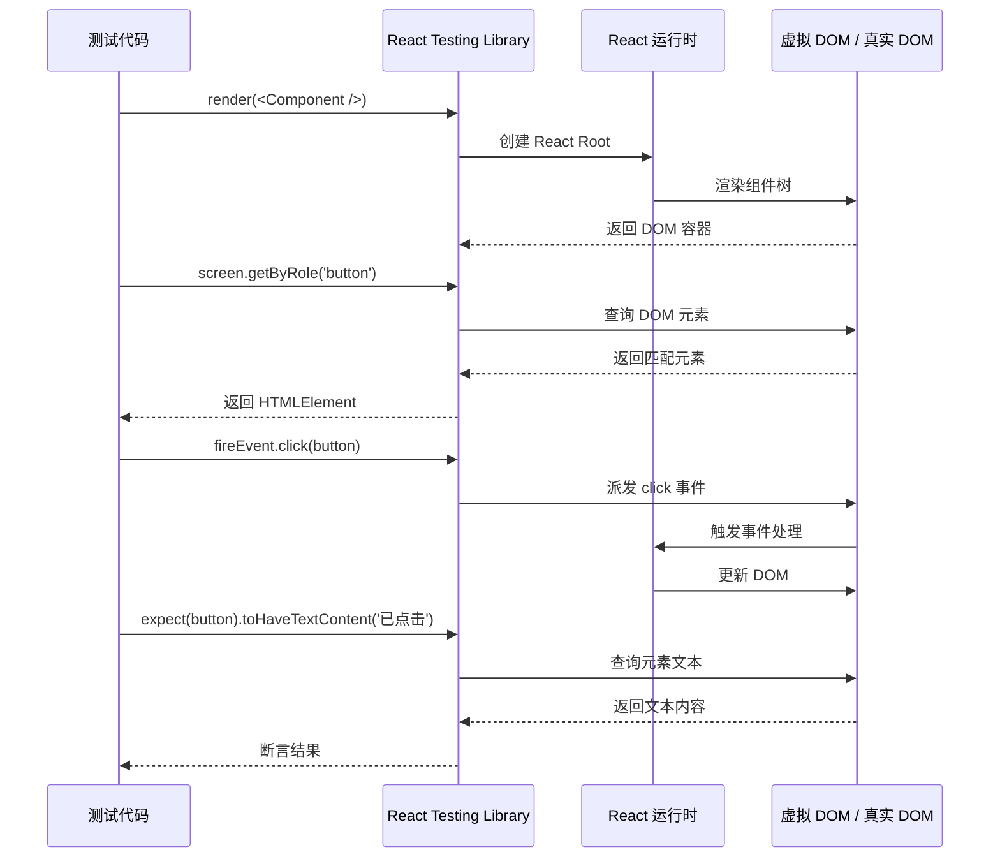
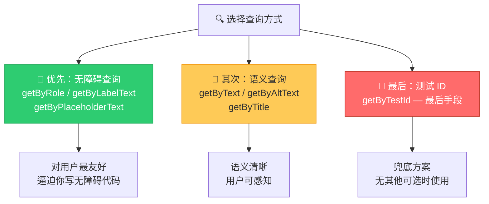
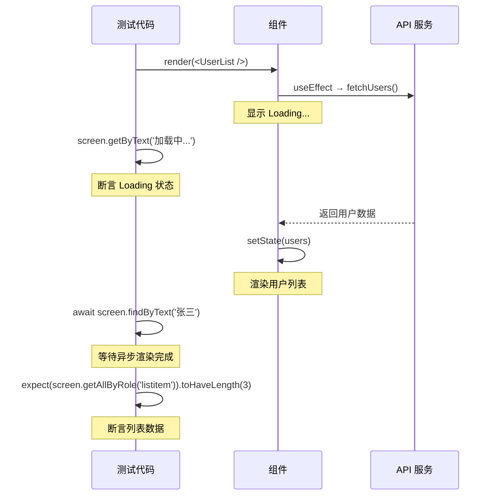
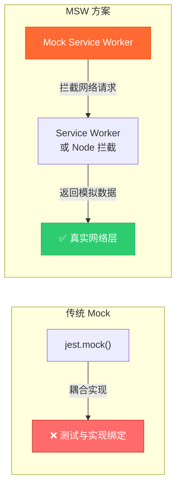

# React 组件测试

React 组件测试的核心理念：**测试用户行为，而非实现细节**。React Testing Library (RTL) 由 Kent C. Dodds 创建，强制你从用户视角编写测试。

---

## 组件测试策略



---

## Testing Library 核心原理



### 优先级：查询方式选择



---

## 渲染测试

```tsx
import { render, screen } from '@testing-library/react';
import userEvent from '@testing-library/user-event';
import { UserProfile } from './UserProfile';

describe('UserProfile', () => {
  const defaultProps = {
    name: '张三',
    email: 'zhangsan@example.com',
    avatar: 'https://example.com/avatar.jpg',
    isVerified: true,
  };

  it('should render user information correctly', () => {
    render(<UserProfile {...defaultProps} />);

    expect(screen.getByText('张三')).toBeInTheDocument();
    expect(screen.getByText('zhangsan@example.com')).toBeInTheDocument();
    expect(screen.getByRole('img', { name: /张三的头像/ })).toHaveAttribute(
      'src',
      defaultProps.avatar
    );
  });

  it('should show verified badge when user is verified', () => {
    render(<UserProfile {...defaultProps} isVerified={true} />);

    expect(screen.getByText('已认证')).toBeInTheDocument();
    expect(screen.getByRole('img', { name: /已认证/ })).toBeInTheDocument();
  });

  it('should not show verified badge when user is not verified', () => {
    render(<UserProfile {...defaultProps} isVerified={false} />);

    expect(screen.queryByText('已认证')).not.toBeInTheDocument();
  });
});
```

---

## 事件测试

```tsx
import { render, screen } from '@testing-library/react';
import userEvent from '@testing-library/user-event';
import { Counter } from './Counter';

describe('Counter', () => {
  it('should increment count when button is clicked', async () => {
    const user = userEvent.setup();
    render(<Counter initialCount={0} />);

    const button = screen.getByRole('button', { name: /增加/ });
    const countDisplay = screen.getByTestId('count-display');

    expect(countDisplay).toHaveTextContent('0');

    await user.click(button);

    expect(countDisplay).toHaveTextContent('1');
  });

  it('should call onChange callback when count changes', async () => {
    const user = userEvent.setup();
    const handleChange = vi.fn();
    render(<Counter initialCount={0} onChange={handleChange} />);

    const button = screen.getByRole('button', { name: /增加/ });
    await user.click(button);
    await user.click(button);

    expect(handleChange).toHaveBeenCalledTimes(2);
    expect(handleChange).toHaveBeenCalledWith(2);
  });
});
```

### 表单事件测试

```tsx
describe('LoginForm', () => {
  it('should submit form with correct values', async () => {
    const user = userEvent.setup();
    const handleSubmit = vi.fn();
    render(<LoginForm onSubmit={handleSubmit} />);

    // 填写表单
    await user.type(
      screen.getByLabelText(/邮箱/),
      'test@example.com'
    );
    await user.type(
      screen.getByLabelText(/密码/),
      'password123'
    );

    // 提交
    await user.click(screen.getByRole('button', { name: /登录/ }));

    expect(handleSubmit).toHaveBeenCalledWith({
      email: 'test@example.com',
      password: 'password123',
    });
  });
});
```

---

## 异步测试



```tsx
import { render, screen, waitFor } from '@testing-library/react';
import { UserList } from './UserList';

// 方式一：findBy（推荐 — 自带等待）
describe('UserList', () => {
  it('should render user list after fetch', async () => {
    // Mock API
    server.use(
      rest.get('/api/users', (req, res, ctx) => {
        return res(
          ctx.json([
            { id: '1', name: '张三' },
            { id: '2', name: '李四' },
          ])
        );
      })
    );

    render(<UserList />);

    // findBy 会自动等待元素出现（默认 1000ms）
    expect(await screen.findByText('张三')).toBeInTheDocument();
    expect(await screen.findByText('李四')).toBeInTheDocument();
  });

  // 方式二：waitFor（更灵活的等待）
  it('should show error state on fetch failure', async () => {
    server.use(
      rest.get('/api/users', (req, res, ctx) => {
        return res(ctx.status(500));
      })
    );

    render(<UserList />);

    await waitFor(() => {
      expect(screen.getByText(/加载失败/)).toBeInTheDocument();
    });
  });
});
```

---

## 自定义 Hook 测试

```tsx
import { renderHook, act } from '@testing-library/react';
import { useCounter } from './useCounter';

describe('useCounter', () => {
  it('should initialize with default value', () => {
    const { result } = renderHook(() => useCounter(0));

    expect(result.current.count).toBe(0);
  });

  it('should increment count', () => {
    const { result } = renderHook(() => useCounter(0));

    act(() => {
      result.current.increment();
    });

    expect(result.current.count).toBe(1);
  });

  it('should not exceed max value', () => {
    const { result } = renderHook(() => useCounter(9, { max: 10 }));

    act(() => {
      result.current.increment();
      result.current.increment(); // 超过 max
    });

    expect(result.current.count).toBe(10);
  });
});
```

---

## MSW — API Mock 方案



```typescript
// tests/mocks/handlers.ts
import { http, HttpResponse } from 'msw';

export const handlers = [
  http.get('/api/users', () => {
    return HttpResponse.json([
      { id: '1', name: '张三' },
      { id: '2', name: '李四' },
    ]);
  }),

  http.get('/api/users/:id', ({ params }) => {
    const { id } = params;
    return HttpResponse.json({ id, name: '张三' });
  }),
];

// tests/mocks/server.ts
import { setupServer } from 'msw/node';
import { handlers } from './handlers';

export const server = setupServer(...handlers);

// vitest.setup.ts
import { server } from './tests/mocks/server';

beforeAll(() => server.listen());
afterEach(() => server.resetHandlers());
afterAll(() => server.close());
```

---

## 最佳实践清单

| 实践 | 说明 |
|------|------|
| 查询优先用 `getByRole` | 最接近用户感知方式 |
| 用 `userEvent` 代替 `fireEvent` | 更真实的用户交互模拟 |
| 用 `findBy` 处理异步 | 自带超时与重试 |
| 测试行为而非实现 | 不要测试 state 值，测试 DOM 输出 |
| 每个测试独立 | 不依赖其他测试的执行顺序 |
| Mock 最外层 | 用 MSW 拦截网络，不要 mock 内部模块 |

---

## 面试高频问题

1. **React Testing Library 和 Enzyme 的区别？为什么推荐 RTL？**
2. **getBy、queryBy、findBy 的区别是什么？**
3. **如何测试自定义 Hook？**
4. **如何测试异步请求和 Loading 状态？**
5. **userEvent 和 fireEvent 的区别？**
6. **如何 Mock API 请求？MSW 的优势是什么？**
7. **什么是测试实现细节？为什么应该避免？**

---

## 参考资源

- [React Testing Library 官方文档](https://testing-library.com/docs/react-testing-library/intro/)
- [MSW 官方文档](https://mswjs.io/)
- [Kent C. Dodds — Testing Implementation Details](https://kentcdodds.com/blog/testing-implementation-details)
- [userEvent 文档](https://testing-library.com/docs/user-event/intro/)
