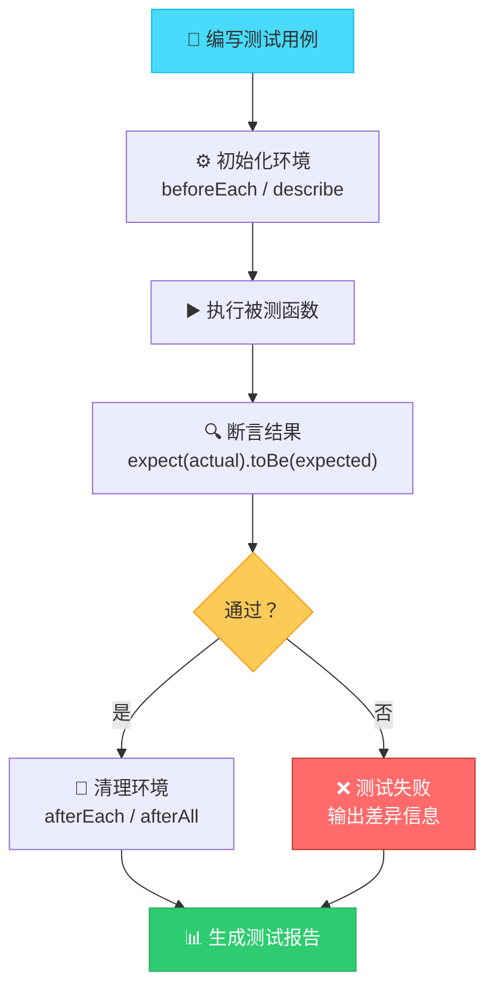
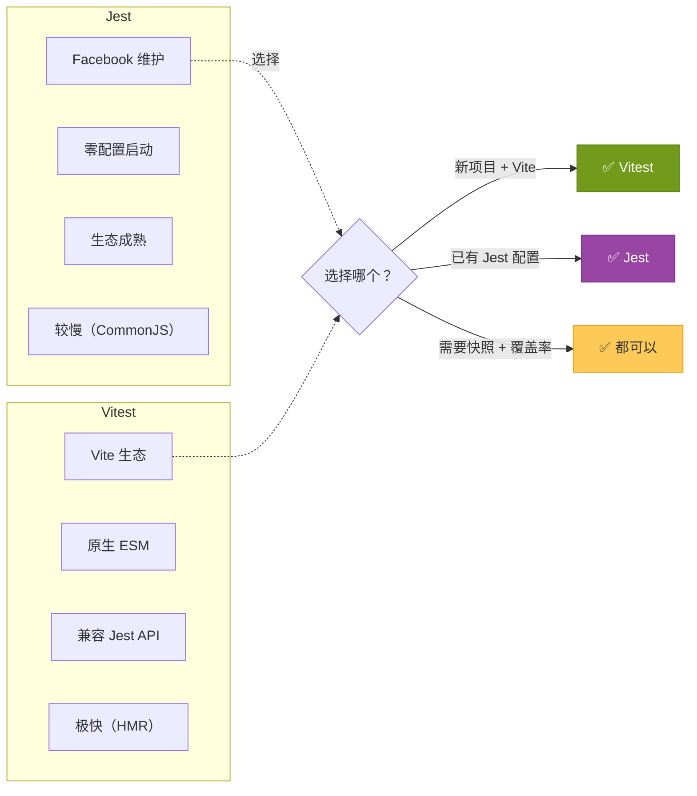
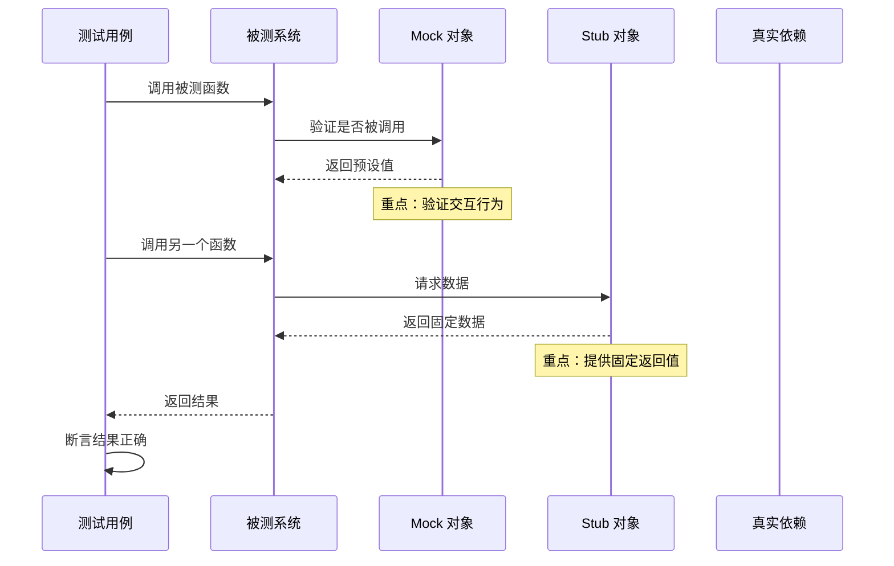
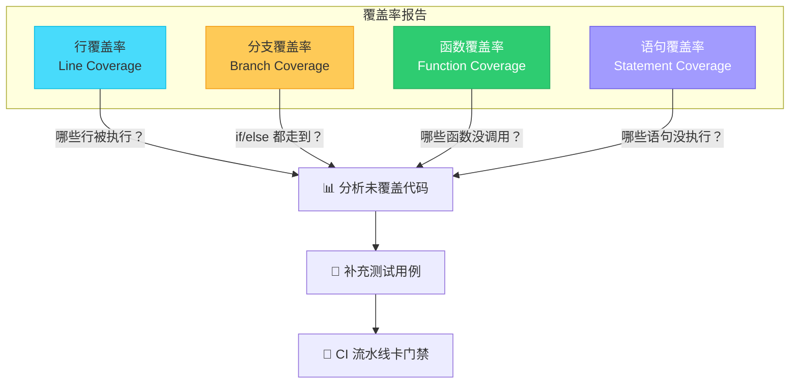
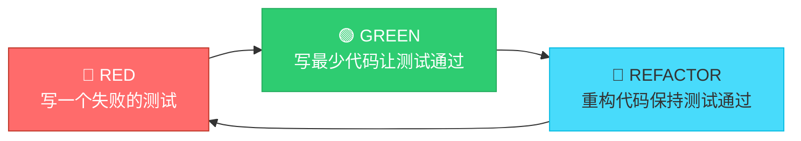

# 单元测试详解

单元测试是对软件中最小可测试单元（函数、方法、组件）进行验证的测试方式。它是前端测试金字塔的基石。

---

## 单元测试执行流程



---

## Jest vs Vitest 对比



### 核心配置对比

```typescript
// Jest 配置 — jest.config.ts
export default {
  testEnvironment: 'jsdom',
  setupFilesAfterSetup: ['./jest.setup.ts'],
  moduleNameMapper: {
    '^@/(.*)$': '<rootDir>/src/$1',
  },
  coverageThreshold: {
    global: {
      branches: 75,
      functions: 85,
      lines: 80,
      statements: 80,
    },
  },
};
```

```typescript
// Vitest 配置 — vitest.config.ts
import { defineConfig } from 'vitest/config';

export default defineConfig({
  test: {
    environment: 'jsdom',
    setupFiles: ['./vitest.setup.ts'],
    globals: true, // 无需每个文件 import
    coverage: {
      provider: 'v8',
      thresholds: {
        branches: 75,
        functions: 85,
        lines: 80,
        statements: 80,
      },
    },
  },
});
```

---

## Mock 与 Stub 详解

Mock 和 Stub 都是测试替身（Test Double），但用途不同。



### Mock 实战示例

```typescript
// 被测函数：fetchUser
export async function fetchUser(id: string): Promise<User> {
  const response = await api.get(`/users/${id}`);
  return response.data;
}

// Jest Mock
describe('fetchUser', () => {
  it('should return user data', async () => {
    const mockGet = jest.fn().mockResolvedValue({
      data: { id: '1', name: '张三' },
    });

    // 注入 mock
    (api as any).get = mockGet;

    const user = await fetchUser('1');

    expect(user).toEqual({ id: '1', name: '张三' });
    expect(mockGet).toHaveBeenCalledWith('/users/1');
  });
});

// Vitest Mock — API 完全一致
import { vi } from 'vitest';

describe('fetchUser', () => {
  it('should return user data', async () => {
    const mockGet = vi.fn().mockResolvedValue({
      data: { id: '1', name: '张三' },
    });

    (api as any).get = mockGet;

    const user = await fetchUser('1');

    expect(user).toEqual({ id: '1', name: '张三' });
    expect(mockGet).toHaveBeenCalledWith('/users/1');
  });
});
```

### Stub 实战示例

```typescript
// Stub：替换模块导出
jest.mock('@/services/api', () => ({
  getUser: jest.fn().mockReturnValue({ id: '1', name: '李四' }),
  updateUser: jest.fn().mockReturnValue(true),
}));

// Vitest 的模块 Mock
vi.mock('@/services/api', () => ({
  getUser: vi.fn().mockReturnValue({ id: '1', name: '李四' }),
  updateUser: vi.fn().mockReturnValue(true),
}));
```

### Spy 实战示例

```typescript
// Spy：监控函数调用但不改变行为
describe('Logger', () => {
  it('should log messages', () => {
    const spy = jest.spyOn(console, 'log');
    spy.mockImplementation(() => {}); // 静默输出

    Logger.info('test message');

    expect(spy).toHaveBeenCalledWith('test message');
    spy.mockRestore(); // 恢复原实现
  });
});
```

---

## 测试覆盖率



### 覆盖率配置

```json
// package.json
{
  "scripts": {
    "test": "vitest run",
    "test:coverage": "vitest run --coverage",
    "test:watch": "vitest watch"
  },
  "nyc": {
    "check-coverage": true,
    "lines": 80,
    "functions": 85,
    "branches": 75,
    "statements": 80
  }
}
```

---

## TDD 流程：红-绿-重构



### TDD 实战：实现一个 `formatCurrency` 函数

```typescript
// Step 1: RED — 先写测试
describe('formatCurrency', () => {
  it('should format number with ¥ symbol', () => {
    expect(formatCurrency(1234.5)).toBe('¥1,234.50');
  });

  it('should handle zero', () => {
    expect(formatCurrency(0)).toBe('¥0.00');
  });

  it('should handle negative numbers', () => {
    expect(formatCurrency(-99.9)).toBe('-¥99.90');
  });
});

// Step 2: GREEN — 最少代码让测试通过
export function formatCurrency(amount: number): string {
  const abs = Math.abs(amount);
  const formatted = abs.toLocaleString('zh-CN', {
    style: 'currency',
    currency: 'CNY',
  });
  return amount < 0 ? `-${formatted}` : formatted;
}

// Step 3: REFACTOR — 优化可读性（测试仍通过才继续）
```

---

## 测试组织最佳实践

```typescript
// ✅ 好的测试结构 — AAA 模式
describe('UserService', () => {
  describe('getUserById', () => {
    it('should return user when valid id is provided', async () => {
      // Arrange — 准备数据
      const userId = '123';
      const expectedUser = { id: '123', name: '张三' };
      mockApi.getUser.mockResolvedValue(expectedUser);

      // Act — 执行操作
      const result = await service.getUserById(userId);

      // Assert — 验证结果
      expect(result).toEqual(expectedUser);
      expect(mockApi.getUser).toHaveBeenCalledWith('123');
    });

    it('should throw error when user not found', async () => {
      // Arrange
      mockApi.getUser.mockRejectedValue(new Error('Not Found'));

      // Act & Assert
      await expect(service.getUserById('999')).rejects.toThrow('Not Found');
    });
  });
});
```

### 测试命名规范

| 模式 | 示例 |
|------|------|
| should + 动词 | `should return user when id is valid` |
| 给定...当...那么 | `given valid id, when called, then returns user` |
| 动词开头 | `returns user for valid id` |

---

## 面试高频问题

1. **Jest 和 Vitest 的区别是什么？新项目如何选择？**
2. **Mock、Stub、Spy 的区别是什么？各适用什么场景？**
3. **什么是 TDD？红-绿-重构具体怎么操作？**
4. **测试覆盖率 100% 有意义吗？如何正确看待覆盖率？**
5. **如何测试异步函数（Promise、async/await）？**
6. **如何测试抛出异常的函数？**
7. **beforeEach / beforeAll / afterEach / afterAll 的区别？**

---

## 参考资源

- [Jest 官方文档](https://jestjs.io/)
- [Vitest 官方文档](https://vitest.dev/)
- [Kent C. Dodds — Testing Implementation Details](https://kentcdodds.com/blog/testing-implementation-details)
- Martin Fowler — [Mocks Aren't Stubs](https://martinfowler.com/articles/mocksArentStubs.html)
