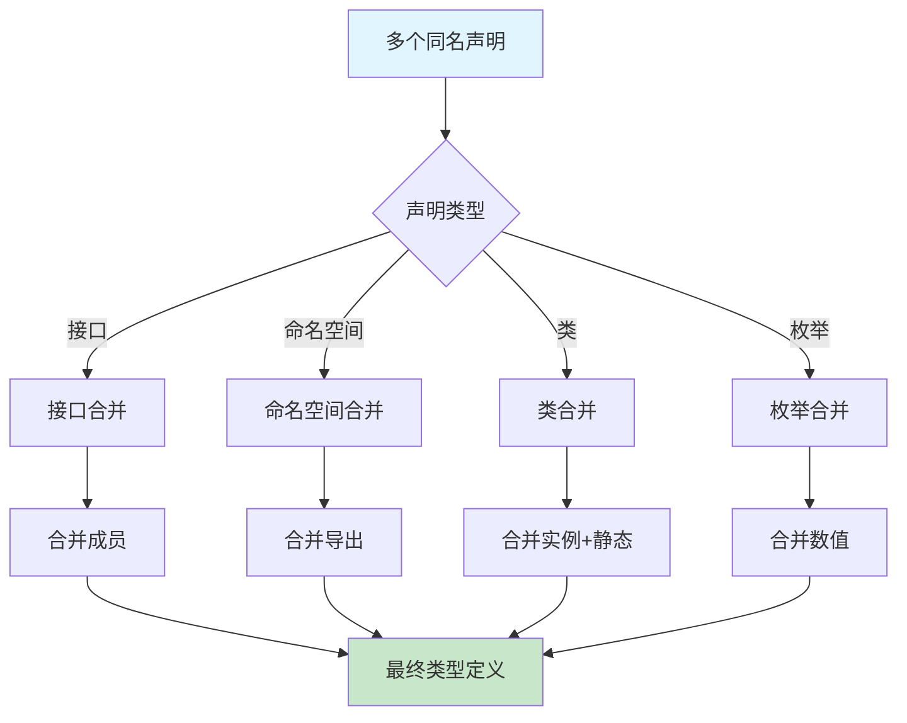
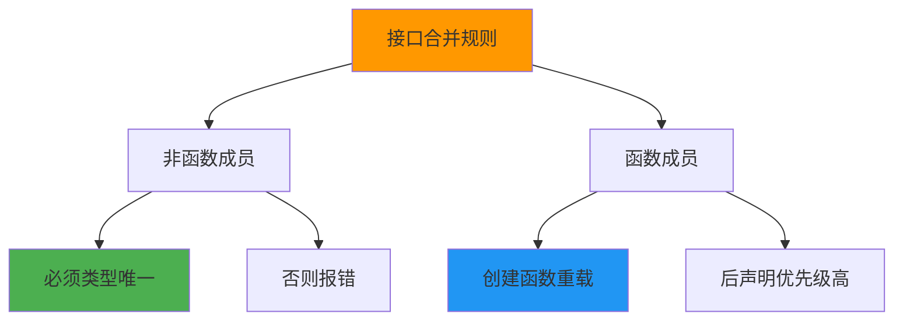
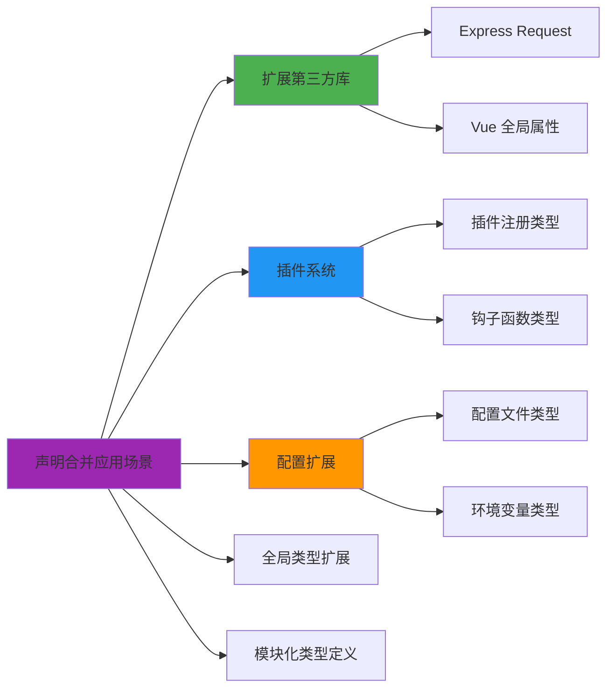

# 声明合并与模块增强

声明合并是 TypeScript 编译器将多个同名声明合并为单一定义的机制。

## 声明合并流程



## 接口合并

接口合并是最常见的声明合并形式，多个同名接口的成员会合并到一起。

### 基本合并

```typescript
// 第一个声明
interface Box {
  height: number;
  width: number;
}

// 第二个声明 - 自动合并
interface Box {
  scale: number;
}

// 合并后的效果
const box: Box = {
  height: 5,
  width: 10,
  scale: 1
};
```

### 合并规则



```typescript
// 函数成员合并为重载
interface Document {
  createElement(tagName: 'div'): HTMLDivElement;
  createElement(tagName: 'span'): HTMLSpanElement;
}

interface Document {
  createElement(tagName: 'canvas'): HTMLCanvasElement;
}

// 合并后：
// createElement(tagName: 'div'): HTMLDivElement
// createElement(tagName: 'span'): HTMLSpanElement
// createElement(tagName: 'canvas'): HTMLCanvasElement
```

### 高级合并示例

```typescript
// 第三方库类型扩展
interface JQuery {
  css(propertyName: string): string;
  css(propertyName: string, value: string | number): JQuery;
}

// 扩展 jQuery 类型
interface JQuery {
  myPlugin(options?: any): JQuery;
}

// 使用
$('.element').myPlugin({ speed: 500 }).css('color', 'red');
```

## 命名空间合并

命名空间合并允许你将分散的定义合并到一个命名空间中。

### 命名空间与接口合并

```typescript
// 命名空间与接口合并
interface Album {
  albumTitle: string;
}

interface Album {
  artist: string;
}

// 命名空间可以与接口同名
namespace Album {
  function create(title: string, artist: string): Album {
    return { albumTitle: title, artist };
  }

  export const defaultAlbum = create('Unknown', 'Unknown');
}

// 使用
const myAlbum: Album = {
  albumTitle: 'My Album',
  artist: 'Me'
};

const created = Album.create('Test', 'Artist');
```

### 命名空间与函数合并

```typescript
// 命名空间扩展函数
function buildLabel(name: string): string {
  return buildLabel.prefix + name + buildLabel.suffix;
}

namespace buildLabel {
  export const prefix = 'Hello, ';
  export const suffix = '!';
}

console.log(buildLabel('TypeScript')); // "Hello, TypeScript!"
```

### 命名空间与类合并

```typescript
// 命名空间扩展类
class Album {
  constructor(public label: string) {}
}

namespace Album {
  export function create(label: string): Album {
    return new Album(label);
  }

  export const DEFAULT_LABEL = 'Unknown';
}

const album = Album.create('My Album');
```

## 枚举合并

```typescript
// 枚举合并
enum Direction {
  Up = 'UP',
  Down = 'DOWN'
}

enum Direction {
  Left = 'LEFT',
  Right = 'RIGHT'
}

// 合并后包含所有成员
console.log(Direction.Up);    // 'UP'
console.log(Direction.Left);  // 'LEFT'
```

## 模块增强

模块增强用于扩展已导入模块的类型。

### 基本模块增强

```typescript
// original.ts
export interface Original {
  name: string;
}

// augmentation.ts
import { Original } from './original';

// 模块增强声明
declare module './original' {
  interface Original {
    age: number;
  }
}

// 使用增强后的类型
const obj: Original = {
  name: 'John',
  age: 30  // 现在可以使用了
};
```

### Express 模块增强

```typescript
// types/express.d.ts
import { User } from '../models/user';

declare module 'express' {
  interface Request {
    user?: User;
    sessionId?: string;
  }

  interface Response {
    success(data: any): void;
    error(message: string, code?: number): void;
  }
}
```

### 扩展全局类型

```typescript
// 全局类型扩展
declare global {
  interface Window {
    __APP_VERSION__: string;
    analytics: AnalyticsService;
  }

  // 扩展 Console
  interface Console {
    customLog(message: string): void;
  }

  // 扩展 Date
  interface Date {
    toRelativeString(): string;
  }
}

// 实现扩展
Date.prototype.toRelativeString = function () {
  const now = new Date();
  const diff = now.getTime() - this.getTime();
  // 实现相对时间字符串
  return `${diff}ms ago`;
};
```

## 声明合并的应用场景



## Vue 3 中的模块增强

```typescript
// vue.d.ts
import { ComponentCustomProperties } from 'vue';

declare module 'vue' {
  interface ComponentCustomProperties {
    $filters: {
      formatDate(date: Date): string;
      formatCurrency(amount: number): string;
    };
  }

  // 扩展全局组件
  interface GlobalComponents {
    RouterLink: typeof import('vue-router')['RouterLink'];
    RouterView: typeof import('vue-router')['RouterView'];
  }
}

// 组件中使用
export default {
  created() {
    console.log(this.$filters.formatDate(new Date()));
  }
}
```

## 合并冲突处理

```typescript
// 合并冲突示例
interface Config {
  port: number;
}

interface Config {
  port: string;  // 错误：类型不兼容
}

// 解决方案1：使用联合类型
interface ConfigFixed {
  port: number;
}

interface ConfigFixed {
  port: number | string;  // 使用联合类型
}

// 解决方案2：使用命名空间隔离
namespace DevConfig {
  export interface Settings {
    port: string;  // 开发环境用字符串
  }
}

namespace ProdConfig {
  export interface Settings {
    port: number;  // 生产环境用数字
  }
}
```

## 最佳实践

:::tip 声明合并原则
1. **谨慎使用**：声明合并可能导致类型混乱
2. **文档化**：为合并的类型添加注释说明
3. **模块化**：将增强声明放在单独的 `.d.ts` 文件中
4. **避免冲突**：确保合并的成员类型兼容
:::

## 面试要点

:::warning 高频面试题
1. 什么是声明合并？有哪些类型可以合并？
2. 接口合并和类型别名有什么区别？
3. 如何扩展第三方库的类型定义？
4. 模块增强和全局扩展有什么区别？
:::

### 常见陷阱

```typescript
// 陷阱1：类型别名不能合并
type Animal = {
  name: string;
};

type Animal = {  // 错误：重复标识符
  age: number;
};

// 解决方案：使用接口
interface Animal {
  name: string;
}

interface Animal {
  age: number;  // 正确：接口可以合并
}

// 陷阱2：合并顺序影响函数重载
interface Api {
  fetch(url: string): Promise<any>;
}

interface Api {
  fetch(config: object): Promise<any>;
}

// 重载顺序：后声明的排在前面
// 实际调用时，TypeScript 按顺序匹配
```

## 高级技巧：条件合并

```typescript
// 条件类型辅助合并
type Merge<A, B> = {
  [K in keyof A | keyof B]: K extends keyof B
    ? B[K]
    : K extends keyof A
    ? A[K]
    : never;
};

interface Base {
  id: number;
  name: string;
}

interface Extended {
  name: string;  // 重写
  email: string; // 新增
}

type Merged = Merge<Base, Extended>;
// 结果：{ id: number; name: string; email: string }
```
