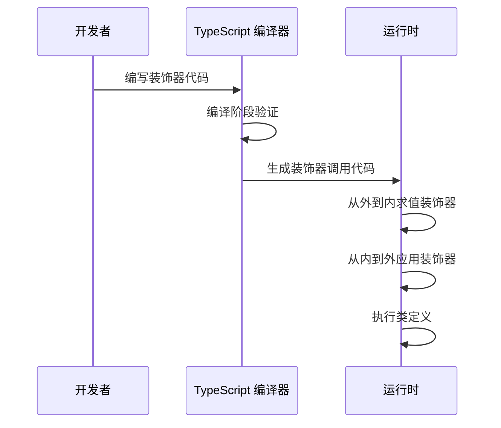
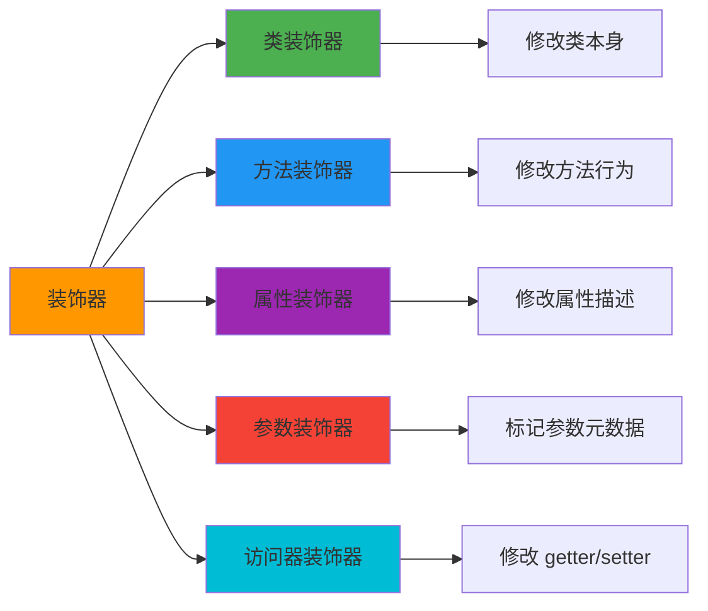
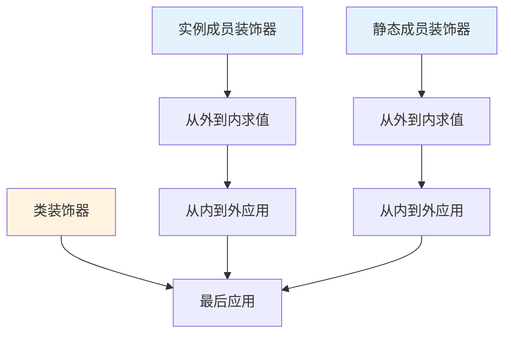

# 装饰器详解

装饰器是一种特殊的声明，可以附加到类声明、方法、访问符、属性或参数上，用于修改类的行为。

## 装饰器执行流程



## Stage 3 装饰器标准

TypeScript 5.0+ 支持 TC39 Stage 3 装饰器提案，这是新的标准语法。

### 基本语法

```typescript
// Stage 3 装饰器语法
function logged(value, context) {
  if (context.kind === 'method') {
    return function (...args) {
      console.log(`Calling ${context.name} with`, args);
      return value.call(this, ...args);
    };
  }
}

class Calculator {
  @logged
  add(a, b) {
    return a + b;
  }
}
```

### 装饰器上下文

```typescript
// 装饰器上下文对象类型
interface DecoratorContext {
  kind: 'class' | 'method' | 'getter' | 'setter' | 'field' | 'accessor';
  name: string | symbol;
  static: boolean;
  private: boolean;
  access: {
    get?(): unknown;
    set?(value: unknown): void;
  };
  addInitializer(initializer: () => void): void;
}
```

## 装饰器类型详解

### 装饰器分类



### 1. 类装饰器

```typescript
// 类装饰器：添加日志功能
function Logger<T extends new (...args: any[]) => any>(
  target: T,
  context: ClassDecoratorContext
) {
  return class extends target {
    constructor(...args: any[]) {
      super(...args);
      console.log(`Created instance of ${context.name}`);
    }
  };
}

@Logger
class UserService {
  name = 'UserService';
}

const service = new UserService();
// 输出: Created instance of UserService
```

### 2. 方法装饰器

```typescript
// 方法装饰器：性能监控
function Measure(
  value: Function,
  context: ClassMethodDecoratorContext
) {
  return function (this: any, ...args: any[]) {
    const start = performance.now();
    const result = value.apply(this, args);
    const end = performance.now();
    console.log(`${String(context.name)} took ${end - start}ms`);
    return result;
  };
}

class DataProcessor {
  @Measure
  processLargeData(data: number[]) {
    return data.sort((a, b) => a - b);
  }
}
```

### 3. 属性装饰器

```typescript
// 属性装饰器：默认值
function DefaultValue(defaultVal: any) {
  return function (value: undefined, context: ClassFieldDecoratorContext) {
    return function (initialValue: any) {
      return initialValue ?? defaultVal;
    };
  };
}

class Config {
  @DefaultValue('localhost')
  host: string;

  @DefaultValue(3000)
  port: number;
}

const config = new Config();
console.log(config.host); // 'localhost'
console.log(config.port); // 3000
```

### 4. 参数装饰器（元数据）

```typescript
// 使用 metadata API
function Validate(
  value: Function,
  context: ClassMethodDecoratorContext
) {
  return function (this: any, ...args: any[]) {
    // 获取参数元数据进行验证
    const rules = context.metadata.paramRules || [];
    rules.forEach((rule, index) => {
      if (!rule.validate(args[index])) {
        throw new Error(`Parameter ${index} validation failed`);
      }
    });
    return value.apply(this, args);
  };
}
```

## 装饰器工厂模式

```typescript
// 装饰器工厂：可配置的装饰器
function Throttle(delay: number) {
  return function (
    value: Function,
    context: ClassMethodDecoratorContext
  ) {
    let lastCall = 0;
    return function (this: any, ...args: any[]) {
      const now = Date.now();
      if (now - lastCall >= delay) {
        lastCall = now;
        return value.apply(this, args);
      }
    };
  };
}

class SearchService {
  @Throttle(300)
  search(query: string) {
    console.log(`Searching: ${query}`);
  }
}
```

## 框架实践

### Angular 中的装饰器

```typescript
import { Component, Injectable, Input } from '@angular/core';

@Component({
  selector: 'app-user',
  template: `<h1>{{ user.name }}</h1>`,
  styles: [`h1 { color: blue; }`]
})
export class UserComponent {
  @Input() user: User;

  constructor(private userService: UserService) {}
}

@Injectable({
  providedIn: 'root'
})
export class UserService {
  getUser(id: string): Observable<User> {
    return this.http.get<User>(`/api/users/${id}`);
  }
}
```

### NestJS 中的装饰器

```typescript
import { Controller, Get, Post, Body, Param } from '@nestjs/common';

@Controller('users')
export class UserController {
  constructor(private readonly userService: UserService) {}

  @Get(':id')
  findOne(@Param('id') id: string): User {
    return this.userService.findOne(id);
  }

  @Post()
  create(@Body() createUserDto: CreateUserDto): User {
    return this.userService.create(createUserDto);
  }
}
```

## 装饰器执行顺序



```typescript
// 执行顺序示例
function LogOrder(order: number) {
  return function (value: any, context: any) {
    console.log(`Decorator ${order} applied: ${context.name}`);
    return value;
  };
}

@LogOrder(1)  // 最后执行
class Example {
  @LogOrder(2)  // 第二个执行
  method(
    @LogOrder(3)  // 第一个执行（参数装饰器）
    param: string
  ) {}
}
```

## 最佳实践

:::tip 装饰器使用原则
1. **单一职责**：每个装饰器只做一件事
2. **可组合**：装饰器应该可以自由组合
3. **无副作用**：避免装饰器产生意外的全局副作用
4. **类型安全**：充分利用 TypeScript 类型系统
:::

## 面试要点

:::warning 高频面试题
1. Stage 3 装饰器和旧版装饰器有什么区别？
2. 装饰器的执行顺序是什么？
3. 如何实现一个方法装饰器来缓存函数结果？
4. Angular/NestJS 如何利用装饰器实现依赖注入？
:::

### 缓存装饰器实现

```typescript
function Cache(ttl: number = 60000) {
  return function (
    value: Function,
    context: ClassMethodDecoratorContext
  ) {
    const cache = new Map<string, { value: any; expiry: number }>();

    return function (this: any, ...args: any[]) {
      const key = JSON.stringify(args);
      const cached = cache.get(key);

      if (cached && cached.expiry > Date.now()) {
        return cached.value;
      }

      const result = value.apply(this, args);
      cache.set(key, {
        value: result,
        expiry: Date.now() + ttl
      });

      return result;
    };
  };
}

class DataService {
  @Cache(5000)
  fetchData(id: string) {
    console.log('Fetching from API...');
    return fetch(`/api/data/${id}`);
  }
}
```
