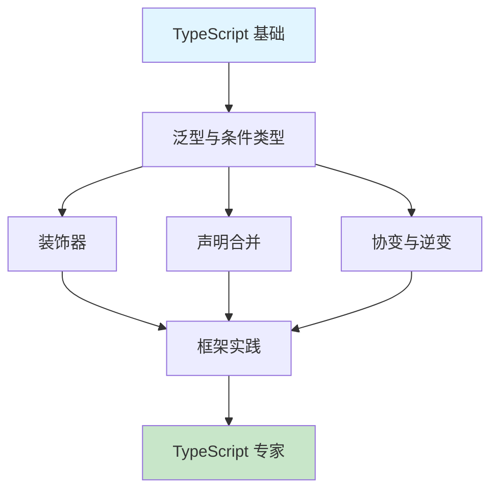
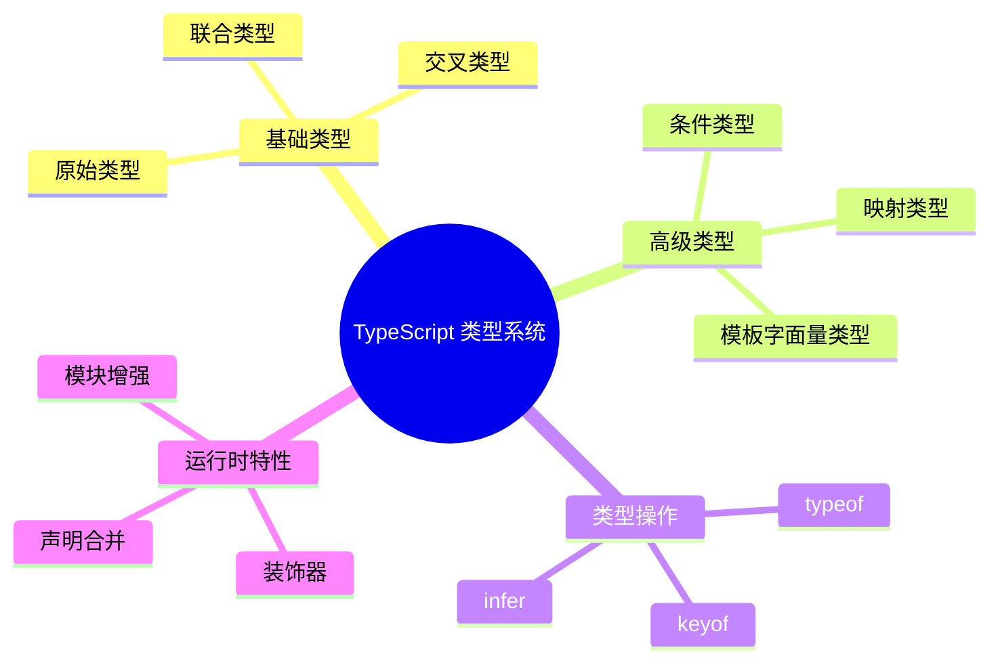

# TypeScript 进阶概述

TypeScript 的类型系统是图灵完备的，掌握其高级特性是成为 TypeScript 专家的关键。

## 学习路线



## 核心知识点

### 1. 装饰器（Decorators）

Stage 3 标准的装饰器语法，广泛应用于 Angular、NestJS 等框架。

- 类装饰器
- 方法装饰器
- 属性装饰器
- 参数装饰器

### 2. 声明合并与模块增强

理解 TypeScript 如何合并多个声明，以及如何扩展第三方类型。

- 接口合并
- 命名空间合并
- 全局类型扩展

### 3. 协变与逆变

深入理解类型兼容性的底层原理。

- 函数参数逆变
- 泛型协变
- strictFunctionTypes 的影响

## TypeScript 类型系统全景



## 面试要点

:::tip 高频面试题
1. TypeScript 装饰器的执行顺序是什么？
2. 如何扩展第三方库的类型定义？
3. 什么是协变和逆变？为什么函数参数是逆变的？
:::

## 学习建议

1. **循序渐进**：先掌握基础类型系统，再学习高级特性
2. **实践为主**：每个知识点都要动手写代码验证
3. **阅读源码**：查看优秀框架的类型定义（如 Vue、React）
4. **关注规范**：跟踪 TypeScript 和 TC39 的最新进展

## 进阶特性速览

```typescript
// 1. 条件类型
type IsString<T> = T extends string ? true : false;

// 2. 映射类型
type Readonly<T> = {
  readonly [P in keyof T]: T[P];
};

// 3. 模板字面量类型
type EventName = `on${Capitalize<'click' | 'change'>}`;

// 4. infer 关键字
type ReturnType<T> = T extends (...args: any[]) => infer R ? R : never;

// 5. 装饰器元数据
function Log(target: any, key: string) {
  console.log(`${key} 被访问`);
}
```

## 相关资源

- [TypeScript 官方文档](https://www.typescriptlang.org/docs/)
- [TypeScript Deep Dive](https://basarat.gitbook.io/typescript/)
- [Type Challenges](https://github.com/type-challenges/type-challenges)
- [TypeScript Playground](https://www.typescriptlang.org/play)
