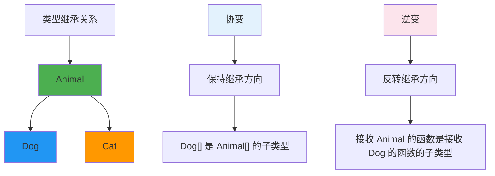
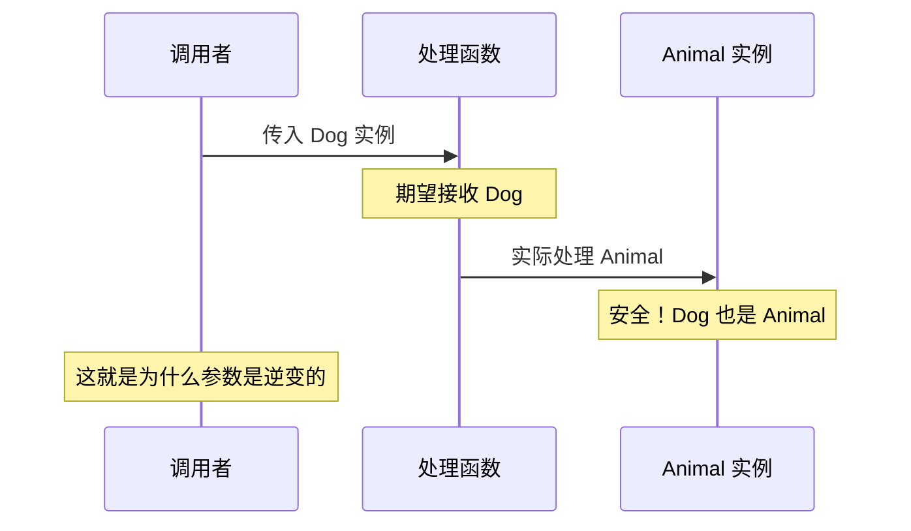
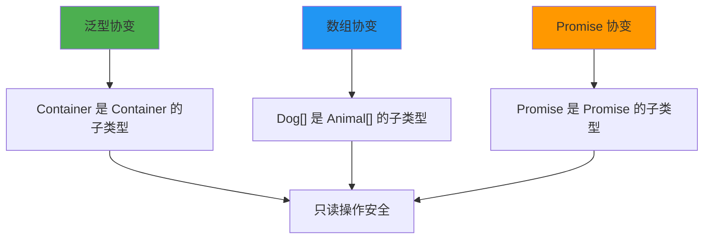
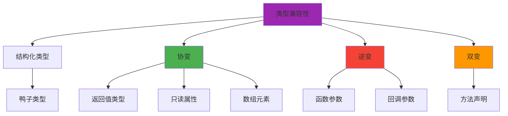

# 协变与逆变

协变（Covariance）和逆变（Contravariance）描述了类型之间的继承关系如何影响复合类型的兼容性。

## 协变与逆变关系图



## 基本概念

### 协变（Covariance）

如果 `Dog` 是 `Animal` 的子类型，那么 `Container<Dog>` 也是 `Container<Animal>` 的子类型。

```typescript
class Animal {
  name: string = '';
}

class Dog extends Animal {
  breed: string = '';
}

// 协变：Dog[] 是 Animal[] 的子类型
let animals: Animal[] = [];
let dogs: Dog[] = [new Dog()];

animals = dogs;  // 正确：数组是协变的
```

### 逆变（Contravariance）

如果 `Dog` 是 `Animal` 的子类型，那么接收 `Animal` 的函数类型是接收 `Dog` 的函数类型的子类型。

```typescript
type AnimalHandler = (animal: Animal) => void;
type DogHandler = (dog: Dog) => void;

// 逆变：AnimalHandler 是 DogHandler 的子类型
let handleAnimal: AnimalHandler = (animal) => {
  console.log(animal.name);
};

let handleDog: DogHandler = handleAnimal;  // 正确
// handleDog 可以处理任何 Dog，而 handleAnimal 可以处理任何 Animal
```

## 函数参数逆变原理



### 详细解释

```typescript
class Animal {
  name: string = '';
  eat() { console.log('eating'); }
}

class Dog extends Animal {
  bark() { console.log('woof'); }
}

class Cat extends Animal {
  meow() { console.log('meow'); }
}

// 一个可以处理任何 Animal 的函数
function processAnimal(animal: Animal) {
  animal.eat();  // 安全：所有 Animal 都有 eat 方法
}

// 一个只能处理 Dog 的函数
function processDog(dog: Dog) {
  dog.bark();  // 不安全：如果传入 Cat 会出错
}

// 逆变关系：
// processAnimal 是 processDog 的子类型
// 因为任何需要 Dog 的地方，Animal 处理函数都能用

let dogProcessor: (dog: Dog) => void;
dogProcessor = processAnimal;  // 正确：逆变
dogProcessor = processDog;     // 正确：同一类型
```

## strictFunctionTypes

TypeScript 2.6 引入了 `strictFunctionTypes` 编译选项，强制执行函数参数逆变检查。

```typescript
// strictFunctionTypes: false (不推荐)
type Callback = (animal: Animal) => void;
const callback: Callback = (dog: Dog) => {
  dog.bark();  // 允许，但不安全
};

// strictFunctionTypes: true (推荐)
type CallbackStrict = (animal: Animal) => void;
const callbackStrict: CallbackStrict = (dog: Dog) => {
  dog.bark();  // 错误：参数类型不兼容
};
```

### 方法声明 vs 函数属性

```typescript
interface EventHandler {
  // 方法声明：双变（不推荐）
  handle(event: Event): void;
}

interface EventHandlerStrict {
  // 函数属性：逆变（推荐）
  handle: (event: Event) => void;
}

// 方法声明是双变的（为了兼容性）
class MouseHandler implements EventHandler {
  handle(event: MouseEvent) {  // 允许
    event.clientX;
  }
}

// 函数属性是逆变的（更安全）
const mouseHandler: EventHandlerStrict = {
  handle(event: MouseEvent) {  // 错误：参数类型不兼容
    event.clientX;
  }
};
```

## 泛型协变



### 只读容器协变

```typescript
interface ReadonlyContainer<T> {
  readonly value: T;
  getValue(): T;
}

// 协变：只读容器保持类型继承关系
let dogContainer: ReadonlyContainer<Dog> = {
  value: new Dog(),
  getValue() { return this.value; }
};

let animalContainer: ReadonlyContainer<Animal> = dogContainer;  // 正确
```

### 可变容器不安全

```typescript
interface MutableContainer<T> {
  value: T;
  setValue(val: T): void;
}

// 协变会导致不安全
let dogContainer: MutableContainer<Dog> = {
  value: new Dog(),
  setValue(val) { this.value = val; }
};

// 如果允许：
let animalContainer: MutableContainer<Animal> = dogContainer;
animalContainer.setValue(new Cat());  // 灾难！把 Cat 放进了 Dog 容器

// TypeScript 数组就是这种情况（历史原因）
let dogs: Dog[] = [new Dog()];
let animals: Animal[] = dogs;  // 允许（协变）
animals.push(new Cat());  // 运行时错误！
```

## 逆变的实际应用

### 事件处理

```typescript
interface MouseEvent {
  x: number;
  y: number;
}

interface KeyboardEvent {
  key: string;
}

// 事件处理器类型
type EventHandler<T> = (event: T) => void;

// 通用事件处理器（可以处理任何事件）
const generalHandler: EventHandler<MouseEvent | KeyboardEvent> = (event) => {
  console.log(event);
};

// 特定事件处理器
const mouseHandler: EventHandler<MouseEvent> = (event) => {
  console.log(event.x, event.y);
};

// 逆变：通用处理器可以赋值给特定处理器
const specificHandler: EventHandler<MouseEvent> = generalHandler;  // 正确
```

### React 事件处理

```typescript
import { MouseEvent, ChangeEvent } from 'react';

// React 的事件处理利用了逆变
type Props = {
  onClick: (event: MouseEvent<HTMLElement>) => void;
};

// 更通用的处理器可以赋值给更具体的处理器
const handleClick = (event: MouseEvent<HTMLElement>) => {
  console.log(event.currentTarget);
};

const MyComponent = ({ onClick }: Props) => {
  return <button onClick={onClick}>Click</button>;
};

// 使用
<MyComponent onClick={handleClick} />
```

## 类型兼容性矩阵



### 兼容性规则总结

| 位置 | 变体 | 示例 |
|------|------|------|
| 函数返回值 | 协变 | `() => Dog` 是 `() => Animal` 的子类型 |
| 函数参数 | 逆变 | `(animal: Animal) => void` 是 `(dog: Dog) => void` 的子类型 |
| 只读属性 | 协变 | `{readonly value: Dog}` 是 `{readonly value: Animal}` 的子类型 |
| 可写属性 | 不变 | `{value: Dog}` 和 `{value: Animal}` 不兼容 |
| 数组 | 协变 | `Dog[]` 是 `Animal[]` 的子类型（不安全） |

## 泛型中的变体注解

### 旧式变体注解（已弃用）

```typescript
// TypeScript 4.7 之前的写法
interface Producer<out T> {
  produce(): T;
}

interface Consumer<in T> {
  consume(item: T): void;
}

interface Processor<in out T> {
  process(item: T): T;
}
```

### 旧式变体注解（已弃用）

```typescript
// TypeScript 4.7 之前的写法
interface Producer<out T> {
  produce(): T;
}

interface Consumer<in T> {
  consume(item: T): void;
}

interface Processor<in out T> {
  process(item: T): T;
}
```

### 实际应用

```typescript
// 只读容器 - 协变
interface ReadonlyArray<out T> {
  readonly length: number;
  readonly [n: number]: T;
  // 只有读取操作，所以 T 是协变的
}

// 可写数组 - 不变
interface Array<T> {
  length: number;
  [n: number]: T;
  push(...items: T[]): number;  // 写入操作
  pop(): T | undefined;         // 读取操作
}

// 事件处理器 - 逆变
interface EventHandler<in T> {
  handle(event: T): void;  // T 只出现在参数位置
}

// 转换器 - 不变
interface Transformer<in TInput, out TOutput> {
  transform(input: TInput): TOutput;
}
```

## 面试要点

:::warning 高频面试题
1. 什么是协变和逆变？请举例说明。
2. 为什么函数参数是逆变的？
3. `strictFunctionTypes` 有什么作用？
4. 为什么 TypeScript 数组是协变的？这有什么问题？
5. 泛型中的 `in` 和 `out` 关键字有什么作用？
:::

### 常见陷阱

```typescript
// 陷阱1：数组协变的不安全性
let dogs: Dog[] = [new Dog()];
let animals: Animal[] = dogs;  // 允许
animals.push(new Cat());  // 运行时错误！

// 解决方案：使用 ReadonlyArray
let readonlyDogs: ReadonlyArray<Dog> = [new Dog()];
// readonlyDogs.push(new Dog());  // 错误：push 不存在

// 陷阱2：方法 vs 函数属性
interface Base {
  method(x: string): void;      // 方法声明：双变
  prop: (x: string) => void;    // 函数属性：逆变
}

interface Derived extends Base {
  method(x: 'hello'): void;     // 允许（双变）
  prop: (x: 'hello') => void;   // 错误（逆变）
}

// 陷阱3：回调函数类型
type Callback<T> = (data: T) => void;

// 这个赋值是不安全的
let animalCallback: Callback<Animal> = (data) => console.log(data.name);
let dogCallback: Callback<Dog> = animalCallback;  // 允许（逆变）

// 但这是安全的，因为 dogCallback 只会接收 Dog
```

## 最佳实践

:::tip 协变逆变原则
1. **使用 `strictFunctionTypes`**：启用严格模式以获得更安全的类型检查
2. **优先使用函数属性**：而不是方法声明，因为函数属性支持逆变
3. **使用 `ReadonlyArray`**：避免数组协变导致的运行时错误
4. **理解泛型变体**：正确使用 `in`、`out` 关键字
5. **注意回调类型**：回调参数通常是逆变的
:::

## 总结

| 概念 | 定义 | 应用场景 |
|------|------|----------|
| 协变 | 子类型关系保持一致 | 返回值、只读属性、数组 |
| 逆变 | 子类型关系反转 | 函数参数、回调参数 |
| 双变 | 可以双向转换 | 方法声明（不推荐） |
| 不变 | 不允许转换 | 可写属性 |
