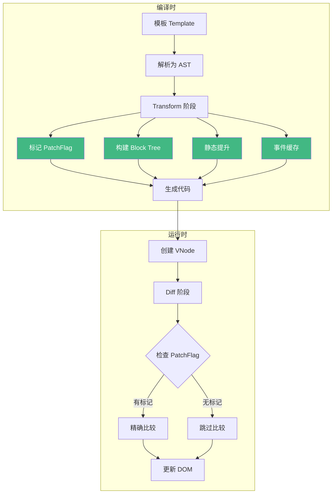
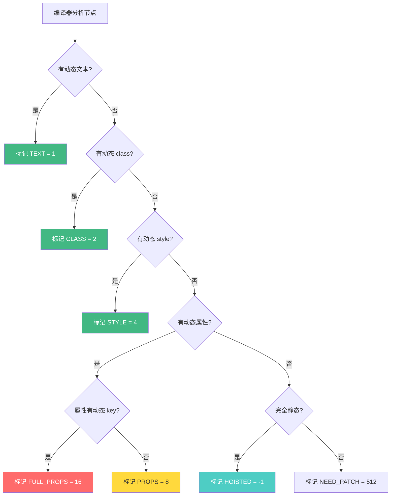
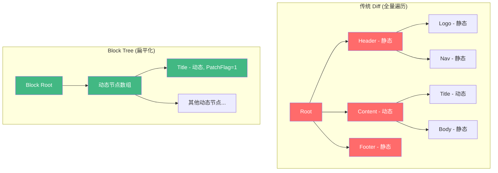
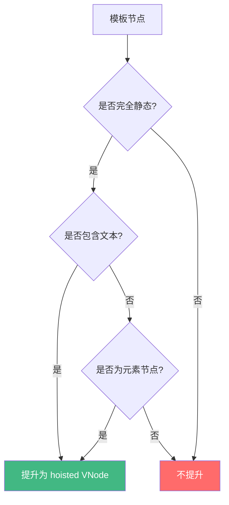
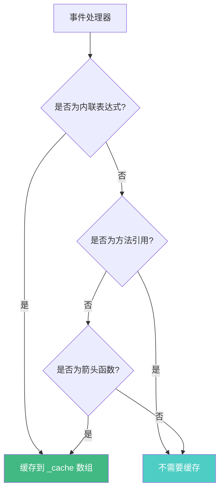
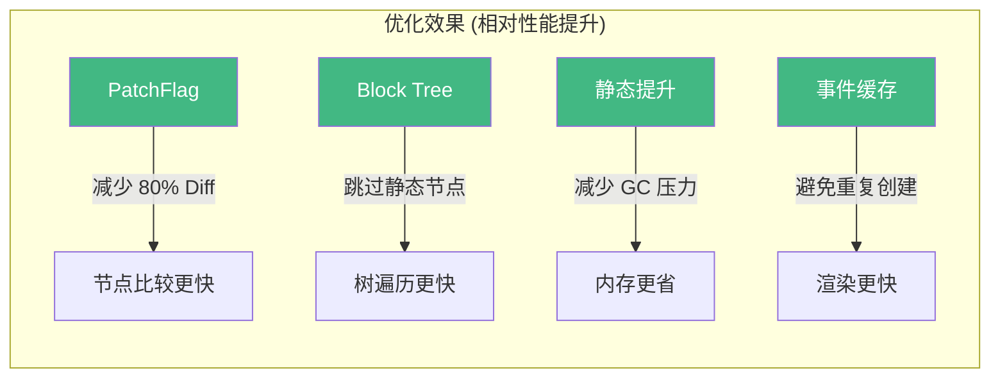

# Vue 编译器优化深入

Vue 3 的编译器通过一系列优化策略，大幅提升了框架的运行时性能。这些优化包括 PatchFlag 标记、Block Tree 结构、静态提升和事件缓存等。

## 编译优化全景图



## PatchFlag（补丁标志）

PatchFlag 是 Vue 3 编译器为每个动态节点生成的标记，告诉运行时哪些部分是动态的，需要进行比较。

### PatchFlag 类型

```javascript
// 源码定义 (packages/shared/src/patchFlags.ts)
export const enum PatchFlags {
  TEXT = 1,              // 动态文本内容
  CLASS = 1 << 1,       // 2 - 动态 class
  STYLE = 1 << 2,       // 4 - 动态 style
  PROPS = 1 << 3,       // 8 - 动态属性（非 class/style）
  FULL_PROPS = 1 << 4,  // 16 - 有动态 key 的属性
  HYDRATE_EVENTS = 1 << 5,  // 32 - 需要事件监听的 hydration
  STABLE_FRAGMENT = 1 << 6, // 64 - 稳定的 fragment
  KEYED_FRAGMENT = 1 << 7,  // 128 - 带 key 的 fragment
  UNKEYED_FRAGMENT = 1 << 8,// 256 - 不带 key 的 fragment
  NEED_PATCH = 1 << 9,      // 512 - 需要非 props 的 patch
  DYNAMIC_SLOTS = 1 << 10,  // 1024 - 动态插槽
  HOISTED = -1,             // 静态提升
  BAIL = -2                 // 放弃优化
}
```

### 编译产物示例

```vue
<template>
  <div>
    <span>静态文本</span>
    <p>{{ message }}</p>
    <div :class="dynamicClass">动态 class</div>
    <a :href="url" :title="linkTitle">动态链接</a>
  </div>
</template>
```

```javascript
// 编译产物
import { createElementVNode as _createElementVNode, toDisplayString as _toDisplayString, openBlock as _openBlock, createElementBlock as _createElementBlock } from "vue"

const _hoisted_1 = /*#__PURE__*/ _createElementVNode("span", null, "静态文本", -1 /* HOISTED */)

export function render(_ctx) {
  return (_openBlock(), _createElementBlock("div", null, [
    _hoisted_1,
    _createElementVNode("p", null, _toDisplayString(_ctx.message), 1 /* TEXT */),
    _createElementVNode("div", { class: _ctx.dynamicClass }, "动态 class", 2 /* CLASS */),
    _createElementVNode("a", {
      href: _ctx.url,
      title: _ctx.linkTitle
    }, "动态链接", 8 /* PROPS */, ["href", "title"])
  ]))
}
```

### PatchFlag 决策流程



## Block Tree（块树）

Block Tree 是 Vue 3 编译器生成的一种树结构，它将动态节点"扁平化"存储，避免在 Diff 时遍历整棵树。

### 传统 Diff vs Block Tree



### Block 的概念

```javascript
// 编译产物中的 Block 结构
function render(_ctx) {
  return (_openBlock(), _createElementBlock("div", null, [
    // 静态节点 - 直接跳过
    _hoisted_1,
    _hoisted_2,
    // 动态节点 - 收集到 Block 的 dynamicChildren 中
    _createElementVNode("p", null, _toDisplayString(_ctx.title), 1 /* TEXT */),
    _createElementVNode("div", { class: _ctx.cls }, null, 2 /* CLASS */),
    // 静态节点 - 跳过
    _hoisted_3
  ]))
}
```

运行时 `openBlock()` 会创建一个收集器，`_createElementBlock` 将动态节点收集到 `dynamicChildren` 数组中。Diff 时只比较 `dynamicChildren`，跳过所有静态节点。

### Block Tree 的嵌套

```vue
<template>
  <div>
    <header>静态头部</header>
    <main>
      <div v-if="show">
        <p>{{ message }}</p>
      </div>
    </main>
    <footer>静态底部</footer>
  </div>
</template>
```

```javascript
// 嵌套 Block 结构
function render(_ctx) {
  return (_openBlock(), _createElementBlock("div", null, [
    _hoisted_1, // header
    _createElementBlock("main", null, [
      // v-if 创建新的 Block (Block Root)
      (_ctx.show)
        ? (_openBlock(), _createElementBlock("div", { key: 0 }, [
            _createElementVNode("p", null, _toDisplayString(_ctx.message), 1)
          ]))
        : _createCommentVNode("v-if", true)
    ]),
    _hoisted_2 // footer
  ]))
}
```

## 静态提升 (Hoist Static)

静态提升将编译时确定的静态 VNode 提升到模块级别，避免每次渲染都重新创建。

### 未优化 vs 静态提升

```javascript
// 未优化：每次渲染都创建新的 VNode
function render() {
  return (_openBlock(), _createElementBlock("div", null, [
    _createElementVNode("span", null, "Hello"),
    _createElementVNode("p", null, _toDisplayString(_ctx.msg), 1)
  ]))
}

// 静态提升后：静态 VNode 只创建一次
const _hoisted_1 = /*#__PURE__*/ _createElementVNode("span", null, "Hello", -1)

function render() {
  return (_openBlock(), _createElementBlock("div", null, [
    _hoisted_1, // 直接复用，不再创建
    _createElementVNode("p", null, _toDisplayString(_ctx.msg), 1)
  ]))
}
```

### 静态提升的条件



## 事件缓存 (Cache Event Handler)

Vue 3 编译器会缓存内联事件处理函数，避免每次渲染都创建新的函数引用。

```vue
<template>
  <button @click="count++">点击</button>
</template>
```

```javascript
// 未优化：每次渲染创建新的函数
function render() {
  return _createElementVNode("button", {
    onClick: () => _ctx.count++ // 每次都是新函数
  }, "点击")
}

// 事件缓存后
function render(_ctx, _cache) {
  return _createElementVNode("button", {
    // 缓存函数，只有第一次创建
    onClick: _cache[0] || (_cache[0] = () => _ctx.count++)
  }, "点击")
}
```

### 事件缓存决策



## 编译优化完整示例

```vue
<template>
  <div class="container">
    <!-- 静态提升 -->
    <h1>Vue 编译优化</h1>

    <!-- PatchFlag: TEXT -->
    <p>{{ message }}</p>

    <!-- PatchFlag: CLASS -->
    <div :class="{ active: isActive }">动态 class</div>

    <!-- 事件缓存 -->
    <button @click="handleClick">点击</button>

    <!-- v-if 创建 Block -->
    <div v-if="show">
      <span>{{ content }}</span>
    </div>
  </div>
</template>
```

```javascript
// 完整编译产物
import { createElementVNode as _createElementVNode, toDisplayString as _toDisplayString, normalizeClass as _normalizeClass, openBlock as _openBlock, createElementBlock as _createElementBlock, createCommentVNode as _createCommentVNode } from "vue"

// 静态提升
const _hoisted_1 = { class: "container" }
const _hoisted_2 = /*#__PURE__*/ _createElementVNode("h1", null, "Vue 编译优化", -1 /* HOISTED */)
const _hoisted_3 = /*#__PURE__*/ _createElementVNode("div", null, "动态 class", -1 /* HOISTED */)

export function render(_ctx, _cache) {
  return (_openBlock(), _createElementBlock("div", _hoisted_1, [
    _hoisted_2,
    // TEXT PatchFlag
    _createElementVNode("p", null, _toDisplayString(_ctx.message), 1 /* TEXT */),
    // CLASS PatchFlag
    _createElementVNode("div", {
      class: _normalizeClass({ active: _ctx.isActive })
    }, "动态 class", 2 /* CLASS */),
    // 事件缓存
    _createElementVNode("button", {
      onClick: _cache[0] || (_cache[0] = (...args) => (_ctx.handleClick(...args)))
    }, "点击"),
    // v-if Block
    (_ctx.show)
      ? (_openBlock(), _createElementBlock("div", { key: 0 }, [
          _createElementVNode("span", null, _toDisplayString(_ctx.content), 1 /* TEXT */)
        ]))
      : _createCommentVNode("v-if", true)
  ]))
}
```

## 性能影响量化



## 面试要点

### Q: Vue 3 的 PatchFlag 是如何工作的？

**A**: PatchFlag 是编译器为每个动态 VNode 生成的数字标记，使用位运算组合多种优化提示：
- `TEXT = 1`：只有文本是动态的
- `CLASS = 2`：只有 class 是动态的
- `STYLE = 4`：只有 style 是动态的
- `PROPS = 8`：有动态属性（非 class/style）
- `FULL_PROPS = 16`：有动态 key 的属性

运行时 Diff 算法通过位运算 `flag & PatchFlags.TEXT` 快速判断节点需要比较哪些部分，跳过不需要比较的属性。

### Q: Block Tree 解决了什么问题？

**A**: 传统 VDOM Diff 需要递归遍历整棵虚拟 DOM 树。Block Tree 通过以下方式优化：
1. 将动态节点"扁平化"收集到 `dynamicChildren` 数组
2. Diff 时只遍历 `dynamicChildren`，跳过所有静态节点
3. 对于 `v-if`、`v-for` 等结构化指令，创建嵌套 Block
4. 结合 PatchFlag，实现精确的最小化更新

### Q: 为什么需要静态提升？

**A**: 静态提升将完全静态的 VNode 从渲染函数中提取到模块级别，避免：
1. 每次渲染都创建新的 VNode 对象
2. 增加 GC 压力
3. 不必要的内存分配

静态 VNode 通常占模板的 40-60%，静态提升可以显著减少渲染函数的执行时间和内存占用。

### Q: 事件缓存是如何工作的？

**A**: 编译器将内联事件处理函数缓存到组件实例的 `_cache` 数组中：
- 第一次渲染：创建函数并缓存到 `_cache[0]`
- 后续渲染：直接从 `_cache[0]` 读取
- 避免每次渲染都创建新的函数引用
- 减少子组件的不必要更新（因为 props 引用不变）

## 常见陷阱

1. **过度依赖运行时优化**：编译优化只适用于模板，手写 render 函数不会享受这些优化
2. **动态 key 破坏优化**：使用动态 key 会导致 `FULL_PROPS`，降低优化效果
3. **v-if/v-for 结构变化**：结构化指令会创建新的 Block，增加 Diff 开销
4. **不要手动修改 VNode**：编译优化依赖 VNode 的不可变性
