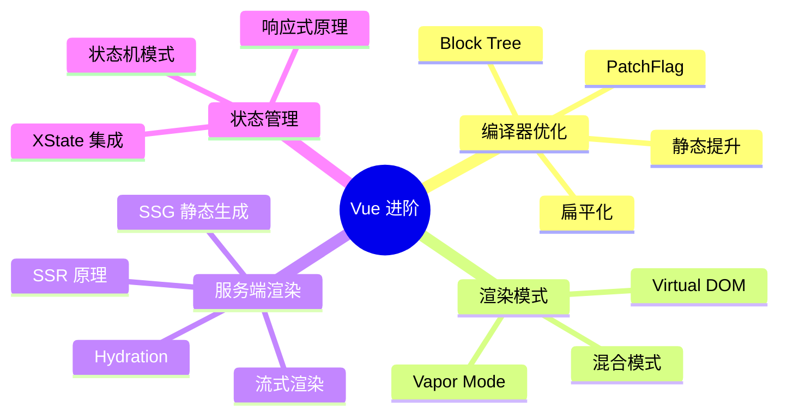
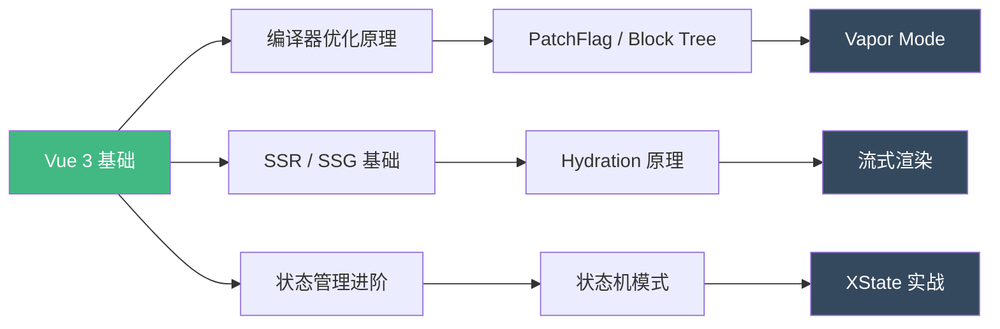
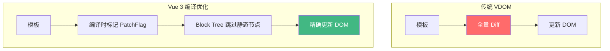

# Vue 进阶概述

Vue 3 不仅仅是一个渐进式框架——它在编译器、运行时和服务端渲染方面都有深度的技术设计。本模块将从**编译策略**、**渲染模式**和**服务端渲染**三个维度，深入 Vue 的内部机制。

## 知识体系总览

## 学习路径

## 模块内容

| 主题 | 核心知识点 | 面试频率 |
|------|-----------|---------|
| [Vapor Mode](./vapor-mode.md) | 编译策略、性能对比、与 Virtual DOM 差异 | ★★★★☆ |
| [Vue SSR/SSG](./vue-ssr.md) | Nuxt 3、Hydration 原理、流式渲染 | ★★★★★ |
| [编译器优化](./compiler-optimization.md) | PatchFlag、Block Tree、静态提升、扁平化 | ★★★★☆ |

## 为什么需要了解编译优化？

传统 Virtual DOM 的核心问题是**Diff 过程的全量比较**。Vue 3 通过编译时分析，将模板中的静态内容和动态内容区分开来，大幅减少了运行时的比较工作。

## 面试高频问题

1. **Vue 3 的编译优化有哪些？各自解决了什么问题？**
2. **Virtual DOM 的优势和劣势分别是什么？**
3. **SSR 的核心原理是什么？Hydration 过程会出什么问题？**
4. **Vapor Mode 和传统模式有什么区别？**

## 前置知识

在深入本模块之前，建议先掌握：

- Vue 3 Composition API
- Vue 3 响应式原理（Proxy、effect、track/trigger）
- 基本的编译原理概念（AST、代码生成）
- 基本的服务端渲染概念

## 推荐阅读

- [Vue 3 Compiler Optimization Hints](https://vuejs.org/guide/extras/rendering-mechanism.html)
- [Vue Vapor Mode RFC](https://github.com/vuejs/core-vapor)
- [Nuxt 3 Documentation](https://nuxt.com/docs)
