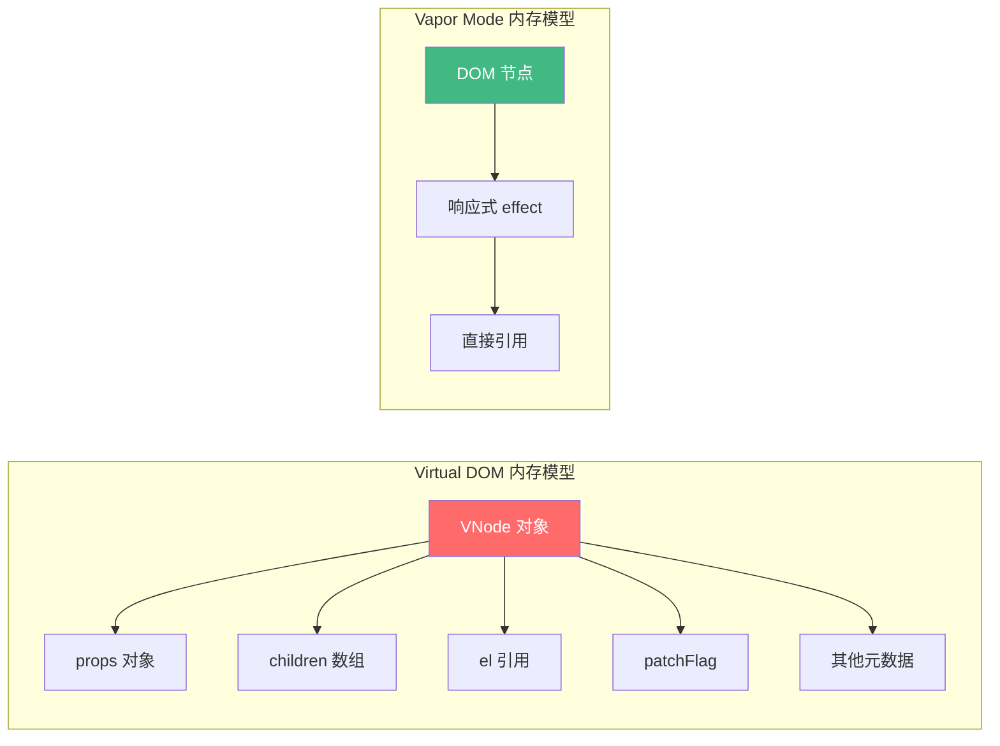
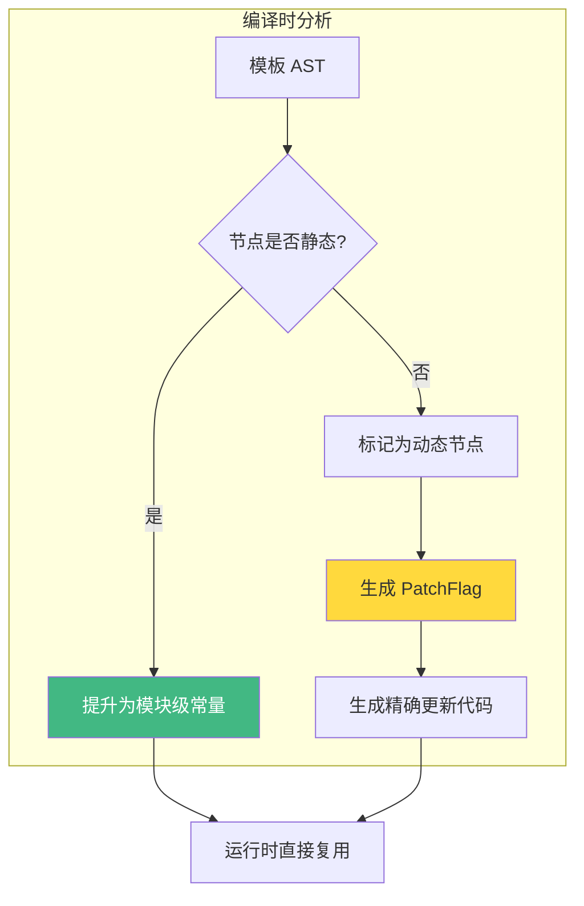
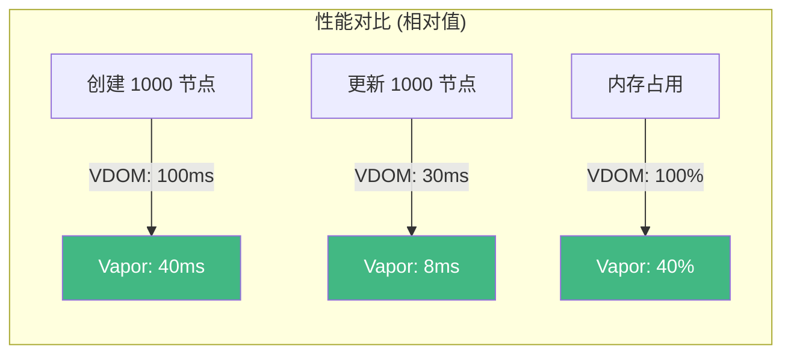
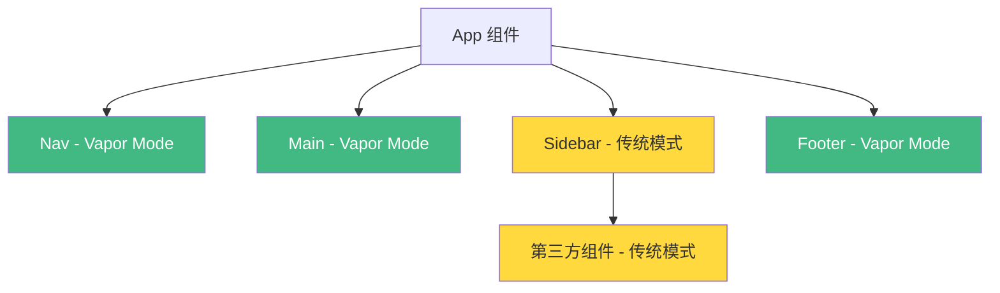

# Vapor Mode 原理

Vapor Mode 是 Vue 3 团队正在开发的一种**无 Virtual DOM 渲染模式**。它通过编译时将模板直接转换为原生 DOM 操作，跳过 Virtual DOM 的创建和 Diff 过程，从而获得更高的性能。

## 核心思想

```mermaid
graph TD
    subgraph "传统模式 (Virtual DOM)"
        A1[模板 Template] --> B1[编译为 Render Function]
        B1 --> C1[生成 VNode Tree]
        C1 --> D1[Diff 新旧 VNode Tree]
        D1 --> E1[生成 DOM Patch]
        E1 --> F1[应用到真实 DOM]
    end

    subgraph "Vapor Mode"
        A2[模板 Template] --> B2[编译为 DOM 操作指令]
        B2 --> C2[直接创建 DOM 节点]
        C2 --> D2[响应式绑定精确更新]
        D2 --> E2[直接操作真实 DOM]
    end

    style C1 fill:#ff6b6b,color:#fff
    style D1 fill:#ff6b6b,color:#fff
    style B2 fill:#42b883,color:#fff
    style D2 fill:#42b883,color:#fff
```



## 与 Virtual DOM 的核心差异

### 1. 编译产物不同

传统 Vue 模板编译为返回 VNode 的 `render` 函数：

```javascript
// 传统模式编译产物
function render() {
  return createVNode('div', { class: 'container' }, [
    createVNode('h1', null, title.value),
    createVNode('p', null, description.value)
  ])
}
```

Vapor Mode 编译为直接的 DOM 操作：

```javascript
// Vapor Mode 编译产物
function setup() {
  const n0 = template('<div class="container"><h1></h1><p></p></div>')
  const h1 = n0.firstChild
  const p = h1.nextSibling

  // 响应式绑定：直接更新文本节点
  effect(() => {
    setTextContent(h1, title.value)
  })
  effect(() => {
    setTextContent(p, description.value)
  })

  return n0
}
```

### 2. 内存占用对比



| 对比维度 | Virtual DOM | Vapor Mode |
|---------|-------------|------------|
| 内存占用 | 每个节点创建 VNode 对象 | 仅保留 DOM 节点引用 |
| 更新路径 | render → diff → patch | effect → 直接 DOM 操作 |
| 树结构 | 虚拟树 + 真实树 | 仅真实 DOM 树 |
| GC 压力 | 大量临时 VNode 对象 | 几乎无额外对象 |

## 编译策略详解

### 静态节点提升



### 响应式绑定类型

Vapor Mode 将不同的动态绑定编译为不同的更新策略：

```javascript
// 模板: <div :class="cls" :id="id" @click="handler">

// 编译产物：每种绑定类型独立的 effect
effect(() => setClass(el, cls.value))      // 属性绑定
effect(() => setId(el, id.value))           // 属性绑定
on(el, 'click', handler)                    // 事件直接绑定
```

### 条件渲染优化

```vue
<template>
  <div>
    <p v-if="show">可见内容</p>
    <span v-else>备选内容</span>
  </div>
</template>
```

```javascript
// Vapor Mode 编译产物
function setup() {
  const n0 = template('<div></div>')
  const frag = createBlock(() => {
    if (show.value) {
      const n1 = template('<p>可见内容</p>')
      return n1
    } else {
      const n2 = template('<span>备选内容</span>')
      return n2
    }
  })
  insert(frag, n0)
  return n0
}
```

## 列表渲染（v-for）处理

```vue
<template>
  <ul>
    <li v-for="item in list" :key="item.id">{{ item.text }}</li>
  </ul>
</template>
```

```javascript
// Vapor Mode 列表编译策略
function setup() {
  const n0 = template('<ul></ul>')

  // 列表渲染使用更高效的 Diff 策略
  effect(() => {
    createList(n0, list.value, (item) => {
      const li = template('<li></li>')
      effect(() => setTextContent(li, item.text))
      return li
    }, item => item.id)
  })

  return n0
}
```

## 性能对比基准



> **注意**: 以上数据为示意性数据，实际性能取决于具体场景。

## 混合模式

Vapor Mode 支持与传统模式混合使用：



```javascript
// 通过 defineVaporComponent 标记 Vapor 组件
import { defineVaporComponent } from 'vue/vapor'

export default defineVaporComponent({
  setup() {
    // Vapor Mode 组件逻辑
  }
})
```

## 最佳实践

1. **渐进式迁移**：从叶子组件开始使用 Vapor Mode，逐步向上迁移
2. **性能敏感组件优先**：对性能要求高的列表、动画组件优先使用
3. **保持兼容性**：Vapor Mode 组件可以和传统模式组件共存
4. **关注编译产物**：检查编译输出，确保生成的代码符合预期

## 面试要点

### Q: Vapor Mode 的核心优势是什么？

**A**: Vapor Mode 通过编译时将模板直接转换为原生 DOM 操作指令，跳过了 Virtual DOM 的创建和 Diff 过程。核心优势包括：
- **更低的内存占用**：不需要维护虚拟 DOM 树
- **更快的更新速度**：响应式系统直接驱动 DOM 更新
- **更小的运行时体积**：不需要 diff 算法和 VNode 相关代码

### Q: Vapor Mode 和 Svelte 有什么异同？

**A**: 两者都采用编译时优化策略，但有本质区别：
- **Svelte**：编译时生成完整的更新函数，响应式基于编译时分析的变量赋值
- **Vapor Mode**：编译时生成 DOM 操作，但响应式系统仍然是 Vue 的 Proxy-based reactivity
- Vapor Mode 保留了 Vue 的 Composition API 和响应式系统，迁移成本更低

### Q: 为什么 Vue 不全面转向 Vapor Mode？

**A**:
1. **渐进式理念**：Vue 的核心价值之一是渐进式，传统模式对于简单应用已经足够
2. **生态兼容**：大量现有组件库基于传统模式开发
3. **开发中**：Vapor Mode 仍在积极开发中，API 和编译策略还在迭代
4. **混合使用**：支持混合模式，可以在同一个项目中按需使用

## 常见陷阱

1. **不要在 Vapor Mode 组件中使用 `this`**：Vapor Mode 组件没有组件实例
2. **注意 `$refs` 行为差异**：Vapor Mode 中 ref 直接引用 DOM 元素
3. **生命周期钩子限制**：部分生命周期钩子在 Vapor Mode 中行为可能不同
4. **第三方库兼容性**：依赖 VNode 的第三方库可能无法直接使用
