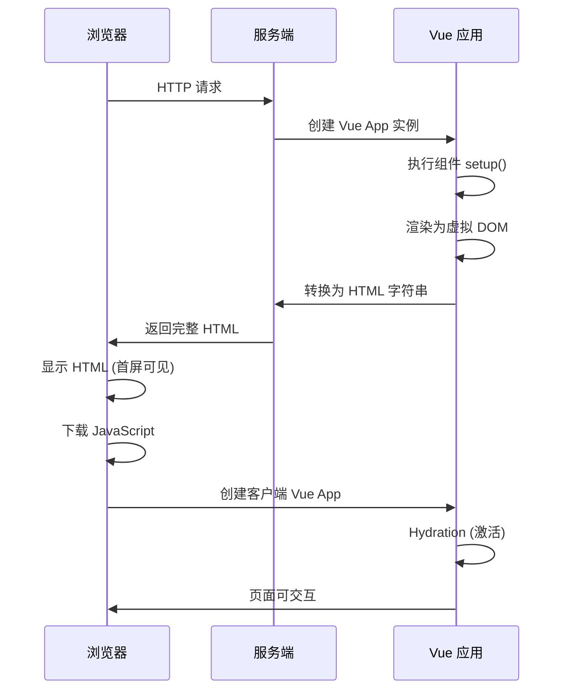
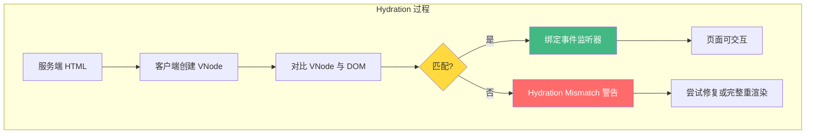
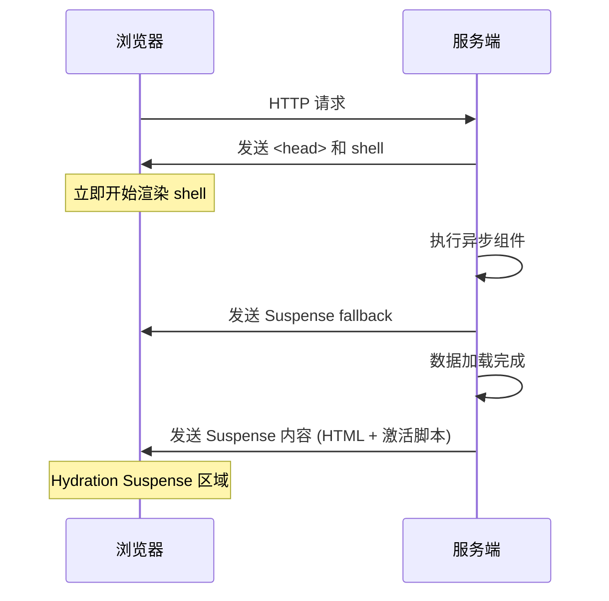
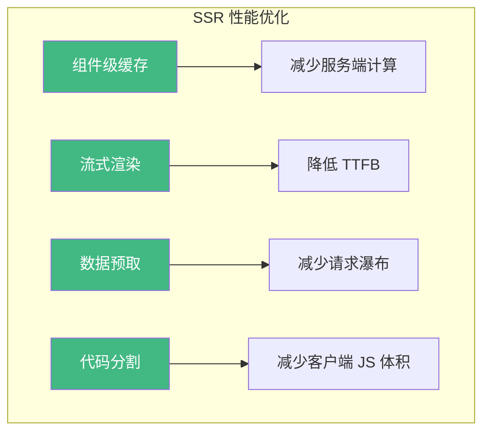

# Vue SSR/SSG 实践

服务端渲染 (SSR) 和静态站点生成 (SSG) 是 Vue 应用提升首屏性能和 SEO 的重要手段。本章将深入 SSR 的核心原理、Hydration 过程以及 Nuxt 3 的最佳实践。

## SSR 核心流程



## SSR vs SSG vs CSR

```mermaid
graph TD
    subgraph "CSR (客户端渲染)"
        C1[空 HTML] --> C2[下载 JS]
        C2 --> C3[执行 JS]
        C3 --> C4[渲染页面]
        C4 --> C5[可交互]
    end

    subgraph "SSR (服务端渲染)"
        S1[完整 HTML] --> S2[首屏可见]
        S2 --> S3[下载 JS]
        S3 --> S4[Hydration]
        S4 --> S5[可交互]
    end

    subgraph "SSG (静态生成)"
        G1[构建时生成 HTML] --> G2[CDN 分发]
        G2 --> G3[首屏可见]
        G3 --> G4[Hydration]
        G4 --> G5[可交互]
    end

    style C1 fill:#ff6b6b,color:#fff
    style S1 fill:#42b883,color:#fff
    style G1 fill:#4ecdc4,color:#fff
```



| 渲染方式 | 首屏时间 | SEO | 服务器压力 | 适用场景 |
|---------|---------|-----|----------|---------|
| CSR | 慢 | 差 | 无 | 后台管理系统 |
| SSR | 快 | 好 | 高 | 内容型网站、电商 |
| SSG | 最快 | 好 | 无 | 文档、博客 |

## Vue 3 SSR 基础实现

### 服务端入口

```javascript
// server.js
import { createSSRApp } from 'vue'
import { renderToString } from 'vue/server-renderer'
import App from './App.vue'

export async function render(url) {
  const app = createSSRApp(App)

  // 服务端渲染为字符串
  const html = await renderToString(app)

  return `
    <!DOCTYPE html>
    <html>
      <head><title>Vue SSR</title></head>
      <body>
        <div id="app">${html}</div>
        <script src="/client.js" type="module"></script>
      </body>
    </html>
  `
}
```

### 客户端入口

```javascript
// client.js
import { createSSRApp } from 'vue'
import App from './App.vue'

// createSSRApp 在客户端会自动进行 Hydration
const app = createSSRApp(App)
app.mount('#app')
```

## Hydration 原理

Hydration（水合）是 SSR 的关键过程：客户端 JavaScript 接管服务端渲染的 HTML，将其"激活"为可交互的应用。



### Hydration Mismatch 常见原因

```javascript
// 错误示例：服务端和客户端渲染结果不一致
const App = {
  setup() {
    // 服务端执行时 window 不存在
    const width = ref(
      typeof window !== 'undefined' ? window.innerWidth : 0
    )

    // 错误：直接在 setup 中使用浏览器 API
    const timestamp = new Date().toLocaleString() // 服务端和客户端时间不同

    return { width, timestamp }
  }
}
```

**正确做法**：

```vue
<script setup>
import { ref, onMounted } from 'vue'

const timestamp = ref('')
const isClient = ref(false)

// 只在客户端执行
onMounted(() => {
  isClient.value = true
  timestamp.value = new Date().toLocaleString()
})
</script>

<template>
  <div>
    <!-- 使用 v-if 避免 hydration mismatch -->
    <span v-if="isClient">{{ timestamp }}</span>
    <span v-else>加载中...</span>
  </div>
</template>
```

## 流式渲染 (Streaming SSR)

流式渲染允许服务端分块发送 HTML，减少 TTFB（首字节时间）。



```javascript
// 流式渲染入口
import { createSSRApp } from 'vue'
import { renderToNodeStream } from 'vue/server-renderer'

app.get('*', async (req, res) => {
  const app = createSSRApp(App)

  res.write(`<!DOCTYPE html>
    <html>
      <head><title>Streaming SSR</title></head>
      <body><div id="app">`)

  // 流式输出
  const stream = renderToNodeStream(app)
  stream.pipe(res, { end: false })

  stream.on('end', () => {
    res.end(`</div>
      <script src="/client.js" type="module"></script>
      </body>
    </html>`)
  })
})
```

### Suspense 与流式渲染

```vue
<!-- AsyncComponent.vue -->
<script setup>
import { ref, onMounted } from 'vue'

const data = ref(null)

// 模拟异步数据获取
const fetchData = async () => {
  const response = await fetch('/api/data')
  return response.json()
}

data.value = await fetchData()
</script>

<template>
  <div>{{ data.title }}</div>
</template>
```

```vue
<!-- App.vue -->
<template>
  <header>网站头部</header>

  <!-- Suspense 允许流式渲染异步组件 -->
  <Suspense>
    <template #default>
      <AsyncComponent />
    </template>
    <template #fallback>
      <div>加载中...</div>
    </template>
  </Suspense>

  <footer>网站底部</footer>
</template>
```

## Nuxt 3 最佳实践

### 数据获取

```vue
<script setup>
// Nuxt 3 提供的 SSR 友好的数据获取
const { data, pending, error } = await useFetch('/api/articles', {
  // 服务端执行，结果序列化到 HTML
  server: true,

  // 客户端不再重复请求
  initialCache: true,

  // 设置缓存 key
  key: 'articles-list',

  // 响应式参数
  query: { page: 1, limit: 10 }
})
</script>
```

### 路由中间件

```javascript
// middleware/auth.js
export default defineNuxtRouteMiddleware((to, from) => {
  // 注意：服务端执行时没有浏览器 API
  const authStore = useAuthStore()

  if (!authStore.isAuthenticated) {
    return navigateTo('/login')
  }
})
```

### SEO 优化

```vue
<script setup>
// Nuxt 3 的 useHead 组合式函数
useHead({
  title: '页面标题',
  meta: [
    { name: 'description', content: '页面描述' },
    { property: 'og:title', content: 'Open Graph 标题' }
  ],
  script: [
    { src: 'https://analytics.example.com/script.js', defer: true }
  ]
})

// 或使用 useSeoMeta
useSeoMeta({
  ogTitle: '页面标题',
  ogDescription: '页面描述',
  ogImage: 'https://example.com/image.jpg'
})
</script>
```

## 性能优化策略



```javascript
// 组件级缓存 (Component-level Caching)
import { createSSRApp } from 'vue'
import { renderToString } from 'vue/server-renderer'

const componentCache = new Map()

function renderWithCache(app) {
  const cacheKey = app.type.name

  if (componentCache.has(cacheKey)) {
    return componentCache.get(cacheKey)
  }

  const html = renderToString(app)
  componentCache.set(cacheKey, html)
  return html
}
```

## 面试要点

### Q: SSR 的核心原理是什么？

**A**: SSR 的核心流程：
1. 服务端创建 Vue App 实例
2. 执行组件的 `setup()` 和渲染函数
3. 将虚拟 DOM 转换为 HTML 字符串
4. 将 HTML 发送给浏览器
5. 浏览器下载 JavaScript 后执行 Hydration
6. Hydration 过程中对比服务端 HTML 和客户端 VNode
7. 绑定事件监听器，页面变为可交互

### Q: 什么是 Hydration Mismatch？如何避免？

**A**: Hydration Mismatch 指服务端渲染的 HTML 与客户端 Vue 生成的 VNode 不一致。常见原因：
- 使用了浏览器特有 API（`window`、`document`）
- 时间戳、随机数等不确定值
- 条件渲染依赖客户端状态

避免方法：
- 使用 `onMounted` 包裹浏览器 API 调用
- 使用 `v-if` 控制客户端特有内容的渲染
- 使用 `useFetch` 等 SSR 友好的数据获取方式

### Q: 流式渲染的优势是什么？

**A**: 流式渲染允许服务端分块发送 HTML：
- **降低 TTFB**：浏览器可以更早开始渲染
- **更好的用户体验**：用户可以先看到页面骨架
- **减少服务端内存占用**：不需要等待所有组件渲染完成

## 常见陷阱

1. **不要在服务端执行浏览器 API**：`window`、`document`、`localStorage` 等
2. **注意全局状态污染**：服务端所有请求共享同一个应用实例
3. **避免在 `setup` 中使用随机值**：会导致 hydration mismatch
4. **正确处理异步数据**：使用 `useFetch` 或 `async setup`
5. **注意内存泄漏**：服务端长时间运行，避免创建大量闭包
