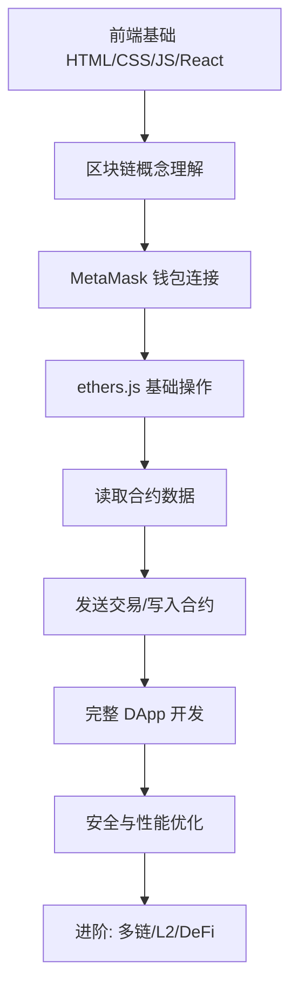

# Web3 前端开发概述

## 什么是 Web3？

Web3 是互联网的下一代演进形态，其核心理念是将数据所有权和控制权归还给用户。作为前端开发者，理解 Web3 意味着掌握一套全新的交互模式——用户不再通过账号密码登录，而是通过**加密钱包**证明身份；数据不再存储在中心化服务器，而是记录在**区块链**上。

### 核心理念

| 理念 | 含义 | 前端体现 |
|------|------|----------|
| 去中心化 | 没有单点控制，数据分布在全网节点 | 连接 RPC 节点而非单一后端 |
| 用户主权 | 用户拥有自己的数据和资产 | 钱包即身份，无需注册登录 |
| 无需信任 | 代码即法律，规则由智能合约保证 | 交互透明，合约代码可验证 |
| 开放组合 | 协议开放，可自由组合 | 前端可调用任意公开合约 |

## Web1 vs Web2 vs Web3

| 维度 | Web1（只读） | Web2（读写） | Web3（读写拥有） |
|------|-------------|-------------|-----------------|
| 时间 | 1990-2004 | 2004-2020 | 2020-至今 |
| 数据所有权 | 网站所有者 | 平台（Google/Meta） | 用户自己 |
| 交互方式 | 静态浏览 | 动态交互、UGC | 钱包签名、链上交互 |
| 商业模式 | 广告、门户 | 平台抽成、数据变现 | 代币经济、NFT |
| 技术架构 | HTML 静态页面 | 前后端分离、云服务 | 区块链 + IPFS + 前端 |
| 身份认证 | 无/简单登录 | OAuth、手机验证 | 加密钱包（密钥对） |
| 典型产品 | 雅虎、新浪 | 微信、抖音、淘宝 | Uniswap、OpenSea |

## Web3 技术栈全景图

```
┌─────────────────────────────────────────────────┐
│                  应用层 (DApp)                    │
│  React/Vue + ethers.js + wagmi + RainbowKit     │
├─────────────────────────────────────────────────┤
│                  协议层                           │
│  DeFi(Uniswap) | NFT(ERC-721) | DAO | DID      │
├─────────────────────────────────────────────────┤
│                  中间件层                         │
│  The Graph | Chainlink | IPFS | ENS             │
├─────────────────────────────────────────────────┤
│                  区块链层                         │
│  Ethereum | Polygon | Arbitrum | Solana         │
└─────────────────────────────────────────────────┘
```

## 前端开发者需要掌握的 Web3 知识体系

作为前端开发者进入 Web3，你已经具备了 80% 的基础能力。以下是需要额外学习的内容：

### 必备知识

1. **区块链基础**：区块结构、共识机制、Gas 机制
2. **钱包交互**：MetaMask API、WalletConnect 协议
3. **ethers.js**：Provider、Signer、Contract 交互
4. **智能合约基础**：理解 ABI、常见标准（ERC-20/721/1155）
5. **安全意识**：签名验证、防钓鱼、权限控制

### 加分知识

- Solidity 基础语法
- The Graph 子图查询
- IPFS 去中心化存储
- Layer2 扩容方案原理

:::tip 好消息
Web3 前端的 UI 开发和传统前端完全一致（React/Vue/CSS），区别只在于**数据来源**从后端 API 变成了区块链 RPC 调用，**身份认证**从 JWT 变成了钱包签名。
:::

## 主流区块链平台对比

| 平台 | 共识机制 | TPS | Gas 费用 | 生态成熟度 | 适合场景 |
|------|---------|-----|---------|-----------|---------|
| Ethereum | PoS | ~15 | 高（$1-50） | ⭐⭐⭐⭐⭐ | DeFi、NFT 核心协议 |
| Polygon | PoS | ~7000 | 极低（<$0.01） | ⭐⭐⭐⭐ | 游戏、社交、高频应用 |
| Arbitrum | Optimistic Rollup | ~4000 | 低（$0.1-0.5） | ⭐⭐⭐⭐ | DeFi、通用 DApp |
| Solana | PoH + PoS | ~65000 | 极低（<$0.01） | ⭐⭐⭐ | 高性能 DeFi、游戏 |
| Base | Optimistic Rollup | ~2000 | 低 | ⭐⭐⭐ | 社交、消费级应用 |

:::info 选择建议
初学者建议从 **Ethereum + Polygon** 开始，因为生态最完善、文档最丰富、工具最成熟。Ethereum 用于理解原理，Polygon 用于低成本实验。
:::

## 开发工具链

### 智能合约开发

| 工具 | 语言 | 特点 | 适合 |
|------|------|------|------|
| Hardhat | JavaScript/TS | 插件丰富、调试方便 | 前端开发者首选 |
| Foundry | Solidity | 速度极快、原生测试 | 合约开发者 |
| Remix | 浏览器 IDE | 零配置、快速原型 | 学习入门 |

### 前端交互库

| 库 | 定位 | 特点 |
|----|------|------|
| ethers.js | 底层库 | 轻量、类型安全、文档完善 |
| wagmi | React Hooks | 基于 ethers，声明式、缓存管理 |
| viem | 底层库 | 新一代替代 ethers，更小更快 |
| RainbowKit | UI 组件 | 开箱即用的钱包连接 UI |
| web3modal | UI 组件 | WalletConnect 官方 UI 方案 |

### 基础设施

| 服务 | 用途 | 免费额度 |
|------|------|---------|
| Infura | RPC 节点服务 | 100K 请求/天 |
| Alchemy | RPC + 增强 API | 300M CU/月 |
| The Graph | 链上数据索引 | 10K 查询/月 |
| Pinata | IPFS 存储 | 500MB |

## 学习路线建议



### 推荐学习顺序

1. **第1周**：理解区块链概念、安装 MetaMask、领取测试网 ETH
2. **第2周**：学习 ethers.js，能连接钱包、查询余额
3. **第3周**：与 ERC-20 合约交互（查余额、授权、转账）
4. **第4周**：使用 wagmi + RainbowKit 构建完整 DApp
5. **第5-6周**：学习 Solidity 基础，部署自己的合约
6. **第7-8周**：完成一个完整项目（NFT Mint 页面或 Token Swap）

:::warning 常见误区
不要一开始就去学 Solidity！作为前端开发者，应该先搞清楚如何与已有合约交互，再考虑自己写合约。很多 DApp 前端开发者日常工作并不需要写 Solidity。
:::

## Web3 行业现状与前景

### 当前趋势

- **账户抽象（AA）**：降低用户门槛，支持社交登录 + Gas 代付
- **Layer2 爆发**：Arbitrum、Optimism、Base 等 L2 降低成本
- **RWA（真实世界资产）**：传统资产上链，合规化发展
- **AI + Web3**：去中心化 AI 计算、AI Agent 链上交互
- **社交与身份**：去中心化社交（Lens/Farcaster）、DID 身份

### 前端开发者的机会

Web3 行业长期缺乏优秀的前端开发者。具备以下能力的人才非常稀缺：

- 能将复杂链上交互设计成友好 UI
- 理解交易状态管理和错误处理
- 掌握钱包连接和多链支持
- 注重安全和用户体验

:::tip 求职建议
Web3 前端岗位通常要求：React + TypeScript + ethers.js/wagmi + 了解 EVM 基础。不需要你是 Solidity 专家，但需要能读懂合约 ABI 并正确调用。
:::

## 小结

Web3 前端开发是传统前端技能的自然延伸。核心差异在于：

1. **身份**：从中心化账户 → 加密钱包
2. **数据**：从后端 API → 区块链 RPC
3. **状态**：多了交易确认的异步流程
4. **安全**：涉及真实资产，安全要求更高

接下来的章节将逐步深入每个技术点，帮助你从零构建 Web3 前端能力。
