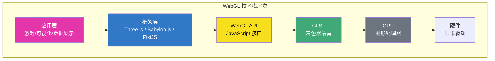
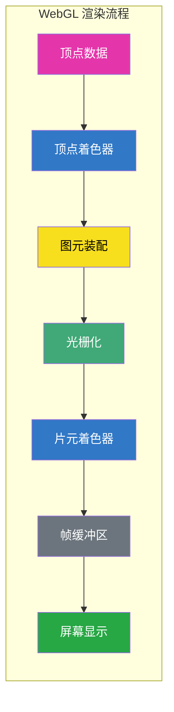
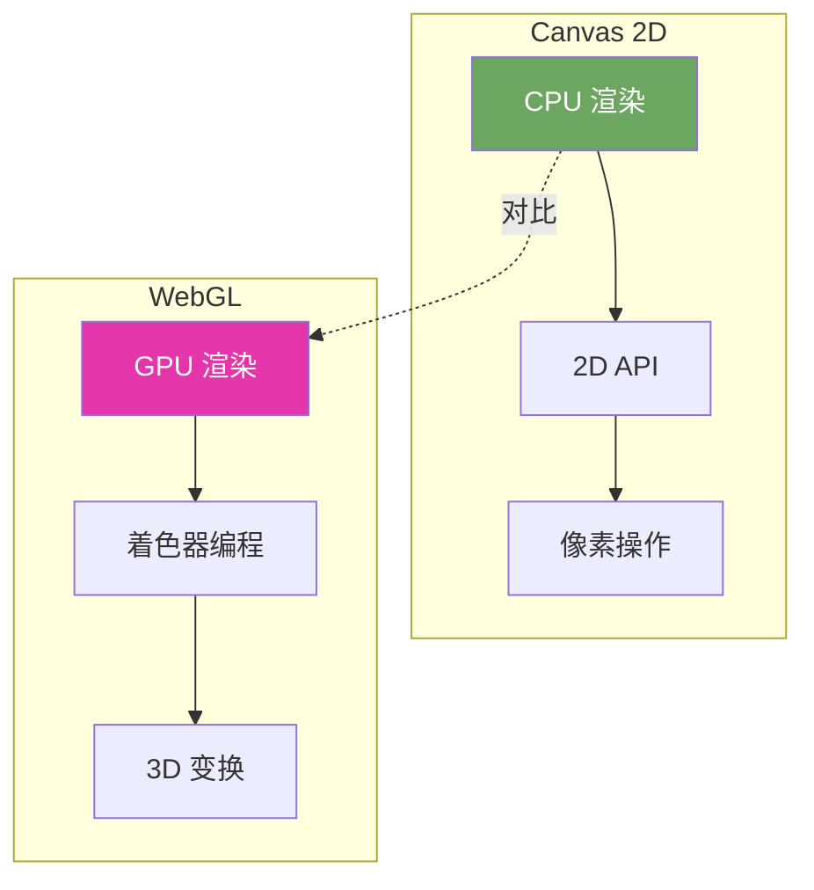
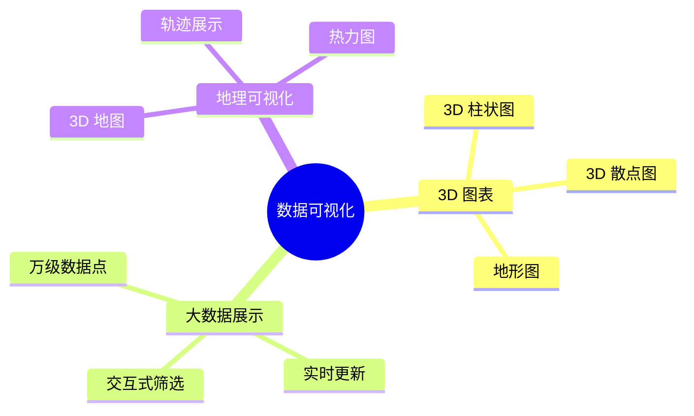
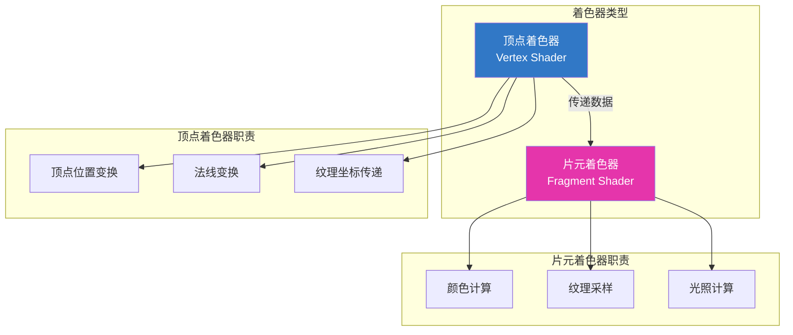
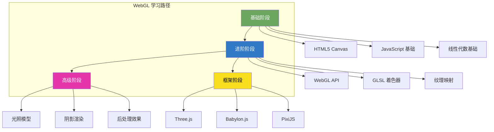
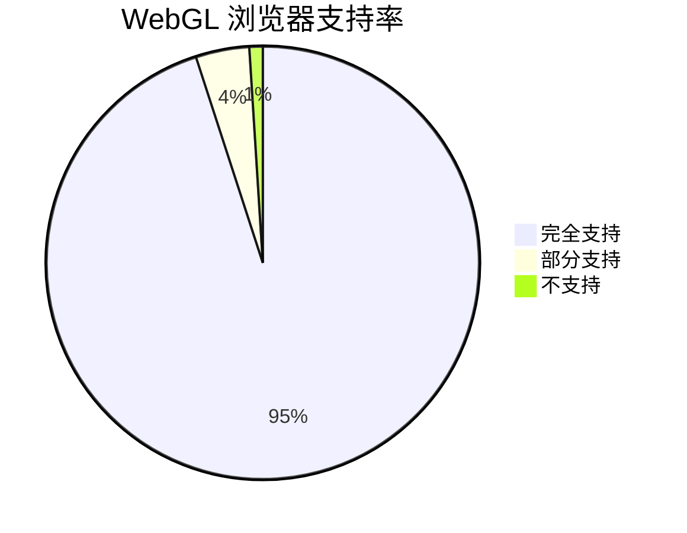

# WebGL 概述

## 什么是 WebGL？

WebGL（Web Graphics Library）是一种 JavaScript API，用于在任何兼容的 Web 浏览器中渲染交互式 3D 和 2D 图形，无需使用插件。它基于 OpenGL ES 2.0 规范，通过 HTML5 Canvas 元素提供硬件加速的图形渲染能力。

## WebGL 技术栈



## WebGL 渲染流程



## Web 图形技术对比

| 特性 | Canvas 2D | CSS3D | WebGL | WebGPU |
|------|-----------|-------|-------|--------|
| **维度** | 2D | 伪 3D | 3D/2D | 3D/2D |
| **性能** | 中 | 低 | 高 | 极高 |
| **学习曲线** | 低 | 低 | 高 | 极高 |
| **浏览器支持** | 全部 | 全部 | 全部 | 部分 |
| **GPU 加速** | 部分 | 是 | 是 | 是 |
| **适用场景** | 2D 游戏、图表 | 简单 3D 效果 | 3D 游戏、可视化 | 下一代图形 |

### Canvas 2D vs WebGL



**Canvas 2D：**
- 简单易用，适合 2D 图形
- CPU 密集型，大量图形时性能下降
- 像素级操作方便

**WebGL：**
- GPU 加速，高性能渲染
- 学习曲线陡峭
- 适合 3D 图形和大量 2D 图形

## WebGL 应用场景

### 1. 数据可视化



### 2. 游戏开发

- 3D 网页游戏
- 2D 游戏引擎
- 物理模拟
- 粒子系统

### 3. 产品展示

- 3D 模型查看器
- 电商产品 360 度展示
- AR/VR 体验
- 建筑可视化

### 4. 创意交互

- 数据艺术
- 交互式动画
- 音乐可视化
- 粒子特效

## WebGL 核心概念

### 1. Canvas 元素

```html
<!-- HTML 中创建 Canvas -->
<canvas id="glCanvas" width="800" height="600">
  您的浏览器不支持 WebGL
</canvas>
```

### 2. WebGL 上下文

```javascript
// 获取 WebGL 上下文
const canvas = document.getElementById('glCanvas');
const gl = canvas.getContext('webgl');

if (!gl) {
  alert('WebGL 不支持');
  return;
}

// 或获取 WebGL 2 上下文
const gl2 = canvas.getContext('webgl2');
```

### 3. 着色器（Shader）



### 4. GLSL 着色器语言

```glsl
// 顶点着色器示例
attribute vec4 aPosition;  // 顶点位置
attribute vec4 aColor;     // 顶点颜色
varying vec4 vColor;       // 传递给片元着色器

void main() {
    gl_Position = aPosition;  // 设置顶点位置
    vColor = aColor;          // 传递颜色
}
```

```glsl
// 片元着色器示例
precision mediump float;   // 精度声明
varying vec4 vColor;       // 从顶点着色器接收

void main() {
    gl_FragColor = vColor;  // 设置像素颜色
}
```

### 5. Buffer 和 Texture

```javascript
// 创建缓冲区
const positionBuffer = gl.createBuffer();
gl.bindBuffer(gl.ARRAY_BUFFER, positionBuffer);

// 设置数据
const positions = [
  0.0,  0.5,   // 顶点 1
  -0.5, -0.5,  // 顶点 2
  0.5, -0.5    // 顶点 3
];
gl.bufferData(gl.ARRAY_BUFFER, new Float32Array(positions), gl.STATIC_DRAW);

// 创建纹理
const texture = gl.createTexture();
gl.bindTexture(gl.TEXTURE_2D, texture);

// 设置纹理图像
gl.texImage2D(
  gl.TEXTURE_2D,    // 目标
  0,                // 级别
  gl.RGBA,          // 内部格式
  gl.RGBA,          // 格式
  gl.UNSIGNED_BYTE, // 类型
  image             // 图像数据
);
```

## 学习路径



### 阶段一：基础准备

1. **HTML5 Canvas**
   - Canvas 2D 绘图基础
   - 动画循环（requestAnimationFrame）
   - 事件处理

2. **JavaScript 基础**
   - 数组操作（Float32Array 等）
   - 异步编程
   - ES6+ 语法

3. **线性代数基础**
   - 向量运算
   - 矩阵变换
   - 四元数（可选）

### 阶段二：WebGL 基础

1. **WebGL API**
   - 初始化上下文
   - 编译着色器
   - 绘制三角形
   - 缓冲区管理

2. **GLSL 着色器**
   - 数据类型（vec2, vec3, mat4 等）
   - 内置变量
   - Uniform 和 Attribute

3. **纹理映射**
   - 纹理加载
   - UV 坐标
   - 纹理过滤

### 阶段三：高级渲染

1. **光照模型**
   - 环境光、漫反射、镜面反射
   - Phong 光照模型
   - 法线贴图

2. **阴影渲染**
   - Shadow Mapping
   - PCF 软阴影
   - 级联阴影

3. **后处理效果**
   - 模糊效果
   - Bloom 效果
   - 色调映射

### 阶段四：框架使用

1. **Three.js**（推荐首选）
   - 场景、相机、灯光
   - 材质和几何体
   - 动画系统
   - 模型加载

2. **其他框架**
   - Babylon.js：游戏引擎
   - PixiJS：2D 渲染
   - A-Frame：VR 开发

## 第一个 WebGL 程序

```javascript
// 完整的 WebGL 示例：绘制一个彩色三角形
function main() {
  const canvas = document.getElementById('glCanvas');
  const gl = canvas.getContext('webgl');

  if (!gl) {
    console.error('WebGL 不支持');
    return;
  }

  // 顶点着色器源码
  const vsSource = `
    attribute vec4 aPosition;
    attribute vec4 aColor;
    varying vec4 vColor;
    void main() {
      gl_Position = aPosition;
      vColor = aColor;
    }
  `;

  // 片元着色器源码
  const fsSource = `
    precision mediump float;
    varying vec4 vColor;
    void main() {
      gl_FragColor = vColor;
    }
  `;

  // 编译着色器
  const vs = gl.createShader(gl.VERTEX_SHADER);
  gl.shaderSource(vs, vsSource);
  gl.compileShader(vs);

  const fs = gl.createShader(gl.FRAGMENT_SHADER);
  gl.shaderSource(fs, fsSource);
  gl.compileShader(fs);

  // 创建程序
  const program = gl.createProgram();
  gl.attachShader(program, vs);
  gl.attachShader(program, fs);
  gl.linkProgram(program);
  gl.useProgram(program);

  // 顶点数据（位置 + 颜色）
  const vertices = new Float32Array([
    0.0, 0.5, 1.0, 0.0, 0.0,  // 顶点 1：红色
    -0.5, -0.5, 0.0, 1.0, 0.0, // 顶点 2：绿色
    0.5, -0.5, 0.0, 0.0, 1.0   // 顶点 3：蓝色
  ]);

  // 创建缓冲区
  const buffer = gl.createBuffer();
  gl.bindBuffer(gl.ARRAY_BUFFER, buffer);
  gl.bufferData(gl.ARRAY_BUFFER, vertices, gl.STATIC_DRAW);

  // 设置位置属性
  const positionLoc = gl.getAttribLocation(program, 'aPosition');
  gl.enableVertexAttribArray(positionLoc);
  gl.vertexAttribPointer(positionLoc, 2, gl.FLOAT, false, 20, 0);

  // 设置颜色属性
  const colorLoc = gl.getAttribLocation(program, 'aColor');
  gl.enableVertexAttribArray(colorLoc);
  gl.vertexAttribPointer(colorLoc, 3, gl.FLOAT, false, 20, 8);

  // 清空画布
  gl.clearColor(0.0, 0.0, 0.0, 1.0);
  gl.clear(gl.COLOR_BUFFER_BIT);

  // 绘制三角形
  gl.drawArrays(gl.TRIANGLES, 0, 3);
}

main();
```

## 浏览器兼容性



### WebGL 1 vs WebGL 2

| 特性 | WebGL 1 | WebGL 2 |
|------|---------|---------|
| **基础** | OpenGL ES 2.0 | OpenGL ES 3.0 |
| **纹理** | 基础支持 | 3D 纹理、数组纹理 |
| **渲染目标** | 单个 | 多个（MRT） |
| **着色器** | GLSL ES 1.0 | GLSL ES 3.0 |
| **浏览器支持** | 全部 | 大部分 |

## 面试要点

### 常见问题

1. **WebGL 和 Canvas 2D 的区别？**

   - **渲染方式**：Canvas 2D 使用 CPU 渲染，WebGL 使用 GPU 渲染
   - **性能**：WebGL 在处理大量图形时性能更好
   - **能力**：WebGL 支持 3D 渲染和复杂的着色器效果
   - **学习曲线**：Canvas 2D 更简单，WebGL 需要图形学知识

2. **什么是着色器？顶点着色器和片元着色器有什么区别？**

   着色器是运行在 GPU 上的小程序：
   - **顶点着色器**：处理每个顶点，负责位置变换
   - **片元着色器**：处理每个像素，负责颜色计算

3. **WebGL 的坐标系统是怎样的？**

   WebGL 使用右手坐标系：
   - X 轴：向右为正
   - Y 轴：向上为正
   - Z 轴：向屏幕外为正
   - 范围：-1 到 1（标准化设备坐标）

4. **如何优化 WebGL 性能？**

   - 减少 draw call（合批渲染）
   - 使用纹理图集
   - 降低着色器复杂度
   - 使用 LOD（Level of Detail）
   - 避免 CPU-GPU 同步

## 总结

WebGL 是 Web 平台的底层 3D 图形 API，它提供了强大的 GPU 加速渲染能力。虽然直接使用 WebGL 较为复杂，但通过 Three.js 等框架可以大大简化开发。

## 延伸阅读

- [WebGL 基础](./webgl-basics.md)
- [Three.js 入门与实战](./threejs.md)
- [MDN WebGL 文档](https://developer.mozilla.org/zh-CN/docs/Web/API/WebGL_API)
- [WebGL Fundamentals](https://webglfundamentals.org/)
