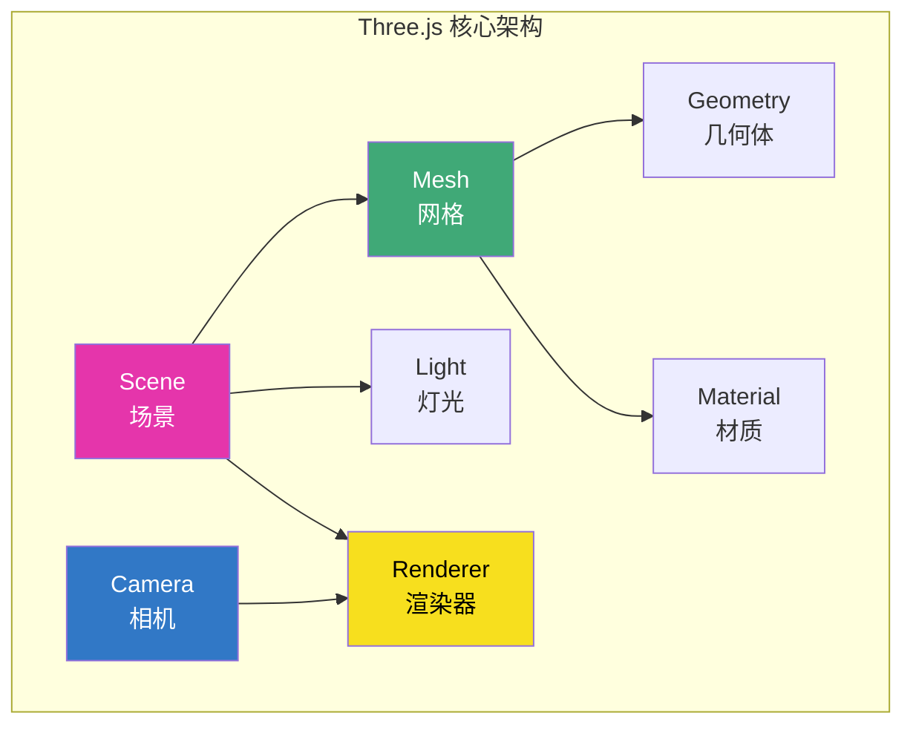
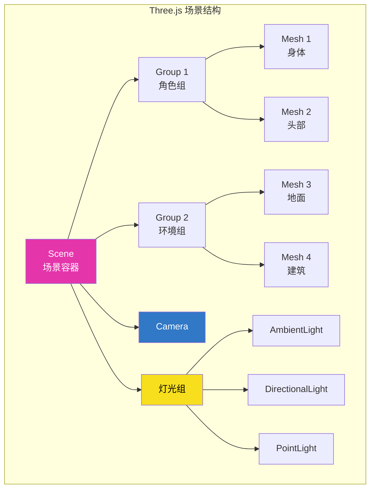
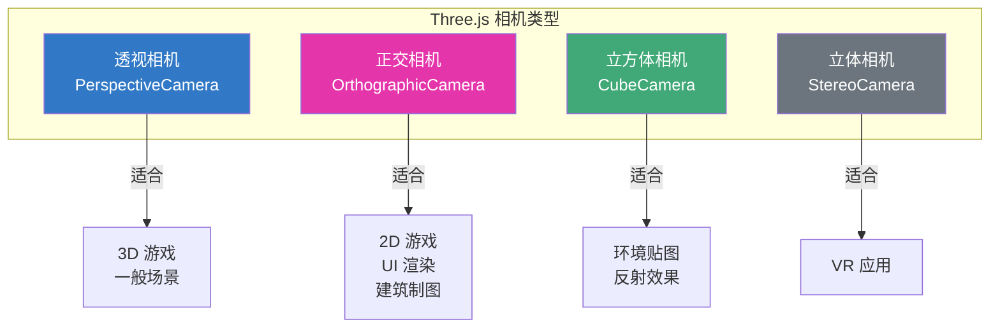
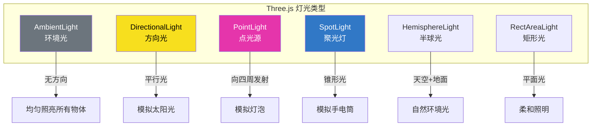
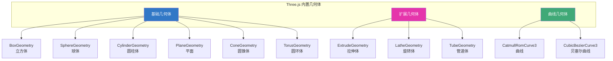
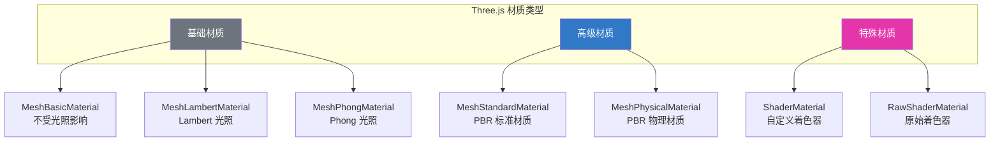
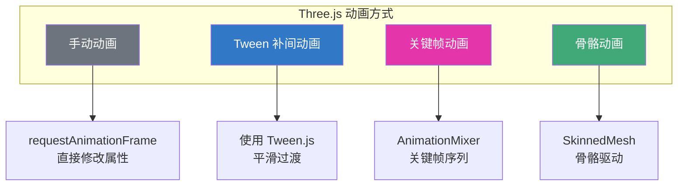
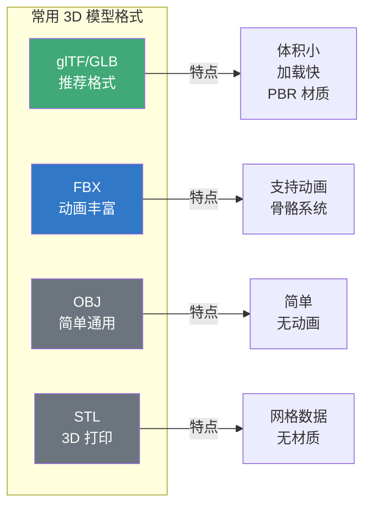
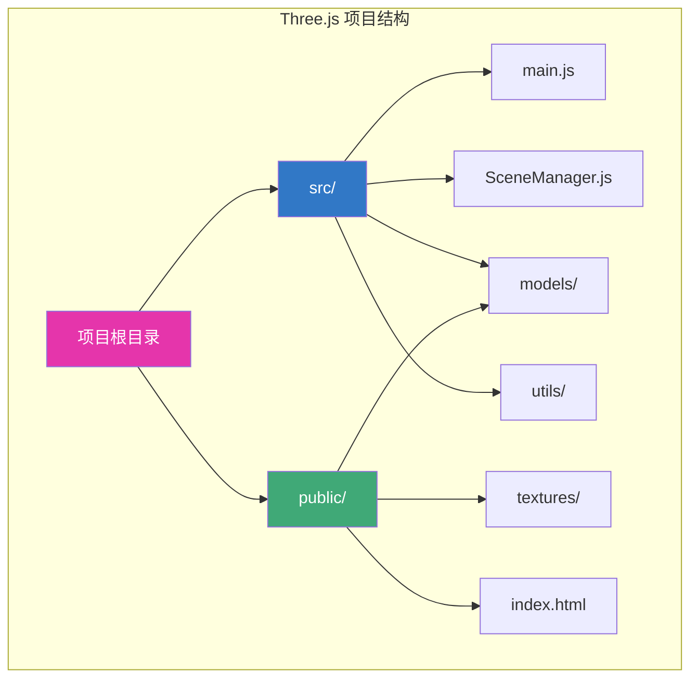
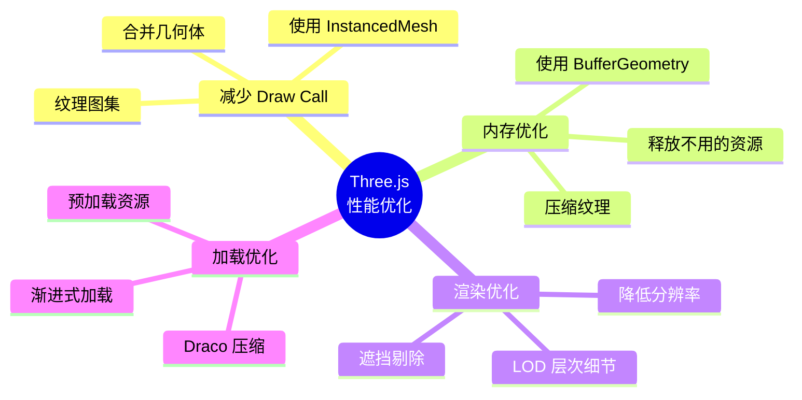

# Three.js 入门与实战

## 什么是 Three.js？

Three.js 是一个基于 WebGL 的 JavaScript 3D 库，它大大简化了 WebGL 的使用，提供了高级抽象和丰富的功能，是目前最流行的 Web 3D 渲染框架。

## Three.js 核心概念



## 场景结构



## 基础设置

### 安装和引入

```bash
npm install three
```

```javascript
import * as THREE from 'three';
import { OrbitControls } from 'three/addons/controls/OrbitControls.js';
```

### 创建场景基础三要素

```javascript
// 1. 创建场景
const scene = new THREE.Scene();
scene.background = new THREE.Color(0x222222);

// 2. 创建相机
const camera = new THREE.PerspectiveCamera(
  75,                                    // 视野角度
  window.innerWidth / window.innerHeight, // 宽高比
  0.1,                                   // 近裁剪面
  1000                                   // 远裁剪面
);
camera.position.set(0, 5, 10);
camera.lookAt(0, 0, 0);

// 3. 创建渲染器
const renderer = new THREE.WebGLRenderer({
  canvas: document.getElementById('canvas'),
  antialias: true, // 抗锯齿
});
renderer.setSize(window.innerWidth, window.innerHeight);
renderer.setPixelRatio(window.devicePixelRatio);
renderer.shadowMap.enabled = true; // 启用阴影

// 4. 添加控制器
const controls = new OrbitControls(camera, renderer.domElement);
controls.enableDamping = true; // 阻尼效果

// 5. 动画循环
function animate() {
  requestAnimationFrame(animate);
  controls.update(); // 更新控制器
  renderer.render(scene, camera);
}
animate();
```

## 相机系统



### 透视相机

```javascript
// 透视相机参数
const camera = new THREE.PerspectiveCamera(
  fov,    // 垂直视野角度（度）
  aspect, // 宽高比
  near,   // 近裁剪面
  far     // 远裁剪面
);

// 示例
const camera = new THREE.PerspectiveCamera(
  60,
  window.innerWidth / window.innerHeight,
  0.1,
  1000
);

// 相机位置和朝向
camera.position.set(10, 10, 10);
camera.lookAt(0, 0, 0);
```

### 正交相机

```javascript
// 正交相机参数
const camera = new THREE.OrthographicCamera(
  left,   // 左边界
  right,  // 右边界
  top,    // 上边界
  bottom, // 下边界
  near,   // 近裁剪面
  far     // 远裁剪面
);

// 示例
const frustumSize = 10;
const aspect = window.innerWidth / window.innerHeight;
const camera = new THREE.OrthographicCamera(
  -frustumSize * aspect / 2,
  frustumSize * aspect / 2,
  frustumSize / 2,
  -frustumSize / 2,
  0.1,
  1000
);
```

## 灯光系统



### 灯光使用示例

```javascript
// 环境光：均匀照亮场景
const ambientLight = new THREE.AmbientLight(0x404040, 0.5);
scene.add(ambientLight);

// 方向光：模拟太阳光
const directionalLight = new THREE.DirectionalLight(0xffffff, 1);
directionalLight.position.set(5, 10, 5);
directionalLight.castShadow = true; // 投射阴影

// 配置阴影
directionalLight.shadow.mapSize.width = 2048;
directionalLight.shadow.mapSize.height = 2048;
directionalLight.shadow.camera.near = 0.5;
directionalLight.shadow.camera.far = 50;
scene.add(directionalLight);

// 点光源：模拟灯泡
const pointLight = new THREE.PointLight(0xff0000, 1, 100);
pointLight.position.set(0, 5, 0);
scene.add(pointLight);

// 聚光灯：模拟手电筒
const spotLight = new THREE.SpotLight(0xffffff, 1);
spotLight.position.set(0, 10, 0);
spotLight.angle = Math.PI / 6; // 光锥角度
spotLight.penumbra = 0.3; // 边缘柔和度
spotLight.castShadow = true;
scene.add(spotLight);

// 半球光：模拟自然环境
const hemisphereLight = new THREE.HemisphereLight(
  0x87CEEB, // 天空颜色
  0x8B4513, // 地面颜色
  0.6       // 强度
);
scene.add(hemisphereLight);
```

## 几何体



### 基础几何体示例

```javascript
// 立方体
const boxGeometry = new THREE.BoxGeometry(1, 1, 1);

// 球体
const sphereGeometry = new THREE.SphereGeometry(0.5, 32, 32);

// 圆柱体
const cylinderGeometry = new THREE.CylinderGeometry(0.5, 0.5, 1, 32);

// 平面
const planeGeometry = new THREE.PlaneGeometry(10, 10);

// 圆环体
const torusGeometry = new THREE.TorusGeometry(0.5, 0.2, 16, 100);

// 圆锥体
const coneGeometry = new THREE.ConeGeometry(0.5, 1, 32);

// 创建网格
const material = new THREE.MeshStandardMaterial({ color: 0x00ff00 });
const cube = new THREE.Mesh(boxGeometry, material);
scene.add(cube);
```

## 材质系统



### PBR 材质（推荐）

```javascript
// MeshStandardMaterial - PBR 标准材质
const material = new THREE.MeshStandardMaterial({
  color: 0x888888,        // 基础颜色
  roughness: 0.5,         // 粗糙度（0-1）
  metalness: 0.5,         // 金属度（0-1）
  map: diffuseTexture,    // 漫反射贴图
  normalMap: normalTexture, // 法线贴图
  roughnessMap: roughnessTexture, // 粗糙度贴图
  metalnessMap: metalnessTexture, // 金属度贴图
  aoMap: aoTexture,       // 环境遮蔽贴图
  envMap: environmentTexture, // 环境贴图
  emissive: 0x000000,     // 自发光颜色
  emissiveIntensity: 0,   // 自发光强度
  side: THREE.DoubleSide, // 双面渲染
});

// MeshPhysicalMaterial - PBR 物理材质（更高级）
const physicalMaterial = new THREE.MeshPhysicalMaterial({
  color: 0xffffff,
  roughness: 0.1,
  metalness: 0.0,
  clearcoat: 1.0,         // 清漆层
  clearcoatRoughness: 0.1,
  transmission: 0.9,       // 透射率（玻璃效果）
  thickness: 0.5,          // 厚度
  ior: 1.5,               // 折射率
});
```

### 纹理加载

```javascript
import { TextureLoader } from 'three';

const textureLoader = new TextureLoader();

// 加载纹理
const texture = textureLoader.load(
  'textures/diffuse.jpg',
  (texture) => {
    // 加载完成回调
    texture.wrapS = THREE.RepeatWrapping;
    texture.wrapT = THREE.RepeatWrapping;
    texture.repeat.set(2, 2);
  },
  (progress) => {
    // 加载进度
    console.log('Loading:', (progress.loaded / progress.total * 100) + '%');
  },
  (error) => {
    // 加载错误
    console.error('Error:', error);
  }
);

// 使用 RGBELoader 加载 HDR 环境贴图
import { RGBELoader } from 'three/addons/loaders/RGBELoader.js';

const rgbeLoader = new RGBELoader();
rgbeLoader.load('textures/environment.hdr', (texture) => {
  texture.mapping = THREE.EquirectangularReflectionMapping;
  scene.background = texture;
  scene.environment = texture;
});
```

## 动画系统



### 手动动画

```javascript
// 基础动画循环
function animate() {
  requestAnimationFrame(animate);

  // 旋转立方体
  cube.rotation.x += 0.01;
  cube.rotation.y += 0.01;

  // 弹跳动画
  const time = Date.now() * 0.001;
  cube.position.y = Math.abs(Math.sin(time)) * 2;

  renderer.render(scene, camera);
}
animate();
```

### Tween 补间动画

```javascript
import TWEEN from '@tweenjs/tween.js';

// 创建补间动画
const tween = new TWEEN.Tween(cube.position)
  .to({ x: 5, y: 2, z: 0 }, 1000) // 目标位置，持续时间
  .easing(TWEEN.Easing.Quadratic.InOut) // 缓动函数
  .onUpdate(() => {
    // 每帧更新回调
  })
  .onComplete(() => {
    // 动画完成回调
  })
  .start();

// 链式动画
const tween2 = new TWEEN.Tween(cube.rotation)
  .to({ y: Math.PI * 2 }, 1000)
  .easing(TWEEN.Easing.Linear.None);

tween.chain(tween2); // tween 完成后播放 tween2

// 动画循环中更新 Tween
function animate(time) {
  requestAnimationFrame(animate);
  TWEEN.update(time);
  renderer.render(scene, camera);
}
animate();
```

### 关键帧动画

```javascript
// 创建关键帧轨道
const positionKF = new THREE.VectorKeyframeTrack(
  '.position',
  [0, 1, 2],           // 时间点
  [
    0, 0, 0,           // 起始位置
    0, 5, 0,           // 中间位置
    0, 0, 0            // 结束位置
  ]
);

const rotationKF = new THREE.QuaternionKeyframeTrack(
  '.quaternion',
  [0, 1, 2],
  [
    0, 0, 0, 1,        // 起始旋转
    0.707, 0, 0, 0.707, // 中间旋转
    0, 0, 0, 1          // 结束旋转
  ]
);

// 创建动画剪辑
const clip = new THREE.AnimationClip('Action', 2, [
  positionKF,
  rotationKF
]);

// 创建动画混合器
const mixer = new THREE.AnimationMixer(cube);

// 创建动画动作
const action = mixer.clipAction(clip);
action.play();

// 动画循环中更新混合器
const clock = new THREE.Clock();

function animate() {
  requestAnimationFrame(animate);

  const delta = clock.getDelta();
  mixer.update(delta);

  renderer.render(scene, camera);
}
animate();
```

## 模型加载



### GLTF/GLB 加载

```javascript
import { GLTFLoader } from 'three/addons/loaders/GLTFLoader.js';
import { DRACOLoader } from 'three/addons/loaders/DRACOLoader.js';

// 创建 Draco 解码器（用于压缩模型）
const dracoLoader = new DRACOLoader();
dracoLoader.setDecoderPath('https://www.gstatic.com/draco/versioned/decoders/1.5.6/');

// 创建 GLTF 加载器
const gltfLoader = new GLTFLoader();
gltfLoader.setDRACOLoader(dracoLoader);

// 加载模型
gltfLoader.load(
  'models/character.glb',
  (gltf) => {
    const model = gltf.scene;

    // 调整模型大小和位置
    model.scale.set(0.01, 0.01, 0.01);
    model.position.set(0, 0, 0);

    // 启用阴影
    model.traverse((child) => {
      if (child.isMesh) {
        child.castShadow = true;
        child.receiveShadow = true;
      }
    });

    scene.add(model);

    // 播放动画
    if (gltf.animations.length > 0) {
      const mixer = new THREE.AnimationMixer(model);
      const action = mixer.clipAction(gltf.animations[0]);
      action.play();

      // 在动画循环中更新
      mixers.push(mixer);
    }
  },
  (progress) => {
    const percent = (progress.loaded / progress.total * 100).toFixed(2);
    console.log(`加载进度: ${percent}%`);
  },
  (error) => {
    console.error('模型加载失败:', error);
  }
);
```

### 模型动画控制

```javascript
class ModelAnimator {
  constructor(model, animations) {
    this.mixer = new THREE.AnimationMixer(model);
    this.actions = {};

    // 创建所有动画动作
    animations.forEach((clip) => {
      this.actions[clip.name] = this.mixer.clipAction(clip);
    });
  }

  play(name, options = {}) {
    const action = this.actions[name];
    if (!action) return;

    // 停止当前动画
    if (this.currentAction && this.currentAction !== action) {
      this.currentAction.fadeOut(options.transitionDuration || 0.3);
    }

    // 播放新动画
    action.reset();
    action.fadeIn(options.transitionDuration || 0.3);
    action.play();

    if (options.loop !== undefined) {
      action.loop = options.loop ? THREE.LoopRepeat : THREE.LoopOnce;
    }

    this.currentAction = action;
  }

  update(delta) {
    this.mixer.update(delta);
  }
}

// 使用示例
const animator = new ModelAnimator(model, gltf.animations);
animator.play('idle');

// 切换到跑步动画
setTimeout(() => {
  animator.play('run', { transitionDuration: 0.5 });
}, 3000);
```

## 完整项目示例

### 项目结构



### SceneManager 类

```javascript
// src/SceneManager.js
import * as THREE from 'three';
import { OrbitControls } from 'three/addons/controls/OrbitControls.js';

export class SceneManager {
  constructor(canvas) {
    // 场景
    this.scene = new THREE.Scene();
    this.scene.background = new THREE.Color(0x1a1a1a);

    // 相机
    this.camera = new THREE.PerspectiveCamera(
      75,
      window.innerWidth / window.innerHeight,
      0.1,
      1000
    );
    this.camera.position.set(5, 5, 5);

    // 渲染器
    this.renderer = new THREE.WebGLRenderer({
      canvas,
      antialias: true,
    });
    this.renderer.setSize(window.innerWidth, window.innerHeight);
    this.renderer.setPixelRatio(Math.min(window.devicePixelRatio, 2));
    this.renderer.shadowMap.enabled = true;
    this.renderer.shadowMap.type = THREE.PCFSoftShadowMap;
    this.renderer.toneMapping = THREE.ACESFilmicToneMapping;
    this.renderer.toneMappingExposure = 1;

    // 控制器
    this.controls = new OrbitControls(this.camera, this.renderer.domElement);
    this.controls.enableDamping = true;
    this.controls.dampingFactor = 0.05;

    // 动画混合器
    this.mixers = [];

    // 时钟
    this.clock = new THREE.Clock();

    // 初始化
    this.setupLights();
    this.setupHelpers();

    // 事件监听
    window.addEventListener('resize', () => this.onResize());
  }

  setupLights() {
    // 环境光
    const ambientLight = new THREE.AmbientLight(0xffffff, 0.3);
    this.scene.add(ambientLight);

    // 方向光
    const directionalLight = new THREE.DirectionalLight(0xffffff, 1);
    directionalLight.position.set(5, 10, 5);
    directionalLight.castShadow = true;
    directionalLight.shadow.mapSize.width = 2048;
    directionalLight.shadow.mapSize.height = 2048;
    this.scene.add(directionalLight);
  }

  setupHelpers() {
    // 网格助手
    const gridHelper = new THREE.GridHelper(20, 20);
    this.scene.add(gridHelper);

    // 坐标轴助手
    const axesHelper = new THREE.AxesHelper(5);
    this.scene.add(axesHelper);
  }

  add(object) {
    this.scene.add(object);
  }

  addMixer(mixer) {
    this.mixers.push(mixer);
  }

  onResize() {
    const width = window.innerWidth;
    const height = window.innerHeight;

    this.camera.aspect = width / height;
    this.camera.updateProjectionMatrix();

    this.renderer.setSize(width, height);
  }

  animate() {
    requestAnimationFrame(() => this.animate());

    const delta = this.clock.getDelta();

    // 更新控制器
    this.controls.update();

    // 更新动画混合器
    this.mixers.forEach((mixer) => mixer.update(delta));

    // 渲染场景
    this.renderer.render(this.scene, this.camera);
  }
}
```

### 主入口文件

```javascript
// src/main.js
import { SceneManager } from './SceneManager';
import { GLTFLoader } from 'three/addons/loaders/GLTFLoader.js';

async function init() {
  const canvas = document.getElementById('canvas');
  const manager = new SceneManager(canvas);

  // 加载模型
  const loader = new GLTFLoader();
  const gltf = await loader.loadAsync('models/scene.glb');

  manager.add(gltf.scene);

  // 如果有动画
  if (gltf.animations.length > 0) {
    const mixer = new THREE.AnimationMixer(gltf.scene);
    gltf.animations.forEach((clip) => {
      mixer.clipAction(clip).play();
    });
    manager.addMixer(mixer);
  }

  // 开始动画循环
  manager.animate();
}

init().catch(console.error);
```

## 性能优化



### 常用优化技巧

```javascript
// 1. 使用 InstancedMesh 渲染大量相同物体
const geometry = new THREE.BoxGeometry(1, 1, 1);
const material = new THREE.MeshStandardMaterial({ color: 0x00ff00 });
const instancedMesh = new THREE.InstancedMesh(geometry, material, 1000);

const matrix = new THREE.Matrix4();
for (let i = 0; i < 1000; i++) {
  matrix.setPosition(
    Math.random() * 50 - 25,
    Math.random() * 50 - 25,
    Math.random() * 50 - 25
  );
  instancedMesh.setMatrixAt(i, matrix);
}
scene.add(instancedMesh);

// 2. 合并几何体
import { mergeGeometries } from 'three/addons/utils/BufferGeometryUtils.js';

const mergedGeometry = mergeGeometries([
  geometry1,
  geometry2,
  geometry3,
]);
const mergedMesh = new THREE.Mesh(mergedGeometry, material);
scene.add(mergedMesh);

// 3. 使用 LOD（层次细节）
const lod = new THREE.LOD();
lod.addLevel(highDetailMesh, 0);    // 近距离：高精度
lod.addLevel(mediumDetailMesh, 50); // 中距离：中精度
lod.addLevel(lowDetailMesh, 100);   // 远距离：低精度
scene.add(lod);

// 4. 释放资源
function disposeMesh(mesh) {
  mesh.geometry.dispose();
  mesh.material.dispose();
  if (mesh.material.map) mesh.material.map.dispose();
}
```

## 面试要点

### 常见问题

1. **Three.js 的核心三要素是什么？**

   - **Scene（场景）**：包含所有 3D 对象的容器
   - **Camera（相机）**：定义观察视角
   - **Renderer（渲染器）**：负责将场景渲染到 Canvas

2. **PerspectiveCamera 和 OrthographicCamera 的区别？**

   - **PerspectiveCamera**：透视相机，有近大远小的效果，适合 3D 场景
   - **OrthographicCamera**：正交相机，没有透视效果，适合 2D 游戏或建筑制图

3. **Three.js 有哪些灯光类型？**

   - **AmbientLight**：环境光，均匀照亮所有物体
   - **DirectionalLight**：方向光，模拟太阳光
   - **PointLight**：点光源，向四周发射光线
   - **SpotLight**：聚光灯，锥形光束
   - **HemisphereLight**：半球光，模拟自然环境

4. **如何优化 Three.js 性能？**

   - 减少 Draw Call（合并几何体、使用 InstancedMesh）
   - 使用 LOD（层次细节）
   - 压缩纹理和模型（Draco、KTX2）
   - 合理使用阴影（限制阴影范围）
   - 使用 BufferGeometry 而非 Geometry

5. **glTF 格式有什么优势？**

   - 体积小，加载快
   - 支持 PBR 材质
   - 支持动画和骨骼
   - 支持 Draco 压缩
   - 是 3D 领域的"JPEG"

## 总结

Three.js 是一个功能强大且易于使用的 3D 框架，它的核心概念包括：
- **场景管理**：Scene、Camera、Renderer
- **物体创建**：Geometry、Material、Mesh
- **灯光系统**：各种灯光类型
- **动画系统**：手动动画、Tween、关键帧动画
- **模型加载**：支持多种 3D 格式

通过 Three.js，可以快速创建各种 Web 3D 应用，从简单的产品展示到复杂的 3D 游戏。

## 延伸阅读

- [Three.js 官方文档](https://threejs.org/docs/)
- [Three.js 示例](https://threejs.org/examples/)
- [WebGL 基础](./webgl-basics.md)
- [Three.js Journey](https://threejs-journey.com/)
