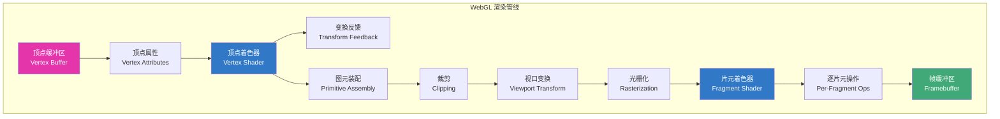
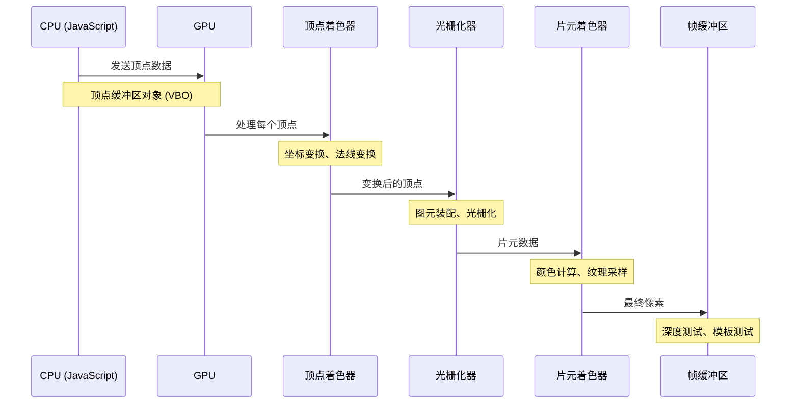
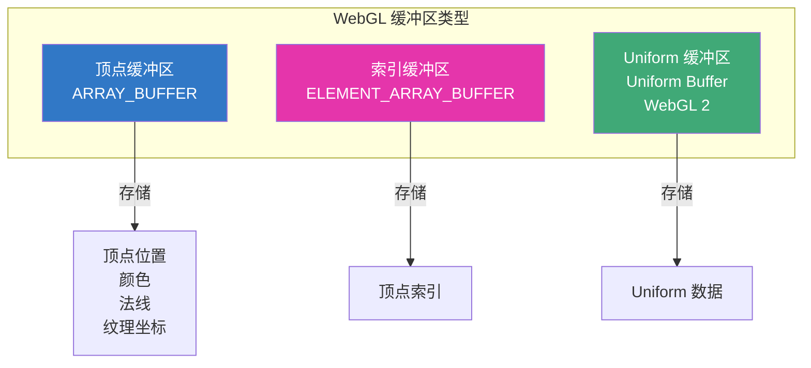
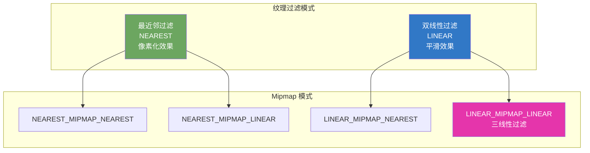

# WebGL 基础

## 渲染管线

WebGL 渲染管线是将 3D 场景转换为 2D 图像的完整流程。



### 管线阶段详解



## 顶点着色器

顶点着色器处理每个顶点，负责将顶点从模型空间变换到裁剪空间。

### 基础顶点着色器

```glsl
// 顶点着色器
attribute vec4 aPosition;      // 顶点位置（模型空间）
attribute vec3 aNormal;        // 顶点法线
attribute vec2 aTexCoord;      // 纹理坐标

uniform mat4 uModelMatrix;     // 模型矩阵
uniform mat4 uViewMatrix;      // 视图矩阵
uniform mat4 uProjectionMatrix; // 投影矩阵
uniform mat3 uNormalMatrix;    // 法线矩阵

varying vec3 vNormal;          // 传递给片元着色器的法线
varying vec2 vTexCoord;        // 传递给片元着色器的纹理坐标
varying vec3 vPosition;        // 传递给片元着色器的位置

void main() {
    // 计算世界空间位置
    vec4 worldPosition = uModelMatrix * aPosition;

    // 计算裁剪空间位置
    gl_Position = uProjectionMatrix * uViewMatrix * worldPosition;

    // 传递数据给片元着色器
    vNormal = uNormalMatrix * aNormal;
    vTexCoord = aTexCoord;
    vPosition = worldPosition.xyz;
}
```

### 内置变量

| 变量 | 类型 | 说明 |
|------|------|------|
| `gl_Position` | vec4 | 裁剪空间位置（必须设置） |
| `gl_PointSize` | float | 点的大小（像素） |
| `gl_VertexID` | int | 顶点索引（WebGL 2） |

### 数据输入

```glsl
// Attribute：逐顶点数据
attribute vec4 aPosition;
attribute vec4 aColor;

// Uniform：全局数据
uniform mat4 uMVPMatrix;
uniform float uTime;

// Varying：传递给片元着色器
varying vec4 vColor;
```

## 片元着色器

片元着色器处理每个片元（像素候选），负责最终颜色计算。

### 基础片元着色器

```glsl
// 片元着色器
precision mediump float;       // 设置精度

varying vec3 vNormal;          // 从顶点着色器接收的法线
varying vec2 vTexCoord;        // 从顶点着色器接收的纹理坐标
varying vec3 vPosition;        // 从顶点着色器接收的位置

uniform sampler2D uTexture;    // 纹理采样器
uniform vec3 uLightPosition;   // 光源位置
uniform vec3 uCameraPosition;  // 相机位置

void main() {
    // 归一化法线
    vec3 normal = normalize(vNormal);

    // 计算光照方向
    vec3 lightDir = normalize(uLightPosition - vPosition);

    // 漫反射光照
    float diff = max(dot(normal, lightDir), 0.0);
    vec3 diffuse = diff * vec3(1.0, 1.0, 1.0);

    // 环境光
    vec3 ambient = vec3(0.1, 0.1, 0.1);

    // 纹理采样
    vec4 texColor = texture2D(uTexture, vTexCoord);

    // 最终颜色
    vec3 finalColor = (ambient + diffuse) * texColor.rgb;
    gl_FragColor = vec4(finalColor, texColor.a);
}
```

### 内置变量

| 变量 | 类型 | 说明 |
|------|------|------|
| `gl_FragColor` | vec4 | 片元颜色（必须设置） |
| `gl_FragCoord` | vec4 | 片元窗口坐标 |
| `gl_PointCoord` | vec2 | 点精灵坐标 |

### 纹理采样

```glsl
// 2D 纹理采样
vec4 color = texture2D(uSampler, vTexCoord);

// 立方体纹理采样
vec4 envColor = textureCube(uEnvironmentMap, reflectDir);

// 纹理参数
gl.texParameteri(gl.TEXTURE_2D, gl.TEXTURE_MIN_FILTER, gl.LINEAR);
gl.texParameteri(gl.TEXTURE_2D, gl.TEXTURE_MAG_FILTER, gl.LINEAR);
gl.texParameteri(gl.TEXTURE_2D, gl.TEXTURE_WRAP_S, gl.CLAMP_TO_EDGE);
gl.texParameteri(gl.TEXTURE_2D, gl.TEXTURE_WRAP_T, gl.CLAMP_TO_EDGE);
```

## Buffer 缓冲区

缓冲区是 GPU 上的数据存储，用于传递顶点数据。

### 缓冲区类型



### 创建和使用缓冲区

```javascript
// 创建顶点缓冲区
function createVertexBuffer(gl, data) {
  const buffer = gl.createBuffer();
  gl.bindBuffer(gl.ARRAY_BUFFER, buffer);
  gl.bufferData(gl.ARRAY_BUFFER, new Float32Array(data), gl.STATIC_DRAW);
  return buffer;
}

// 创建索引缓冲区
function createIndexBuffer(gl, data) {
  const buffer = gl.createBuffer();
  gl.bindBuffer(gl.ELEMENT_ARRAY_BUFFER, buffer);
  gl.bufferData(gl.ELEMENT_ARRAY_BUFFER, new Uint16Array(data), gl.STATIC_DRAW);
  return buffer;
}

// 设置顶点属性
function setupAttribute(gl, program, name, buffer, size, stride, offset) {
  const location = gl.getAttribLocation(program, name);
  gl.bindBuffer(gl.ARRAY_BUFFER, buffer);
  gl.enableVertexAttribArray(location);
  gl.vertexAttribPointer(location, size, gl.FLOAT, false, stride, offset);
}

// 使用示例
const positions = [
  -0.5, -0.5, 0.0,  // 顶点 1
   0.5, -0.5, 0.0,  // 顶点 2
   0.0,  0.5, 0.0   // 顶点 3
];

const colors = [
  1.0, 0.0, 0.0,  // 红色
  0.0, 1.0, 0.0,  // 绿色
  0.0, 0.0, 1.0   // 蓝色
];

const positionBuffer = createVertexBuffer(gl, positions);
const colorBuffer = createVertexBuffer(gl, colors);

setupAttribute(gl, program, 'aPosition', positionBuffer, 3, 0, 0);
setupAttribute(gl, program, 'aColor', colorBuffer, 3, 0, 0);
```

### 交错数组（Interleaved Array）

```javascript
// 交错存储：位置和颜色交替
const vertices = [
  // x, y, z, r, g, b
  -0.5, -0.5, 0.0, 1.0, 0.0, 0.0,  // 顶点 1
   0.5, -0.5, 0.0, 0.0, 1.0, 0.0,  // 顶点 2
   0.0,  0.5, 0.0, 0.0, 0.0, 1.0   // 顶点 3
];

const buffer = createVertexBuffer(gl, vertices);
const stride = 6 * 4; // 6 个 float，每个 4 字节

// 位置属性：从偏移 0 开始
setupAttribute(gl, program, 'aPosition', buffer, 3, stride, 0);

// 颜色属性：从偏移 12 字节（3 * 4）开始
setupAttribute(gl, program, 'aColor', buffer, 3, stride, 12);
```

## Texture 纹理

纹理是应用到 3D 表面的 2D 图像，增加视觉细节。

### 纹理坐标系

```mermaid
graph LR
    subgraph "纹理坐标系 (UV)"
        direction LR
        O[0,0] --> U[1,0]
        O --> V[0,1]
        U --> UV[1,1]
        V --> UV
    end

    Note[左下角为原点 (0,0)<br/>右上角为 (1,1)]

    style O fill:#e535ab,color:#fff
    style UV fill:#3178c6,color:#fff
```

### 创建纹理

```javascript
function createTexture(gl, image) {
  const texture = gl.createTexture();
  gl.bindTexture(gl.TEXTURE_2D, texture);

  // 设置纹理参数
  gl.texParameteri(gl.TEXTURE_2D, gl.TEXTURE_WRAP_S, gl.CLAMP_TO_EDGE);
  gl.texParameteri(gl.TEXTURE_2D, gl.TEXTURE_WRAP_T, gl.CLAMP_TO_EDGE);
  gl.texParameteri(gl.TEXTURE_2D, gl.TEXTURE_MIN_FILTER, gl.LINEAR);
  gl.texParameteri(gl.TEXTURE_2D, gl.TEXTURE_MAG_FILTER, gl.LINEAR);

  // 上传纹理数据
  gl.texImage2D(
    gl.TEXTURE_2D,
    0,                // Mipmap 级别
    gl.RGBA,          // 内部格式
    gl.RGBA,          // 数据格式
    gl.UNSIGNED_BYTE, // 数据类型
    image             // 图像数据
  );

  // 生成 Mipmap
  gl.generateMipmap(gl.TEXTURE_2D);

  return texture;
}

// 加载图像并创建纹理
function loadTexture(gl, url) {
  return new Promise((resolve, reject) => {
    const image = new Image();
    image.onload = () => {
      const texture = createTexture(gl, image);
      resolve(texture);
    };
    image.onerror = reject;
    image.src = url;
  });
}

// 使用纹理
async function init() {
  const texture = await loadTexture(gl, 'texture.png');

  // 绑定纹理到纹理单元 0
  gl.activeTexture(gl.TEXTURE0);
  gl.bindTexture(gl.TEXTURE_2D, texture);

  // 设置 uniform
  const textureLocation = gl.getUniformLocation(program, 'uTexture');
  gl.uniform1i(textureLocation, 0); // 纹理单元 0
}
```

### 纹理过滤



| 过滤模式 | 说明 | 适用场景 |
|----------|------|----------|
| `NEAREST` | 最近邻采样，像素化 | 像素风格游戏 |
| `LINEAR` | 双线性插值，平滑 | 一般 3D 场景 |
| `LINEAR_MIPMAP_LINEAR` | 三线性过滤 | 远距离物体 |

## Uniform 变量

Uniform 是从 JavaScript 传递给着色器的全局变量。

### 传递 Uniform

```javascript
// 获取 uniform 位置
const matrixLocation = gl.getUniformLocation(program, 'uMVPMatrix');
const timeLocation = gl.getUniformLocation(program, 'uTime');
const colorLocation = gl.getUniformLocation(program, 'uColor');

// 传递矩阵
gl.uniformMatrix4fv(matrixLocation, false, mvpMatrix);

// 传递浮点数
gl.uniform1f(timeLocation, performance.now() / 1000);

// 传递向量
gl.uniform3fv(colorLocation, [1.0, 0.0, 0.0]);

// 传递整数
gl.uniform1i(textureLocation, 0);
```

### 常用 Uniform 类型

```glsl
// 标量
uniform float uTime;
uniform int uCount;

// 向量
uniform vec2 uResolution;
uniform vec3 uLightPosition;
uniform vec4 uColor;

// 矩阵
uniform mat3 uNormalMatrix;
uniform mat4 uModelViewMatrix;
uniform mat4 uProjectionMatrix;

// 纹理
uniform sampler2D uTexture;
uniform samplerCube uEnvironmentMap;

// 数组
uniform float uWeights[10];
```

## 帧缓冲区（Framebuffer）

帧缓冲区用于离屏渲染和后处理效果。

### 创建帧缓冲区

```javascript
function createFramebuffer(gl, width, height) {
  // 创建帧缓冲区
  const framebuffer = gl.createFramebuffer();
  gl.bindFramebuffer(gl.FRAMEBUFFER, framebuffer);

  // 创建颜色纹理
  const colorTexture = gl.createTexture();
  gl.bindTexture(gl.TEXTURE_2D, colorTexture);
  gl.texImage2D(gl.TEXTURE_2D, 0, gl.RGBA, width, height, 0, gl.RGBA, gl.UNSIGNED_BYTE, null);
  gl.texParameteri(gl.TEXTURE_2D, gl.TEXTURE_MIN_FILTER, gl.LINEAR);
  gl.texParameteri(gl.TEXTURE_2D, gl.TEXTURE_WRAP_S, gl.CLAMP_TO_EDGE);
  gl.texParameteri(gl.TEXTURE_2D, gl.TEXTURE_WRAP_T, gl.CLAMP_TO_EDGE);

  // 附加颜色纹理
  gl.framebufferTexture2D(gl.FRAMEBUFFER, gl.COLOR_ATTACHMENT0, gl.TEXTURE_2D, colorTexture, 0);

  // 创建深度缓冲区
  const depthBuffer = gl.createRenderbuffer();
  gl.bindRenderbuffer(gl.RENDERBUFFER, depthBuffer);
  gl.renderbufferStorage(gl.RENDERBUFFER, gl.DEPTH_COMPONENT16, width, height);

  // 附加深度缓冲区
  gl.framebufferRenderbuffer(gl.FRAMEBUFFER, gl.DEPTH_ATTACHMENT, gl.RENDERBUFFER, depthBuffer);

  // 检查完整性
  if (gl.checkFramebufferStatus(gl.FRAMEBUFFER) !== gl.FRAMEBUFFER_COMPLETE) {
    console.error('帧缓冲区不完整');
  }

  gl.bindFramebuffer(gl.FRAMEBUFFER, null);

  return { framebuffer, colorTexture, depthBuffer };
}
```

## 错误处理

```javascript
// 检查 WebGL 错误
function checkGLError(gl) {
  const error = gl.getError();
  if (error !== gl.NO_ERROR) {
    const errorNames = {
      [gl.INVALID_ENUM]: 'INVALID_ENUM',
      [gl.INVALID_VALUE]: 'INVALID_VALUE',
      [gl.INVALID_OPERATION]: 'INVALID_OPERATION',
      [gl.OUT_OF_MEMORY]: 'OUT_OF_MEMORY',
      [gl.CONTEXT_LOST_WEBGL]: 'CONTEXT_LOST_WEBGL',
    };
    console.error('WebGL Error:', errorNames[error] || error);
    return false;
  }
  return true;
}

// 检查着色器编译错误
function checkShaderError(gl, shader, type) {
  if (!gl.getShaderParameter(shader, gl.COMPILE_STATUS)) {
    const error = gl.getShaderInfoLog(shader);
    console.error(`${type} 编译错误:`, error);
    gl.deleteShader(shader);
    return false;
  }
  return true;
}

// 检查程序链接错误
function checkProgramError(gl, program) {
  if (!gl.getProgramParameter(program, gl.LINK_STATUS)) {
    const error = gl.getProgramInfoLog(program);
    console.error('程序链接错误:', error);
    gl.deleteProgram(program);
    return false;
  }
  return true;
}
```

## 完整示例：带纹理的立方体

```javascript
async function createTexturedCube() {
  // 获取 WebGL 上下文
  const canvas = document.getElementById('glCanvas');
  const gl = canvas.getContext('webgl');

  // 着色器源码
  const vsSource = `
    attribute vec4 aPosition;
    attribute vec2 aTexCoord;
    uniform mat4 uMVPMatrix;
    varying vec2 vTexCoord;
    void main() {
      gl_Position = uMVPMatrix * aPosition;
      vTexCoord = aTexCoord;
    }
  `;

  const fsSource = `
    precision mediump float;
    varying vec2 vTexCoord;
    uniform sampler2D uTexture;
    void main() {
      gl_FragColor = texture2D(uTexture, vTexCoord);
    }
  `;

  // 创建着色器程序
  const program = createProgram(gl, vsSource, fsSource);

  // 立方体顶点数据（位置 + 纹理坐标）
  const vertices = new Float32Array([
    // 前面
    -1, -1, 1, 0, 0,
     1, -1, 1, 1, 0,
     1,  1, 1, 1, 1,
    -1,  1, 1, 0, 1,
    // ... 其他面
  ]);

  const indices = new Uint16Array([
    0, 1, 2, 0, 2, 3, // 前面
    // ... 其他面
  ]);

  // 创建缓冲区
  const vertexBuffer = createVertexBuffer(gl, vertices);
  const indexBuffer = createIndexBuffer(gl, indices);

  // 加载纹理
  const texture = await loadTexture(gl, 'crate.png');

  // 动画循环
  function render(time) {
    gl.clear(gl.COLOR_BUFFER_BIT | gl.DEPTH_BUFFER_BIT);

    // 计算 MVP 矩阵
    const mvpMatrix = calculateMVPMatrix(time);

    // 设置 Uniform
    gl.useProgram(program);
    gl.uniformMatrix4fv(
      gl.getUniformLocation(program, 'uMVPMatrix'),
      false,
      mvpMatrix
    );

    // 绑定纹理
    gl.activeTexture(gl.TEXTURE0);
    gl.bindTexture(gl.TEXTURE_2D, texture);
    gl.uniform1i(gl.getUniformLocation(program, 'uTexture'), 0);

    // 绘制立方体
    gl.bindBuffer(gl.ARRAY_BUFFER, vertexBuffer);
    setupAttribute(gl, program, 'aPosition', vertexBuffer, 3, 20, 0);
    setupAttribute(gl, program, 'aTexCoord', vertexBuffer, 2, 20, 12);

    gl.bindBuffer(gl.ELEMENT_ARRAY_BUFFER, indexBuffer);
    gl.drawElements(gl.TRIANGLES, 36, gl.UNSIGNED_SHORT, 0);

    requestAnimationFrame(render);
  }

  requestAnimationFrame(render);
}
```

## 面试要点

### 常见问题

1. **WebGL 渲染管线的主要阶段有哪些？**

   主要阶段：
   - 顶点处理（顶点着色器）
   - 图元装配
   - 光栅化
   - 片元处理（片元着色器）
   - 逐片元操作（深度测试、模板测试、混合）

2. **顶点着色器和片元着色器的作用是什么？**

   - **顶点着色器**：处理每个顶点，进行坐标变换（模型空间 -> 裁剪空间）
   - **片元着色器**：处理每个片元（像素候选），计算最终颜色

3. **什么是 Attribute、Uniform 和 Varying？**

   - **Attribute**：逐顶点数据，从缓冲区读取
   - **Uniform**：全局数据，从 JavaScript 传递
   - **Varying**：从顶点着色器传递给片元着色器的数据

4. **纹理过滤有哪些模式？**

   - `NEAREST`：最近邻采样，像素化效果
   - `LINEAR`：双线性插值，平滑效果
   - Mipmap 模式：多级纹理，提高远处物体质量

## 总结

WebGL 基础包括：
- **渲染管线**：理解数据如何从 CPU 流向 GPU
- **着色器**：顶点着色器和片元着色器的编写
- **缓冲区**：顶点数据的存储和传递
- **纹理**：图像的加载和采样

掌握这些基础后，可以进一步学习 Three.js 等框架来简化开发。

## 延伸阅读

- [WebGL 概述](./index.md)
- [Three.js 入门与实战](./threejs.md)
- [WebGL Fundamentals](https://webglfundamentals.org/)
- [Learn OpenGL](https://learnopengl.com/)
