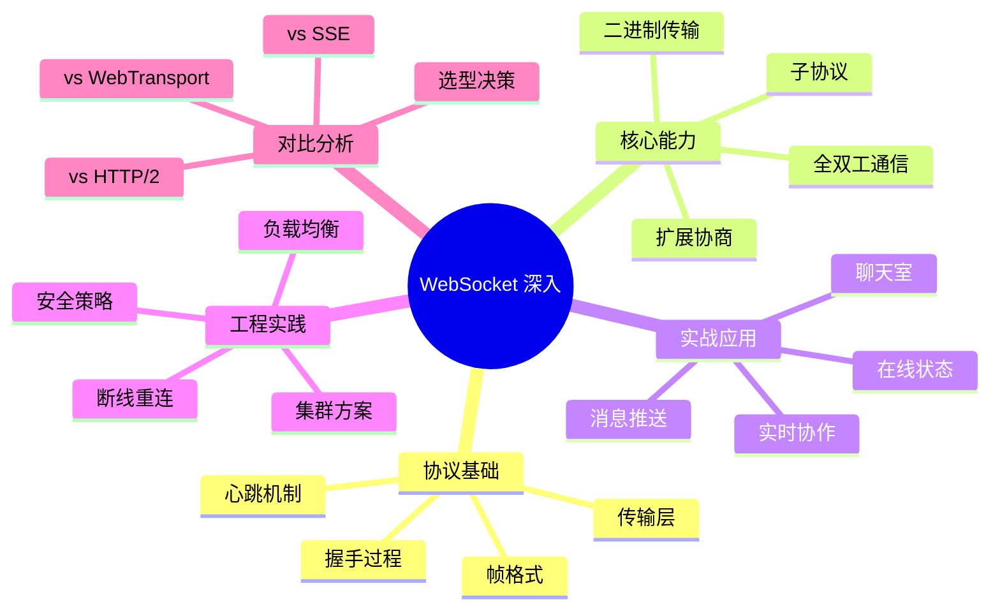
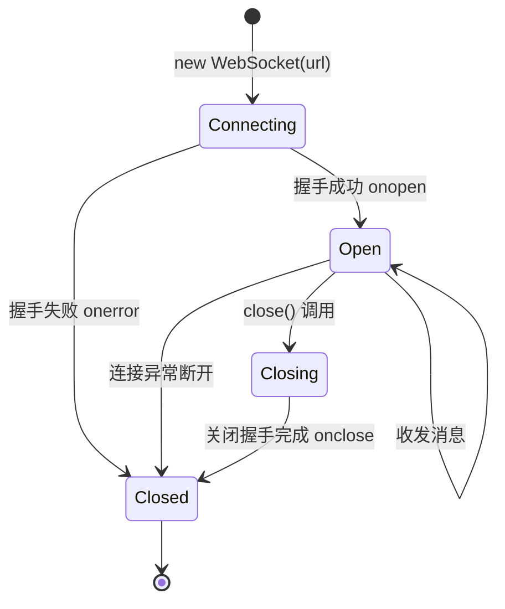

# WebSocket 深入

WebSocket 是一种在单个 TCP 连接上进行全双工通信的协议，广泛应用于实时 Web 应用场景。本模块将深入讲解 WebSocket 协议原理、实战应用及与替代方案的对比。

## 知识体系



## 为什么需要 WebSocket

HTTP 协议是请求-响应模式，服务端无法主动向客户端推送数据。在实时场景下，开发者只能通过以下方式模拟：

| 方案 | 原理 | 缺点 |
|------|------|------|
| 轮询（Polling） | 客户端定时请求 | 延迟高、浪费带宽 |
| 长轮询（Long Polling） | 服务端 hold 住请求 | 每次推送需重新建立连接 |
| SSE | 基于 HTTP 的单向流 | 仅支持服务端到客户端 |
| **WebSocket** | 独立的双向协议 | 需要服务端额外支持 |

## WebSocket 连接生命周期



## 核心优势

1. **全双工通信** — 客户端和服务端可同时发送数据，无需等待对方响应
2. **低延迟** — 建立连接后数据帧头部仅 2-14 字节，远小于 HTTP 请求头
3. **服务端推送** — 服务端可随时主动向客户端推送消息
4. **二进制支持** — 原生支持 ArrayBuffer、Blob 等二进制数据传输

## 学习路径

| 章节 | 内容 | 适合人群 |
|------|------|---------|
| [协议详解](./protocol.md) | 帧格式、握手过程、心跳、重连 | 想理解底层原理的开发者 |
| [实战应用](./practice.md) | 聊天室、实时协作、推送、对比 | 想快速上手项目的开发者 |

## 快速上手

### 基本用法

```javascript
// 创建 WebSocket 连接
const ws = new WebSocket('wss://example.com/socket');

// 连接建立
ws.onopen = () => {
  console.log('连接已建立');
  ws.send(JSON.stringify({ type: 'greeting', data: 'Hello Server' }));
};

// 接收消息
ws.onmessage = (event) => {
  if (typeof event.data === 'string') {
    const message = JSON.parse(event.data);
    console.log('收到消息:', message);
  } else {
    // 二进制数据
    console.log('收到二进制数据:', event.data);
  }
};

// 连接关闭
ws.onclose = (event) => {
  console.log(`连接关闭: code=${event.code}, reason=${event.reason}`);
};

// 错误处理
ws.onerror = (error) => {
  console.error('WebSocket 错误:', error);
};
```

### 服务端示例（Node.js）

```javascript
const WebSocket = require('ws');

const wss = new WebSocket.Server({ port: 8080 });

wss.on('connection', (ws, req) => {
  const ip = req.socket.remoteAddress;
  console.log(`新连接: ${ip}`);

  ws.on('message', (data) => {
    console.log('收到:', data.toString());
    ws.send(JSON.stringify({ echo: data.toString() }));
  });

  ws.on('close', () => {
    console.log(`连接断开: ${ip}`);
  });
});
```

## 面试要点

1. **WebSocket 与 HTTP 的关系** — WebSocket 借助 HTTP 完成握手，之后切换到独立协议
2. **为什么选择 WebSocket** — 全双工、低延迟、适合实时场景
3. **WebSocket 的局限** — 需要服务端支持、部分代理不兼容、无自动重连
4. **生产环境挑战** — 负载均衡、集群广播、连接管理、安全防护
