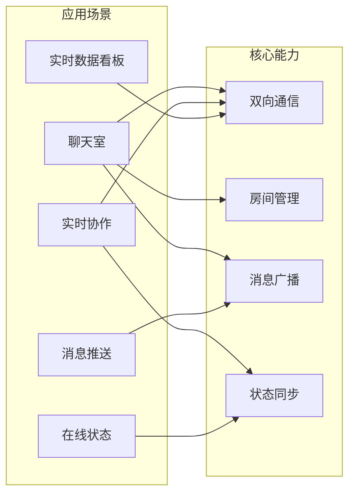
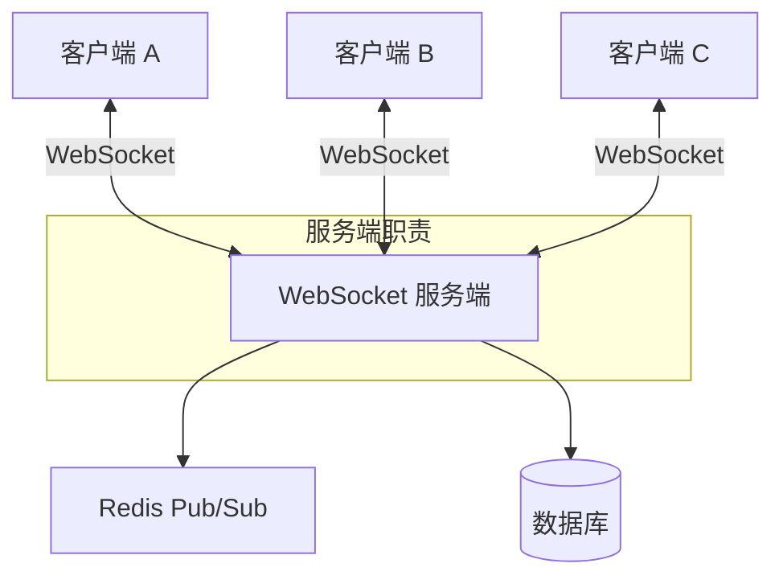
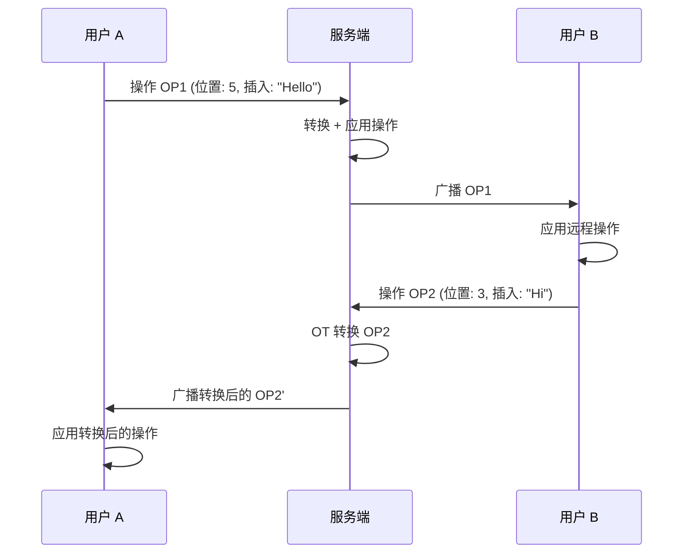
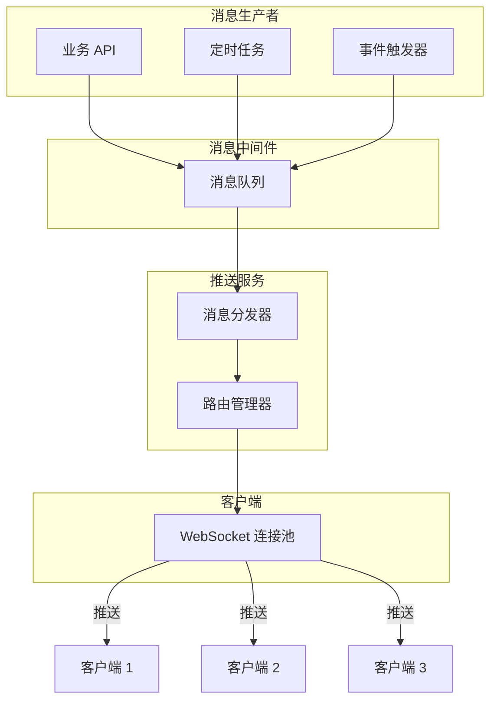
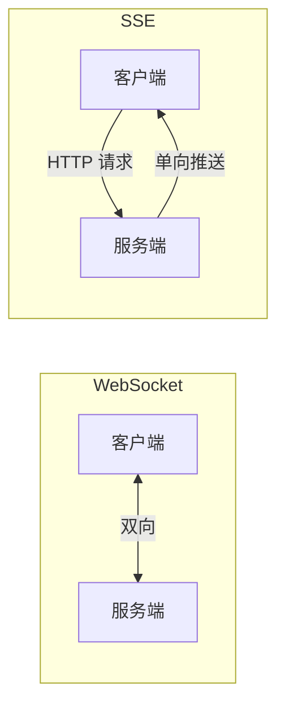
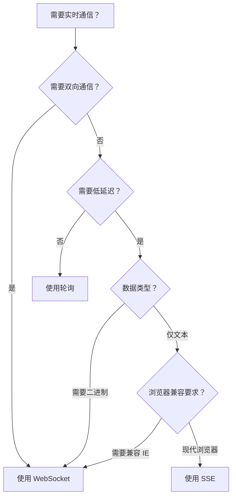
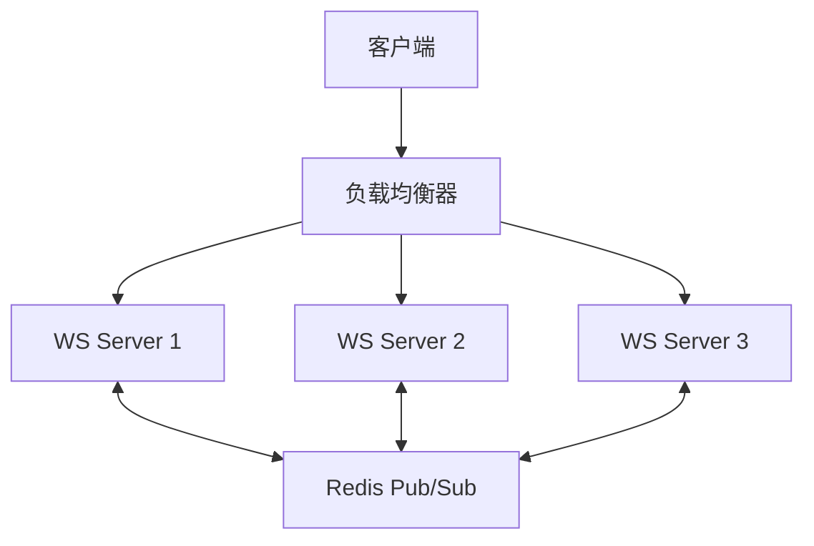

# WebSocket 实战

本文通过具体案例展示 WebSocket 的实际应用，包括聊天室、实时协作、消息推送，并与 SSE 进行对比。

## 实战案例总览



## 聊天室实现

### 整体架构



### 客户端实现

```javascript
class ChatClient {
  constructor(url) {
    this.ws = null;
    this.url = url;
    this.messageHandlers = new Map();
    this.reconnectManager = null;
  }

  connect(token) {
    this.ws = new WebSocket(`${this.url}?token=${token}`);

    this.ws.onopen = () => {
      console.log('已连接到聊天服务器');
      this.emit('connected');
    };

    this.ws.onmessage = (event) => {
      const data = JSON.parse(event.data);
      const handler = this.messageHandlers.get(data.type);
      if (handler) handler(data.payload);
    };

    this.ws.onclose = (event) => {
      if (!event.wasClean) {
        this.emit('disconnected');
        this.scheduleReconnect();
      }
    };
  }

  // 加入房间
  joinRoom(roomId) {
    this.send('join_room', { roomId });
  }

  // 发送消息
  sendMessage(roomId, content) {
    this.send('chat_message', {
      roomId,
      content,
      timestamp: Date.now(),
    });
  }

  // 注册消息处理器
  on(type, handler) {
    this.messageHandlers.set(type, handler);
  }

  send(type, payload) {
    if (this.ws.readyState === WebSocket.OPEN) {
      this.ws.send(JSON.stringify({ type, payload }));
    }
  }

  emit(event) {
    const handler = this.messageHandlers.get(event);
    if (handler) handler();
  }

  scheduleReconnect() {
    // 指数退避重连（参见 protocol.md）
    setTimeout(() => this.connect(), 3000);
  }
}

// 使用示例
const chat = new ChatClient('wss://example.com/chat');
chat.connect('user-token-xxx');

chat.on('connected', () => {
  chat.joinRoom('room-general');
});

chat.on('chat_message', (message) => {
  console.log(`${message.sender}: ${message.content}`);
});

chat.sendMessage('room-general', '大家好！');
```

### 服务端实现（Node.js + ws）

```javascript
const WebSocket = require('ws');
const Redis = require('ioredis');

const wss = new WebSocket.Server({ port: 8080 });
const redis = new Redis();
const subscriber = new Redis();

// 房间管理
const rooms = new Map();

wss.on('connection', (ws, req) => {
  const userId = authenticate(req);
  ws.userId = userId;
  ws.rooms = new Set();

  ws.on('message', (raw) => {
    const { type, payload } = JSON.parse(raw);

    switch (type) {
      case 'join_room':
        joinRoom(ws, payload.roomId);
        break;
      case 'chat_message':
        broadcastToRoom(payload.roomId, {
          type: 'chat_message',
          payload: {
            sender: userId,
            content: payload.content,
            timestamp: Date.now(),
          },
        });
        break;
    }
  });

  ws.on('close', () => {
    // 离开所有房间
    ws.rooms.forEach((roomId) => leaveRoom(ws, roomId));
  });
});

function joinRoom(ws, roomId) {
  if (!rooms.has(roomId)) rooms.set(roomId, new Set());
  rooms.get(roomId).add(ws);
  ws.rooms.add(roomId);
}

function leaveRoom(ws, roomId) {
  if (rooms.has(roomId)) {
    rooms.get(roomId).delete(ws);
    if (rooms.get(roomId).size === 0) rooms.delete(roomId);
  }
  ws.rooms.delete(roomId);
}

function broadcastToRoom(roomId, message) {
  const clients = rooms.get(roomId);
  if (!clients) return;
  const data = JSON.stringify(message);
  clients.forEach((client) => {
    if (client.readyState === WebSocket.OPEN) {
      client.send(data);
    }
  });
}
```

## 实时协作（文档协同编辑）

### 状态同步架构



### 基于 OT 的协作实现

```javascript
class CollaborationClient {
  constructor(ws, documentId) {
    this.ws = ws;
    this.documentId = documentId;
    this.pendingOps = [];     // 等待确认的操作
    this.revision = 0;

    this.ws.onmessage = (event) => {
      const msg = JSON.parse(event.data);
      switch (msg.type) {
        case 'operation':
          this.handleRemoteOperation(msg.op);
          break;
        case 'ack':
          this.handleAck();
          break;
      }
    };
  }

  // 本地操作：在光标位置插入文本
  insert(position, text) {
    const op = {
      type: 'insert',
      position,
      text,
      revision: this.revision + this.pendingOps.length,
    };

    this.pendingOps.push(op);
    this.applyLocally(op);
    this.ws.send(JSON.stringify({ type: 'operation', op }));
  }

  // 处理远程操作（简化版 OT）
  handleRemoteOperation(op) {
    // 对待确认队列中的操作进行转换
    let transformedOp = op;
    for (const pending of this.pendingOps) {
      transformedOp = this.transform(transformedOp, pending);
    }
    this.applyLocally(transformedOp);
    this.revision++;
  }

  handleAck() {
    this.pendingOps.shift();
    this.revision++;
  }

  // Operational Transformation 核心
  transform(op1, op2) {
    if (op1.type === 'insert' && op2.type === 'insert') {
      if (op1.position <= op2.position) return op1;
      return { ...op1, position: op1.position + op2.text.length };
    }
    return op1;
  }

  applyLocally(op) {
    // 应用操作到本地文档
    console.log(`应用操作: ${op.type} at ${op.position}`);
  }
}
```

## 消息推送系统

### 推送架构



### 推送客户端封装

```javascript
class PushClient {
  constructor(url, options = {}) {
    this.url = url;
    this.channels = new Set();
    this.handlers = new Map();
    this.ws = null;
    this.options = {
      reconnect: true,
      heartbeatInterval: 30000,
      ...options,
    };
  }

  async connect(token) {
    return new Promise((resolve, reject) => {
      this.ws = new WebSocket(`${this.url}?token=${token}`);

      this.ws.onopen = () => {
        this.startHeartbeat();
        this.resubscribe();
        resolve();
      };

      this.ws.onmessage = (event) => {
        const { channel, data } = JSON.parse(event.data);
        const handler = this.handlers.get(channel);
        if (handler) handler(data);
      };

      this.ws.onerror = reject;
    });
  }

  // 订阅频道
  subscribe(channel, handler) {
    this.channels.add(channel);
    this.handlers.set(channel, handler);

    if (this.ws?.readyState === WebSocket.OPEN) {
      this.ws.send(JSON.stringify({
        type: 'subscribe',
        channel,
      }));
    }
  }

  // 取消订阅
  unsubscribe(channel) {
    this.channels.delete(channel);
    this.handlers.delete(channel);

    if (this.ws?.readyState === WebSocket.OPEN) {
      this.ws.send(JSON.stringify({
        type: 'unsubscribe',
        channel,
      }));
    }
  }

  startHeartbeat() {
    setInterval(() => {
      if (this.ws.readyState === WebSocket.OPEN) {
        this.ws.send(JSON.stringify({ type: 'ping' }));
      }
    }, this.options.heartbeatInterval);
  }

  resubscribe() {
    // 断线重连后重新订阅所有频道
    this.channels.forEach((channel) => {
      this.ws.send(JSON.stringify({ type: 'subscribe', channel }));
    });
  }
}

// 使用
const push = new PushClient('wss://example.com/push');
await push.connect('auth-token');

push.subscribe('notifications', (data) => {
  showToast(data.title, data.body);
});

push.subscribe('price-update', (data) => {
  updatePriceChart(data);
});
```

## WebSocket vs SSE 对比



### 详细对比

| 维度 | WebSocket | SSE |
|------|-----------|-----|
| 通信方向 | 全双工（双向） | 单向（服务端到客户端） |
| 协议 | 独立的 ws/wss 协议 | 基于 HTTP |
| 自动重连 | 不支持，需手动实现 | 浏览器原生支持 |
| 事件 ID 恢复 | 不支持 | 支持（Last-Event-ID） |
| 二进制数据 | 原生支持 | 仅支持文本 |
| 浏览器兼容 | 所有现代浏览器 | 所有现代浏览器（IE 不支持） |
| 代理/防火墙 | 可能被拦截 | 基于 HTTP，兼容性好 |
| 服务端复杂度 | 较高 | 较低 |

### 选型决策树



### SSE 实现示例

```javascript
// 客户端 — 使用 EventSource
const source = new EventSource('/api/events', {
  withCredentials: true,
});

source.addEventListener('message', (event) => {
  const data = JSON.parse(event.data);
  console.log('收到推送:', data);
});

source.addEventListener('error', (event) => {
  if (event.target.readyState === EventSource.CLOSED) {
    console.log('连接已关闭');
  }
  // EventSource 会自动重连
});

// 服务端 — Node.js
const http = require('http');

http.createServer((req, res) => {
  if (req.url === '/api/events') {
    res.writeHead(200, {
      'Content-Type': 'text/event-stream',
      'Cache-Control': 'no-cache',
      'Connection': 'keep-alive',
      'Access-Control-Allow-Origin': '*',
    });

    let id = 0;
    const timer = setInterval(() => {
      const data = { time: new Date().toISOString() };
      res.write(`id: ${++id}\n`);
      res.write(`event: message\n`);
      res.write(`data: ${JSON.stringify(data)}\n\n`);
    }, 1000);

    req.on('close', () => clearInterval(timer));
  }
}).listen(8080);
```

## 生产环境最佳实践

### 1. 负载均衡



使用 Redis Pub/Sub 实现跨节点消息广播：

```javascript
const Redis = require('ioredis');
const publisher = new Redis();
const subscriber = new Redis();

// 订阅房间消息
subscriber.subscribe('room:broadcast');

subscriber.on('message', (channel, message) => {
  const { roomId, data } = JSON.parse(message);
  // 仅广播给本节点的客户端
  broadcastToLocalClients(roomId, data);
});

// 发布消息到所有节点
function publishToRoom(roomId, data) {
  publisher.publish('room:broadcast', JSON.stringify({ roomId, data }));
}
```

### 2. 连接管理

```javascript
class ConnectionManager {
  constructor() {
    this.connections = new Map(); // userId -> Set<WebSocket>
  }

  addConnection(userId, ws) {
    if (!this.connections.has(userId)) {
      this.connections.set(userId, new Set());
    }
    this.connections.get(userId).add(ws);

    ws.on('close', () => {
      this.connections.get(userId)?.delete(ws);
      if (this.connections.get(userId)?.size === 0) {
        this.connections.delete(userId);
      }
    });
  }

  // 向用户的所有连接推送
  sendToUser(userId, message) {
    const sockets = this.connections.get(userId);
    if (!sockets) return;
    const data = JSON.stringify(message);
    sockets.forEach((ws) => {
      if (ws.readyState === WebSocket.OPEN) ws.send(data);
    });
  }

  getOnlineCount() {
    return this.connections.size;
  }
}
```

### 3. 消息协议设计

```typescript
// 统一消息格式
interface WSMessage<T = unknown> {
  type: string;        // 消息类型
  payload: T;          // 消息载荷
  requestId?: string;  // 请求 ID，用于关联响应
  timestamp: number;   // 时间戳
}

// 请求-响应模式
interface RequestMessage<T> extends WSMessage<T> {
  requestId: string;   // 必须携带 requestId
}

interface ResponseMessage<T> extends WSMessage<T> {
  requestId: string;   // 与请求对应
  code: number;        // 状态码
  message?: string;    // 错误信息
}
```

## 面试要点

1. **WebSocket 与 SSE 如何选型** — 双向需求选 WebSocket，单向推送选 SSE
2. **如何实现断线重连** — 指数退避 + 随机抖动，避免惊群效应
3. **多节点如何广播** — Redis Pub/Sub 或消息队列实现跨进程通信
4. **消息协议设计** — 统一格式、类型字段、请求-响应关联
5. **实时协作的核心难点** — OT 算法、冲突解决、状态一致性
6. **生产环境注意事项** — 负载均衡、连接管理、安全认证、限流
