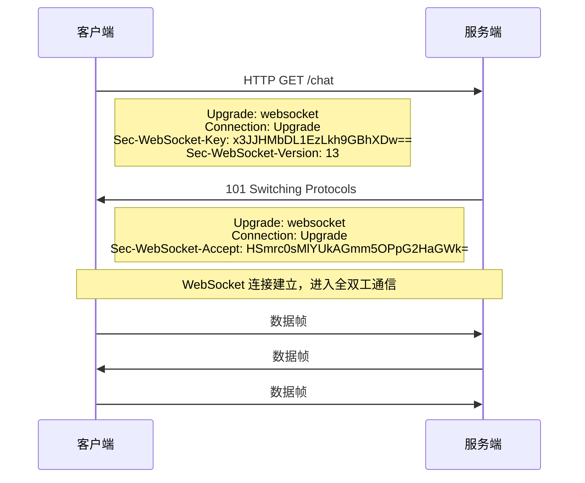
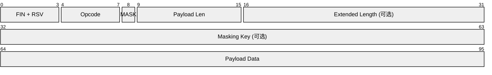
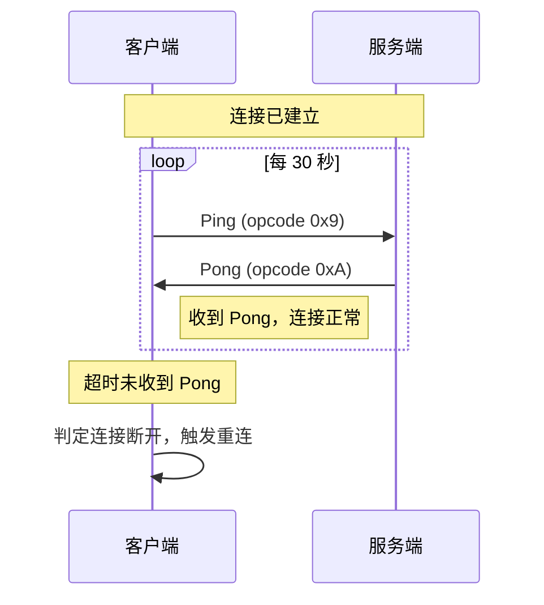
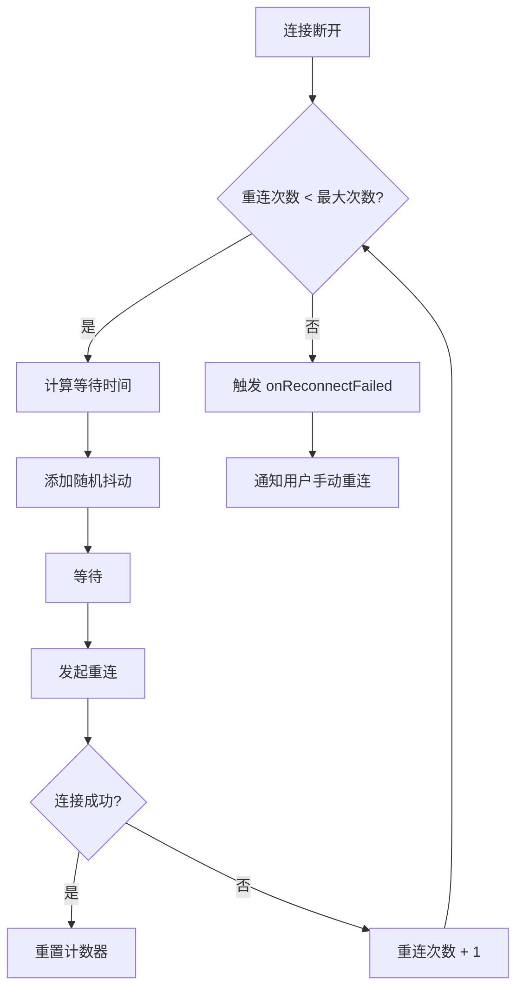
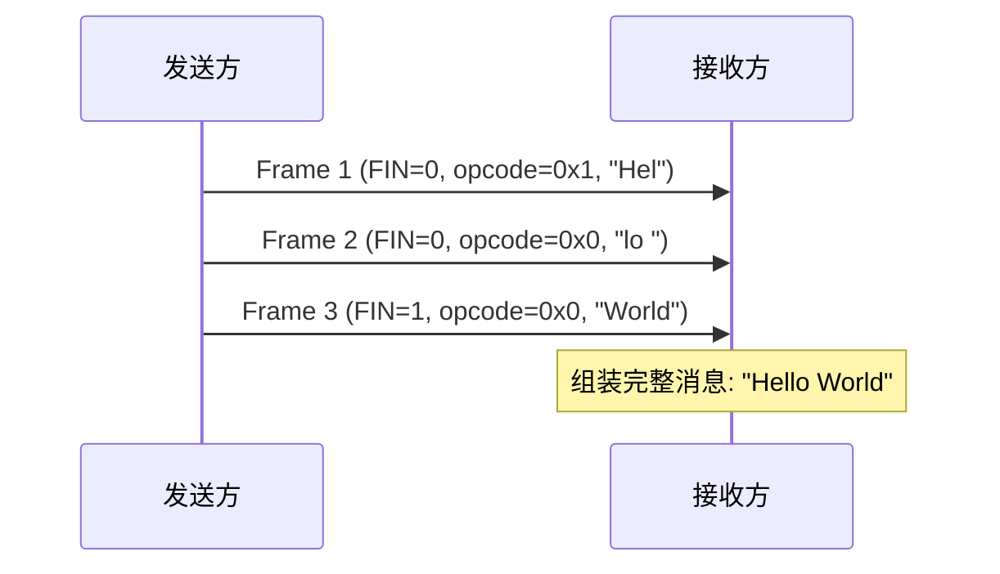

# WebSocket 协议详解

本文深入讲解 WebSocket 协议的底层机制，包括握手过程、帧格式、心跳保活和断线重连策略。

## WebSocket 握手过程

WebSocket 连接通过 HTTP Upgrade 机制建立。客户端发送一个特殊的 HTTP 请求，服务端确认后切换到 WebSocket 协议。



### 握手请求示例

```http
GET /chat HTTP/1.1
Host: example.com
Upgrade: websocket
Connection: Upgrade
Sec-WebSocket-Key: dGhlIHNhbXBsZSBub25jZQ==
Sec-WebSocket-Version: 13
Sec-WebSocket-Protocol: chat, superchat
Sec-WebSocket-Extensions: permessage-deflate
Origin: http://example.com
```

### 握手响应示例

```http
HTTP/1.1 101 Switching Protocols
Upgrade: websocket
Connection: Upgrade
Sec-WebSocket-Accept: s3pPLMBiTxaQ9kYGzzhZRbK+xOo=
Sec-WebSocket-Protocol: chat
```

### Key 验证算法

服务端通过 `Sec-WebSocket-Key` 计算 `Sec-WebSocket-Accept`：

```javascript
// 服务端验证逻辑（Node.js 示例）
const crypto = require('crypto');

const MAGIC_STRING = '258EAFA5-E914-47DA-95CA-5AB95BCA3B1E';

function computeAcceptKey(clientKey) {
  return crypto
    .createHash('sha1')
    .update(clientKey + MAGIC_STRING)
    .digest('base64');
}

// 验证
const clientKey = 'dGhlIHNhbXBsZSBub25jZQ==';
const expectedAccept = computeAcceptKey(clientKey);
// => 's3pPLMBiTxaQ9kYGzzhZRbK+xOo='
```

## 帧格式详解

WebSocket 数据以帧（Frame）为单位传输。每个帧包含头部和载荷。



### 帧头字段说明

| 字段 | 位数 | 说明 |
|------|------|------|
| FIN | 1 bit | 是否为消息的最后一帧 |
| RSV1-3 | 3 bit | 保留位，扩展协商时使用 |
| Opcode | 4 bit | 帧类型（0x0 文本、0x1 二进制、0x8 关闭、0x9 Ping、0xA Pong） |
| MASK | 1 bit | 载荷是否经过掩码处理 |
| Payload Length | 7 bit | 载荷长度（后续可能有扩展长度） |
| Masking Key | 32 bit | 掩码密钥（客户端发送时必须） |
| Payload Data | 可变 | 实际传输的数据 |

### Opcode 类型

| Opcode | 含义 | 说明 |
|--------|------|------|
| 0x0 | Continuation | 延续帧，属于上一个消息 |
| 0x1 | Text | 文本帧，载荷为 UTF-8 编码 |
| 0x2 | Binary | 二进制帧 |
| 0x8 | Close | 关闭连接 |
| 0x9 | Ping | 心跳探测 |
| 0xA | Pong | 心跳响应 |

### 掩码算法

客户端发送的帧必须经过掩码处理，防止缓存投毒攻击：

```javascript
// 掩码/解掩码函数
function maskPayload(payload, maskingKey) {
  const result = new Uint8Array(payload.length);
  for (let i = 0; i < payload.length; i++) {
    result[i] = payload[i] ^ maskingKey[i % 4];
  }
  return result;
}

// 使用示例
const payload = new TextEncoder().encode('Hello');
const maskingKey = crypto.getRandomValues(new Uint8Array(4));
const masked = maskPayload(payload, maskingKey);
const unmasked = maskPayload(masked, maskingKey);
console.log(new TextDecoder().decode(unmasked)); // "Hello"
```

## 心跳机制（Ping/Pong）

心跳用于检测连接是否存活，防止中间代理或防火墙因超时断开连接。



### 心跳实现

```javascript
class HeartbeatManager {
  constructor(ws, options = {}) {
    this.ws = ws;
    this.interval = options.interval || 30000; // 30 秒
    this.timeout = options.timeout || 10000;    // 10 秒超时
    this.timer = null;
    this.timeoutTimer = null;
  }

  start() {
    this.timer = setInterval(() => {
      if (this.ws.readyState === WebSocket.OPEN) {
        this.ws.send('ping'); // 或使用原生 ping 帧
        this.timeoutTimer = setTimeout(() => {
          console.warn('心跳超时，连接可能已断开');
          this.ws.close();
        }, this.timeout);
      }
    }, this.interval);
  }

  // 收到 pong 时调用
  onPong() {
    if (this.timeoutTimer) {
      clearTimeout(this.timeoutTimer);
      this.timeoutTimer = null;
    }
  }

  stop() {
    clearInterval(this.timer);
    clearTimeout(this.timeoutTimer);
  }
}
```

## 断线重连策略

网络不稳定时，客户端需要自动重连。推荐使用指数退避策略，避免服务端被大量重连请求压垮。



### 指数退避重连实现

```javascript
class ReconnectManager {
  constructor(wsFactory, options = {}) {
    this.wsFactory = wsFactory;       // 创建 WebSocket 的工厂函数
    this.maxRetries = options.maxRetries || 10;
    this.baseDelay = options.baseDelay || 1000;
    this.maxDelay = options.maxDelay || 30000;
    this.retryCount = 0;
    this.ws = null;
  }

  connect() {
    this.ws = this.wsFactory();

    this.ws.onopen = () => {
      this.retryCount = 0; // 重置计数
      console.log('连接成功');
    };

    this.ws.onclose = (event) => {
      if (!event.wasClean && this.retryCount < this.maxRetries) {
        this.scheduleReconnect();
      }
    };
  }

  scheduleReconnect() {
    // 指数退避 + 随机抖动
    const delay = Math.min(
      this.baseDelay * Math.pow(2, this.retryCount),
      this.maxDelay
    );
    const jitter = delay * 0.5 * Math.random();
    const waitTime = delay + jitter;

    console.log(`第 ${this.retryCount + 1} 次重连，等待 ${Math.round(waitTime)}ms`);

    setTimeout(() => {
      this.retryCount++;
      this.connect();
    }, waitTime);
  }
}

// 使用
const manager = new ReconnectManager(
  () => new WebSocket('wss://example.com/ws'),
  { maxRetries: 10, baseDelay: 1000, maxDelay: 30000 }
);
manager.connect();
```

## 消息分片

大消息会被拆分为多个帧传输，通过 FIN 位标识最后一帧：



## 安全考量

### WSS（WebSocket Secure）

生产环境必须使用 `wss://` 协议，数据通过 TLS 加密传输：

```javascript
// 不安全 — 仅用于本地开发
const ws = new WebSocket('ws://localhost:8080');

// 安全 — 生产环境必须使用 wss
const ws = new WebSocket('wss://example.com/ws');
```

### 安全检查清单

1. **验证 Origin 头** — 防止跨站 WebSocket 劫持（CSWSH）
2. **使用 WSS** — 防止中间人攻击
3. **输入校验** — 验证所有接收到的消息格式
4. **速率限制** — 防止消息洪泛攻击
5. **认证机制** — 连接时验证 Token 或 Session

```javascript
// 服务端验证 Origin（Node.js 示例）
const server = new WebSocket.Server({
  verifyClient: (info, callback) => {
    const origin = info.origin || info.req.headers.origin;
    const allowedOrigins = ['https://example.com', 'https://app.example.com'];

    if (!allowedOrigins.includes(origin)) {
      callback(false, 403, 'Forbidden origin');
      return;
    }

    // 验证 Token
    const token = new URL(info.req.url, 'http://localhost').searchParams.get('token');
    if (!verifyToken(token)) {
      callback(false, 401, 'Unauthorized');
      return;
    }

    callback(true);
  }
});
```

## 面试要点

1. **WebSocket 握手过程** — 基于 HTTP Upgrade，使用 `Sec-WebSocket-Key` 验证
2. **帧格式关键字段** — FIN、Opcode、MASK、Payload Length
3. **为什么客户端必须掩码** — 防止缓存投毒攻击
4. **心跳的作用** — 保活连接，检测断线
5. **断线重连策略** — 指数退避 + 随机抖动，避免惊群效应
6. **WSS 的必要性** — 加密传输，防止中间人攻击
